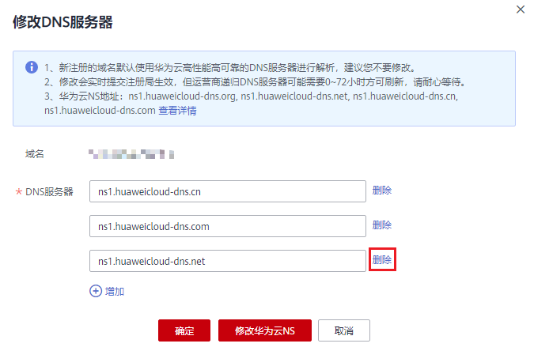
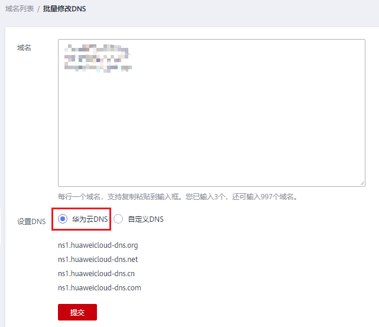

# 修改DNS服务器

## 操作场景

域名的DNS服务器定义了域名用于解析的权威DNS服务器。

通过华为云注册成功的域名默认使用华为云DNS进行解析，详细内容，请参见[华为云DNS对用户提供域名服务的DNS是什么？](https://support.huaweicloud.com/dns_faq/dns_faq_012.html)。

您可以根据业务需要修改域名的DNS服务器。域名注册服务支持修改单个域名的DNS服务器，也支持批量修改多个域名的DNS服务器。

域名注册服务支持一次性批量修改1000个域名的DNS服务器。

修改DNS服务器并不能立即生效，具体的生效时间请参见[修改DNS服务器后多久生效？](https://support.huaweicloud.com/dns_faq/dns_faq_140305.html)。

## 修改单个域名的DNS服务器

1.  登录管理控制台。
2.  选择“域名与网站 \> 域名注册”。

    进入“域名列表”页面。

3.  在域名列表中，单击“域名”列的待修改DNS服务器的域名。

    进入域名信息页面。

    **图 1**  域名信息  
    

4.  在域名信息页面，单击“DNS服务器”后的“修改”，进入“修改DNS服务器”页面。

    **图 2**  修改DNS服务器（2）  
    

5.  在“DNS服务器”的文本框内，修改DNS服务器地址。

    域名最多支持设置6个不同的DNS服务器，最少支持设置2个不同的DNS服务器。

    在此页面，您还可以增加和删除DNS服务器。

    -   增加：单击“增加”，输入新的DNS服务器地址。

        若您的域名使用华为云DNS进行解析，可以将“DNS服务器”设置为：

        -   ns1.huaweicloud-dns.com：中国大陆各区域DNS地址
        -   ns1.huaweicloud-dns.cn：中国大陆各区域DNS地址
        -   ns1.huaweicloud-dns.net：除中国大陆之外国家或地区DNS地址
        -   ns1.huaweicloud-dns.org：除中国大陆之外国家或地区DNS地址

        更多华为云DNS服务器点设置建议，请参见[华为云DNS对用户提供域名服务的DNS是什么？](https://support.huaweicloud.com/dns_faq/dns_faq_012.html)。

    -   删除：当设置的DNS服务器超过2个时，可以单击“删除”删除不需要的DNS服务器。

        **图 3**  删除DNS服务器  
        

6.  单击“确定”，完成DNS服务器的修改。

## 批量修改多个域名的DNS服务器

1.  登录管理控制台。
2.  选择“域名与网站 \> 域名注册”。

    进入“域名列表”页面。

3.  在“域名列表”中，勾选待修改DNS服务器的域名，单击“修改DNS服务器”，进入“批量修改DNS”页面。

    **图 4**  批量修改DNS服务器（1）  
    

    -   批量设置域名的DNS服务器为华为云DNS。

        在“批量修改DNS”页面，“设置DNS”选择“华为云DNS”，批量将域名的DNS服务器设置为华为云的DNS。

        **图 5**  批量修改DNS服务器（华为云DNS）  
        

    -   批量设置域名的DNS服务器为自定义DNS。

        在“批量修改DNS”页面，“设置DNS”选择“自定义DNS”，在文本框中输入自定义的DNS服务器地址：dns1.example.com、dns2.example.com、dns3.example.com。

        域名最多支持设置6个不同的DNS服务器，最少支持设置2个不同的DNS服务器。

        -   增加：单击“增加”，输入新的DNS服务器地址。
        -   删除：若设置的DNS服务器超过2个，可以单击“删除”删除不需要的DNS服务器。

        **图 6**  批量修改DNS服务器（自定义DNS）  
        

4.  单击“提交”，完成DNS服务器的修改。

