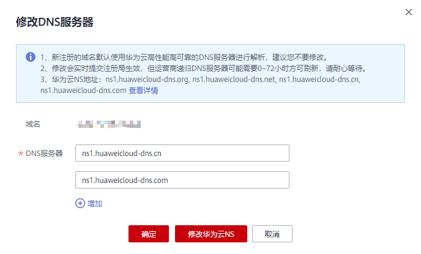

# 修改DNS服务器

## 操作场景

注册成功的域名默认使用华为云DNS进行解析，DNS服务器地址为：ns1.hwclouds-dns.com、ns1.hwclouds-dns.net。

您可以根据业务需要修改域名的DNS服务器。域名注册服务支持修改单个域名的DNS服务器，也支持批量修改多个域名的DNS服务器。

域名注册服务支持一次性批量修改1000个域名的DNS服务器。

## 修改单个域名的DNS服务器

1.  登录管理控制台。
2.  选择“域名与网站 \> 域名注册”。

    进入“域名列表”页面。

3.  在域名列表中，单击“域名”列的待修改DNS服务器的域名。

    进入域名信息页面。

    **图 1**  域名信息  
    

4.  在域名信息页面，单击“DNS服务器”后的“修改”，进入“修改DNS服务器”页面。

    **图 2**  修改DNS服务器（2）  
    

5.  在“DNS服务器”的文本框内，修改DNS服务器地址。

    域名的最多支持设置6个不同的DNS服务器，最少支持设置2个不同的DNS服务器。

    在此页面，您还可以增加和删除DNS服务器。

    -   增加：单击“增加”，输入新的DNS服务器地址。
    -   删除：若设置的DNS服务器超过2个，可以单击“删除”删除不需要的DNS服务器。

        **图 3**  删除DNS服务器  
        

6.  单击“确定”，完成DNS服务器的修改。

## 批量修改多个域名的DNS服务器

1.  登录管理控制台。
2.  选择“域名与网站 \> 域名注册”。

    进入“域名列表”页面。

3.  在“域名列表”中，勾选待修改DNS服务器的域名，单击“修改DNS服务器”，进入“批量修改DNS”页面。

    **图 4**  批量转移域名（1）  
    

    **图 5**  批量转移域名（2）  
    

4.  在“批量修改DNS”页面，选择“自定义DNS”。
5.  在文本框中输入修改后的DNS服务器地址。

    域名的最多支持设置6个不同的DNS服务器，最少支持设置2个不同的DNS服务器。

    在此页面，您还可以增加和删除DNS服务器。

    -   增加：单击“增加”，输入新的DNS服务器地址。
    -   删除：若设置的DNS服务器超过2个，可以单击“删除”删除不需要的DNS服务器。

        **图 6**  删除DNS服务器  
        

6.  单击“提交”，完成DNS服务器的修改。

