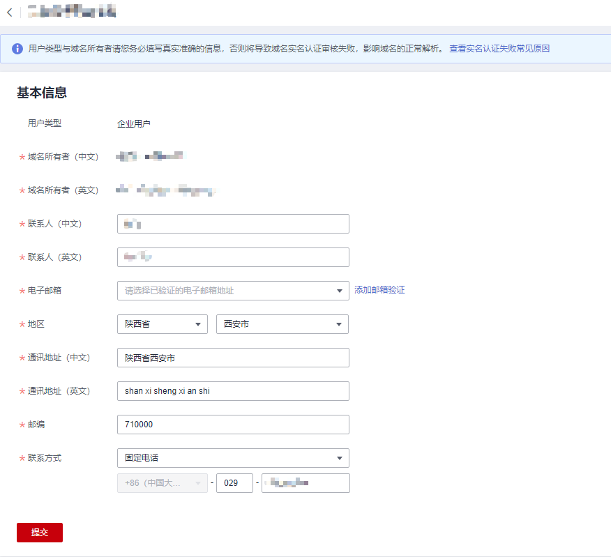

# 修改信息模板

## 操作场景

本章节指导您如何变更域名注册信息，例如电子邮箱、联系方式、域名所有者。修改完善域名资料，以便更好地保护您的域名。

<table><thead align="left"><tr id="row182381553151911"><th class="cellrowborder" valign="top" width="29.99%" id="mcps1.1.3.1.1">
操作场景

</th>
<th class="cellrowborder" valign="top" width="70.00999999999999%" id="mcps1.1.3.1.2">
操作说明

</th>
</tr>
</thead>
<tbody><tr id="row1123875371911"><td class="cellrowborder" valign="top" width="29.99%" headers="mcps1.1.3.1.1 ">
修改域名所有者信息

（用户类型、域名所有者中文/英文）

</td>
<td class="cellrowborder" valign="top" width="70.00999999999999%" headers="mcps1.1.3.1.2 ">
信息模板中的“用户类型”和“域名所有者”不支持修改，需要通过<a href="域名过户.md">域名过户</a>操作实现。

<ul id="ul78488228524"><li>选择未实名认证模板，请根据新的域名所有者重新填写并提交信息模板的实名认证材料。该过程需要向注册局提交审核，一般1个工作日内即可完成审核（部分需要3~5个工作日），不支持加急处理，建议您耐心等待。创建信息模板并实名认证的详细内容，请参见<a href="创建信息模板（个人用户）.md">创建信息模板（个人用户）</a>或者<a href="创建信息模板（企业用户）.md">创建信息模板（企业用户）</a>。</li><li>选择已实名认证模板，域名信息可立即修改成功。</li></ul>
</td>
</tr>
<tr id="row1223865391918"><td class="cellrowborder" valign="top" width="29.99%" headers="mcps1.1.3.1.1 ">
修改其他域名信息

(联系人中文/英文、电子邮箱、通信地址中文/英文、邮编、联系方式)

</td>
<td class="cellrowborder" valign="top" width="70.00999999999999%" headers="mcps1.1.3.1.2 ">
当信息模板的“认证状态”为“未实名认证”或者“实名认证失败”时，您可以修改信息模板中的除了“用户类型”以及“域名所有者”以外的相关信息。修改方法参见<a href="#zh-cn_topic_0193892074_section166731449164516">操作步骤</a>。

</td>
</tr>
</tbody>
</table>

> **说明：** 
>不支持修改“认证状态”为“已实名认证”和“实名认证审核中”的信息模板。

## 操作步骤

1.  登录[域名注册控制台](https://console.huaweicloud.com/domain/?region=cn-north-4#/domain/list)。

    进入“域名列表”页面。

2.  在左侧树状导航栏中，选择“信息模板”。

1.  在信息模板列表中，找到待修改的信息模板，单击“操作”列的“修改”。

    进入信息模板的“基本信息”页面。

    **图 1**  修改信息模板  
    

2.  修改信息模板的联系人相关信息。
3.  单击“提交”，完成信息模板的修改。

