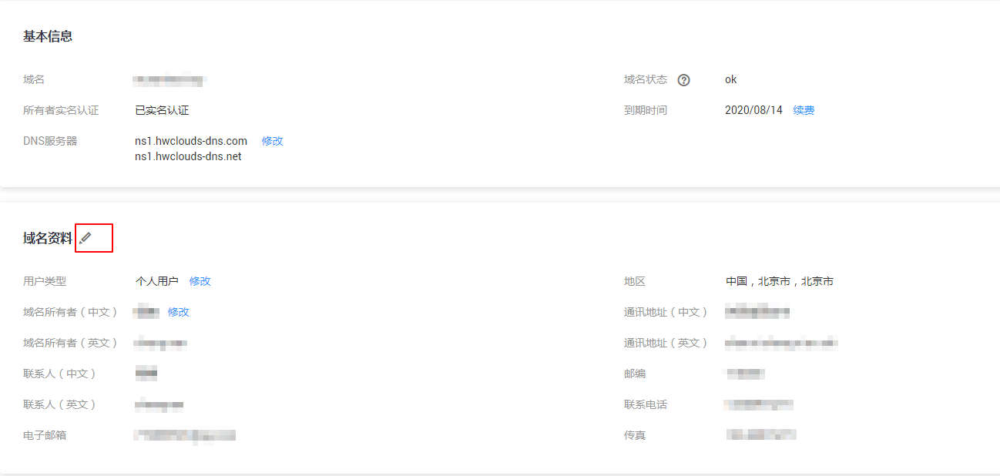
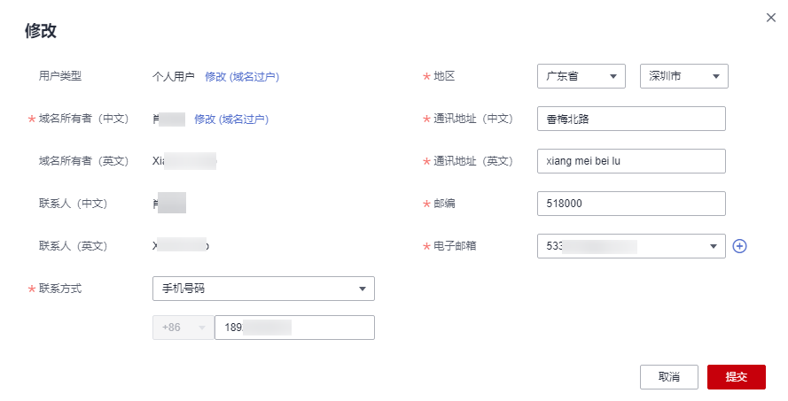

# 修改域名信息

## 操作场景

用户在注册域名后，可以修改如下“服务状态”的域名信息：

-   未实名认证
-   已实名认证
-   实名认证失败

## 操作步骤

1.  登录管理控制台。
2.  选择“域名与网站 \> 域名注册”。

    进入“域名列表”页面。

3.  在“域名列表”页面，单击“域名”列的待修改域名。，进入域名信息页面。

    **图 1**  域名信息  
    

4.  在域名信息页面，单击“域名资料”后面的“”，进入“修改”页面。

    **图 2**  域名资料修改  
    

5.  在“修改”页面，修改除“用户类型”和“域名所有者（中文）”之外的域名信息。

    支持修改域信息：

    -   联系人
    -   联系方式
    -   地区
    -   通讯地址
    -   邮编
    -   电子邮箱
    -   传真

    > **说明：**   
    >如果要修改“用户类型”和“域名所有者（中文）”，则需要创建新的域名信息模板，将域名过户到该模板中。  
    >-   创建信息模板可参考[创建信息模板（个人用户）](创建信息模板（个人用户）.md)或者[创建信息模板（企业用户）](创建信息模板（企业用户）.md)。  
    >-   域名过户请参考[域名过户](域名过户.md)，您可以通过单击[图2](#fig1522794362711)中“用户类型”和“域名所有者（中文）”后面的“修改”，进入“域名过户”页面。  

6.  单击“提交”，完成域名信息的修改。

