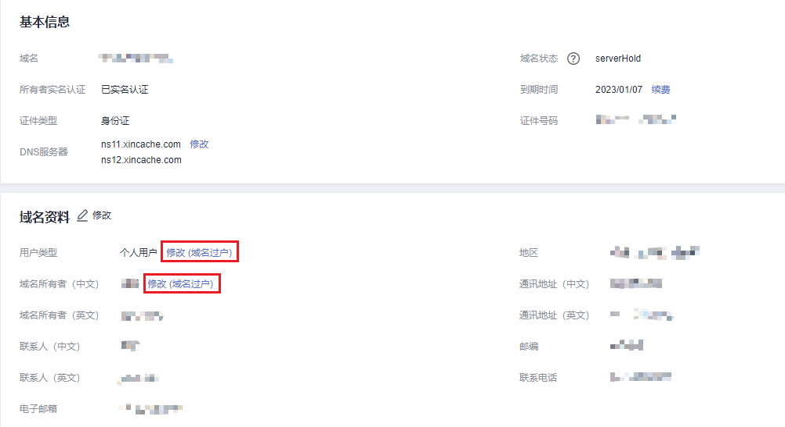
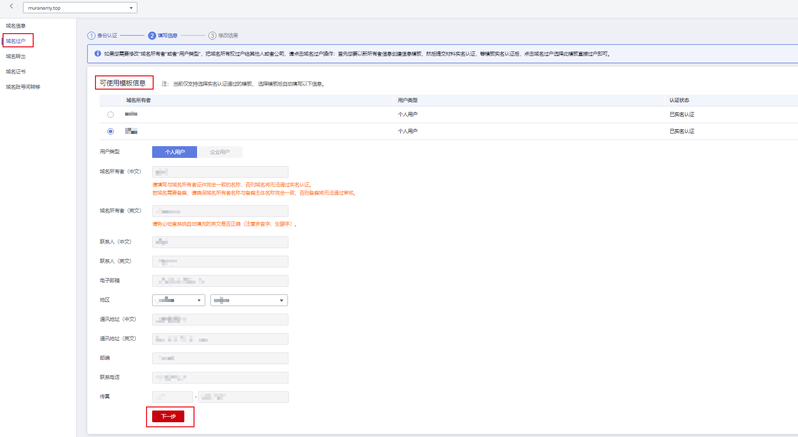
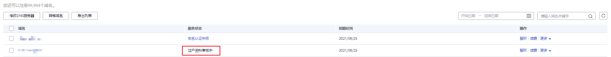
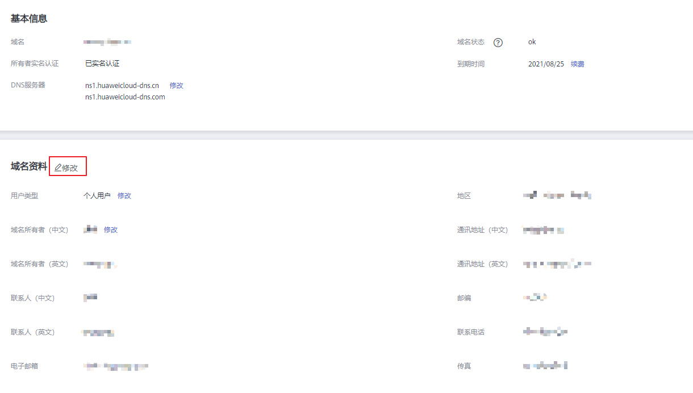

# 修改域名资料

## 操作场景

本章节介绍如何修改域名资料，包括“用户类型”、“域名所有者”以及域名联系人等信息。

-   [修改用户类型和域名所有者](#section171591401221)：需要1\~3个工作日。
-   [修改域名联系人等相关信息](#section16863139153817)：即时生效。

用户在注册域名后，可以修改如下“服务状态”的域名：

-   未实名认证
-   已实名认证
-   实名认证失败

修改域名资料并不改变域名的“DNS服务器”设置以及域名的解析记录，因此，不影响域名的正常解析。

## 修改用户类型和域名所有者

修改用户类型和域名所有者即域名过户，将域名过户到已实名认证的合适的信息模板上。

域名过户需要注册局审核，大约需要1\~3个工作日。

> **说明：** 
>执行本操作的前提条件是，预先创建信息模板并进行信息模板的实名认证，详细操作可参考：
>-   [创建信息模板（个人用户）](创建信息模板（个人用户）.md)
>-   [创建信息模板（企业用户）](创建信息模板（企业用户）.md)
>-   [实名认证信息模板](实名认证信息模板.md)
>创建的待过户信息模板需要与域名在同一用户账号中。

1.  登录[管理控制台](https://auth.huaweicloud.com/authui/login.html?locale=zh-cn#/login)。
2.  选择“域名与网站 \> 域名注册”。

    进入“域名列表”页面。

3.  在“域名列表”页面，单击“域名”列的待修改域名，进入域名信息页面。
4.  在“域名资料”区域，单击“用户类型”或者“域名所有者”后面的“修改”，进入“域名过户”的“身份认证”环节。

    **图 1**  修改入口  
    

5.  根据界面提示完成身份认证。

    **图 2**  身份认证  
    

    支持“手机验证”方式，该“联系电话”与登录管理控制台的帐号关联，若无法接收验证码，可以单击“修改手机号码”进行修改。

6.  单击“下一步”，进入“填写信息”环节。
7.  在“域名过户”页面“可使用模板信息”列表中，勾选待过户的信息模板。

    **图 3**  勾选待过户的信息模板  
    

8.  单击“下一步”，提交域名过户请求。

    **图 4**  提交域名过户请求  
    

9.  返回域名列表，查看域名过户状态。

    **图 5**  查看域名过户状态  
    

    您可以通过域名的“服务状态”列查看域名过户的进程。

    -   过户成功：域名过户已经完成。
    -   过户资料审核中：域名过户申请等待注册局审核，大约需要1\~3个工作日。

## 修改域名联系人等相关信息

修改除“用户类型”和“域名所有者”之外的信息，可参考本操作执行。

1.  登录[管理控制台](https://auth.huaweicloud.com/authui/login.html?locale=zh-cn#/login)。
2.  选择“域名与网站 \> 域名注册”。

    进入“域名列表”页面。

3.  在“域名列表”页面，单击“域名”列的待修改域名，进入域名信息页面。

    **图 6**  域名信息  
    

4.  在域名信息页面，单击“域名资料”后面的“”，进入“修改”页面。

    **图 7**  域名资料修改  
    

5.  在“修改”页面，修改除“用户类型”和“域名所有者（中文）”之外的域名信息。

    支持修改域信息：

    -   联系人
    -   联系方式
    -   地区
    -   通讯地址
    -   邮编
    -   电子邮箱
    -   传真

6.  单击“提交”，完成域名信息的修改。

    该修改无需注册局审核，即时生效。

