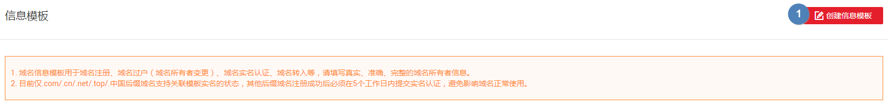
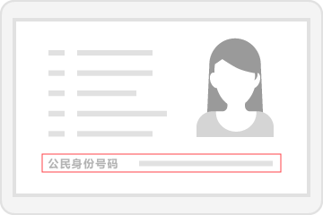
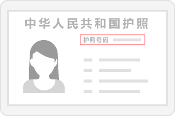

# 创建信息模板（个人用户）

## 操作场景

域名的信息模板定义了域名的用户信息，包括：

-   用户类型：个人用户或者企业用户。
-   域名所有者：域名所有者的姓名或者企业名称。
-   域名联系人及各类联系方式：域名联系人的姓名、电子邮箱、所在地区、通讯地址、联系电话等。

根据工信部域名实名认证的要求，在进行域名注册、域名过户（用户类型及域名所有者变更）、域名实名认证、域名转入等操作时，需要填写域名的用户信息。

本操作可以预先配置域名的用户信息并进行实名认证，这样在进行上述操作时，您可以直接使用已经配置的信息模板设置域名的用户信息。

> **说明：**   
>“.com”、“.cn”、“.net”、“.top”以及“.中国”后缀的域名支持关联模板实名认证状态。  
>如果您注册上述后缀的域名时，选择了已经通过实名认证的信息模板，那么在域名注册成功后无需再次对域名进行实名认证。  

本章节介绍“个人用户”信息模板的创建过程。

## 前提条件

-   已经注册华为云帐号并实名认证。
-   已经确定个人用户的域名所有者信息及相关证件。

## 创建信息模板

1.  登录管理控制台。
2.  选择“域名与网站 \> 域名注册”。

    进入“域名列表”页面。

3.  在左侧树状导航栏中，选择“域名注册 \> 信息模板”。
4.  在页面右上角，单击“创建信息模板”。

    **图 1**  创建域名信息模板  
    

5.  设置“用户类型”为“个人用户”。
6.  根据实际情况填写“基本信息”区域。

    填写说明：

    -   模板中带“\*”的参数不能为空。
    -   域名所有者（中文）：支持输入1\~64个汉字，可包含数字和字母。

        > **说明：**   
        >-   需要与用于实名认证的证件上的“名称”完全一致，否则将会实名认证失败。  
        >-   填写的内容不允许包含空格。  

    -   域名所有者（英文）：可自动填入“域名所有者（中文）”的拼音，最多支持输入64个英文字符。
    -   “传真”：若不填写，在信息模板创建成功后，会自动填入“联系方式”中的电话号码。

    **图 2**  个人用户基本信息  
    

7.  在“身份认证”区域，提交信息模板的实名认证材料。

    1.  选择“证件类型”，证件类型需要与域名所有者相匹配。
    2.  填写对应的“证件号码”。
    3.  单击“”上传实名认证材料。

    实名认证材料需要与域名所有者信息相符，详细说明如[表1](#zh-cn_topic_0193892073_table531201717377)所示。

    **表 1**  实名认证材料示例（个人用户）

    
    <table><thead align="left"><tr id="domain_ug_320002_zh-cn_topic_0216046856_zh-cn_topic_0193892073_row431081783718"><th class="cellrowborder" valign="top" width="12.43124312431243%" id="mcps1.2.5.1.1">
证件类型

    </th>
    <th class="cellrowborder" valign="top" width="14.891489148914891%" id="mcps1.2.5.1.2">
证件号码

    </th>
    <th class="cellrowborder" valign="top" width="39.64396439643964%" id="mcps1.2.5.1.3">
证件示例图样

    </th>
    <th class="cellrowborder" valign="top" width="33.03330333033303%" id="mcps1.2.5.1.4">
实名认证材料要求

    </th>
    </tr>
    </thead>
    <tbody><tr id="domain_ug_320002_zh-cn_topic_0216046856_zh-cn_topic_0193892073_row4311161713718"><td class="cellrowborder" valign="top" width="12.43124312431243%" headers="mcps1.2.5.1.1 ">
身份证

    </td>
    <td class="cellrowborder" valign="top" width="14.891489148914891%" headers="mcps1.2.5.1.2 ">
身份证号码

    </td>
    <td class="cellrowborder" valign="top" width="39.64396439643964%" headers="mcps1.2.5.1.3 ">

    </td>
    <td class="cellrowborder" valign="top" width="33.03330333033303%" headers="mcps1.2.5.1.4 ">
域名所有者身份证人像面扫描件或照片。格式要求为：

    <ul id="domain_ug_320002_zh-cn_topic_0216046856_zh-cn_topic_0193892073_ul2311171717374"><li>清晰、完整的电子版图片（含证件边框）。</li><li>无遮挡、无涂抹。</li><li>图片大小为55KB~1MB。</li><li>图片格式为jpg。</li></ul>
    </td>
    </tr>
    <tr id="domain_ug_320002_zh-cn_topic_0216046856_zh-cn_topic_0193892073_row1931281713377"><td class="cellrowborder" valign="top" width="12.43124312431243%" headers="mcps1.2.5.1.1 ">
护照

    </td>
    <td class="cellrowborder" valign="top" width="14.891489148914891%" headers="mcps1.2.5.1.2 ">
护照号码

    </td>
    <td class="cellrowborder" valign="top" width="39.64396439643964%" headers="mcps1.2.5.1.3 ">

    </td>
    <td class="cellrowborder" valign="top" width="33.03330333033303%" headers="mcps1.2.5.1.4 ">
域名所有者护照个人资料页扫描件或照片。格式要求为：

    <ul id="domain_ug_320002_zh-cn_topic_0216046856_zh-cn_topic_0193892073_ul6312201716371"><li>清晰、完整的电子版图片（含证件边框）。</li><li>无遮挡、无涂抹。</li><li>图片大小为55KB~1MB。</li><li>图片格式为jpg。</li></ul>
    </td>
    </tr>
    </tbody>
    </table>

8.  单击“提交”，完成信息模板的配置。
9.  在左侧树状导航栏中，选择“域名注册 \> 信息模板”。

    在信息模板列表中，可以查看已创建的信息模板。

    此时，信息模板的“认证状态”为“实名认证审核中”。待信息模板的“认证状态”变为“已实名认证”，表示信息模板实名认证审核通过。

    实名认证审核需要3\~5个工作日，请您耐心等待。

## 后续操作

-   [实名认证信息模板](实名认证信息模板.md)
-   [修改信息模板](修改信息模板.md)
-   [删除信息模板](删除信息模板.md)
-   [设置默认信息模板](设置默认信息模板.md)

