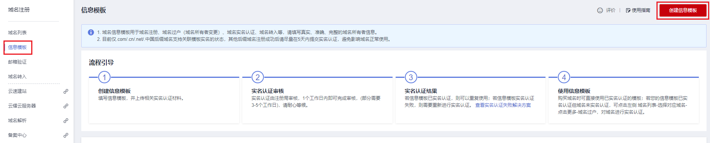
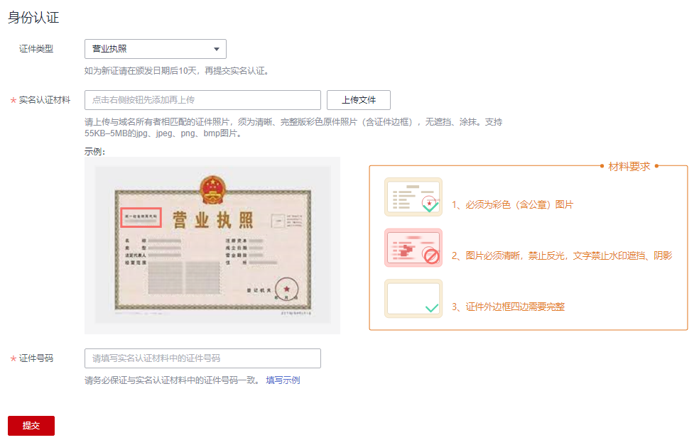

# 创建信息模板（企业用户）

## 操作场景

域名的信息模板定义了域名的用户信息，包括：

-   用户类型：个人用户或者企业用户。
-   域名所有者：域名所有者的姓名或者企业名称。
-   域名联系人及各类联系方式：域名联系人的姓名、电子邮箱、所在地区、通讯地址、联系电话等。

根据工信部域名实名认证的要求，在进行域名注册、域名过户（用户类型及域名所有者变更）、域名实名认证、域名转入等操作时，需要填写域名的用户信息。

本操作可以预先配置域名的用户信息并进行实名认证，这样在进行上述操作时，您可以直接使用已经配置的信息模板设置域名的用户信息。

信息模板的实名认证审核由注册局负责，一般1个工作日内即可完成审核（部分需要3\~5个工作日）。

> **说明：** 
>-   “.com”、“.cn”、“.net”以及“.中国”后缀的域名支持关联模板实名认证状态。
>    如果您注册上述后缀的域名时，选择了已经通过实名认证的信息模板，那么在域名注册成功后无需再次对域名进行实名认证。
>-   如果域名用于部署在中国大陆节点的网站，则还需要进行域名的备案。备案时，要求域名的实名认证信息（域名所有者、证件类型、证件号码）与备案主体信息保持一致。
>    因此，在确认域名实名认证信息时，建议参考域名所属网站的用途及备案主体信息，详细内容请参考[个人备案与单位备案FAQ](https://support.huaweicloud.com/icp_faq/icp_05_0136.html)。

本章节介绍“企业用户”的信息模板的创建过程。

## 前提条件

-   已经注册华为云帐号并实名认证。
-   已经确认企业用户的域名所有者信息及相关证件。

## 创建信息模板

1.  登录[域名注册控制台](https://console.huaweicloud.com/domain/?region=cn-north-4#/domain/list)。

    进入“域名列表”页面。

2.  在左侧树状导航栏中，选择“信息模板”。
3.  在页面右上角，单击“创建信息模板”。

    **图 1**  创建信息模板  
    

4.  设置“用户类型”为“企业用户”。
5.  根据实名认证证件内容填写“基本信息”区域，填写说明如[表1](#table111828581945)所示。

    **图 2**  企业用户基本信息  
    

    > **说明：** 
    >模板中带“\*”的参数不能为空。

    **表 1**  基本信息填写说明

    
    <table><thead align="left"><tr id="row218395813416"><th class="cellrowborder" valign="top" width="50%" id="mcps1.2.3.1.1">
参数

    </th>
    <th class="cellrowborder" valign="top" width="50%" id="mcps1.2.3.1.2">
参数说明

    </th>
    </tr>
    </thead>
    <tbody><tr id="row918314581347"><td class="cellrowborder" valign="top" width="50%" headers="mcps1.2.3.1.1 ">
域名所有者（中文）

    </td>
    <td class="cellrowborder" valign="top" width="50%" headers="mcps1.2.3.1.2 ">
域名所有者的姓名。

    <ul id="ul19929049201411"><li>支持输入4~64个字符，可以包含数字及英文字母。</li><li>可以使用.,、&middot;（）()《》\\-\"“”/'特殊字符。</li><li>必须包含中文，中间不允许输入空格。</li></ul>
    
 说明： 

必须与用于实名认证的证件上的“名称”完全一致，否则将会实名认证失败。

    

    </td>
    </tr>
    <tr id="row5183135814411"><td class="cellrowborder" valign="top" width="50%" headers="mcps1.2.3.1.1 ">
域名所有者（英文）

    </td>
    <td class="cellrowborder" valign="top" width="50%" headers="mcps1.2.3.1.2 "><ul id="ul116681532018"><li>支持输入4~64个字符，可以包含数字及空格。</li><li>可以使用.&middot;,()\\-\"/'特殊字符，但不允许以特殊字符紧跟空格开头。</li><li>填写的内容不允许包含"《》"。</li></ul>
    
 说明： 

若无英文名称，可使用系统自动填入的“域名所有者（中文）”的拼音。自动填充的英文内容如果因超长显示不完整，不影响信息模板的使用和实名认证。

    

    </td>
    </tr>
    <tr id="row18731356850"><td class="cellrowborder" valign="top" width="50%" headers="mcps1.2.3.1.1 ">
联系人（中文）

    </td>
    <td class="cellrowborder" valign="top" width="50%" headers="mcps1.2.3.1.2 "><ul id="ul1345175217218"><li>支持输入1~32个字符，可以包含数字及英文字母。</li><li>可以使用.,、&middot;（）()《》\\-\"“”/'特殊字符。</li><li>必须包含中文，中间不允许输入空格。
 说明： 

建议与实名认证证件上的“法定代表人”保持一致。

    

    </li></ul>
    </td>
    </tr>
    <tr id="row94721141669"><td class="cellrowborder" valign="top" width="50%" headers="mcps1.2.3.1.1 ">
联系人（英文）

    </td>
    <td class="cellrowborder" valign="top" width="50%" headers="mcps1.2.3.1.2 ">
支持输入3~64个字符，可以包含数字及.,&middot;()-'\"/\\特殊字符。
 说明： 

若无英文名称，可使用系统自动填入的“联系人（中文）”的拼音。

    

    

    </td>
    </tr>
    <tr id="row12181229618"><td class="cellrowborder" valign="top" width="50%" headers="mcps1.2.3.1.1 ">
电子邮箱

    </td>
    <td class="cellrowborder" valign="top" width="50%" headers="mcps1.2.3.1.2 ">
必须选择已验证的电子邮箱。可通过单击右侧“添加邮箱验证”进行验证，详细操作请参考<a href="https://support.huaweicloud.com/usermanual-domain/domain_ug_340008.html" target="_blank" rel="noopener noreferrer">邮箱验证</a>。

    </td>
    </tr>
    <tr id="row4414427613"><td class="cellrowborder" valign="top" width="50%" headers="mcps1.2.3.1.1 ">
地区

    </td>
    <td class="cellrowborder" valign="top" width="50%" headers="mcps1.2.3.1.2 ">
根据所在地区进行选择。

    </td>
    </tr>
    <tr id="row63108441269"><td class="cellrowborder" valign="top" width="50%" headers="mcps1.2.3.1.1 ">
通讯地址（中文）

    </td>
    <td class="cellrowborder" valign="top" width="50%" headers="mcps1.2.3.1.2 ">
支持输入4~64个中文，由中文开头，可包括英文字母和数字，建议与实名认证证件上的地址保持一致。

    </td>
    </tr>
    <tr id="row718316581842"><td class="cellrowborder" valign="top" width="50%" headers="mcps1.2.3.1.1 ">
通讯地址（英文）

    </td>
    <td class="cellrowborder" valign="top" width="50%" headers="mcps1.2.3.1.2 ">
支持输入4~64个字符，由英文字母开头，可包括数字、点（.）、连字符（-）、逗号（,）以及空格。

    
 说明： 
<ul id="ul16381229192116"><li>若无英文地址，可使用系统自动填入的“通讯地址（中文）”的拼音。</li><li>若英文地址长度超过64个字符，则可将英文字符删除到限值以内，不会影响实名认证。</li></ul>
    

    </td>
    </tr>
    <tr id="row197305411274"><td class="cellrowborder" valign="top" width="50%" headers="mcps1.2.3.1.1 ">
邮编

    </td>
    <td class="cellrowborder" valign="top" width="50%" headers="mcps1.2.3.1.2 ">
通讯地址所在地的邮政编码。

    </td>
    </tr>
    <tr id="row1928813441873"><td class="cellrowborder" valign="top" width="50%" headers="mcps1.2.3.1.1 ">
联系方式

    </td>
    <td class="cellrowborder" valign="top" width="50%" headers="mcps1.2.3.1.2 ">
支持输入固定电话和手机号码。

    </td>
    </tr>
    </tbody>
    </table>

6.  在“身份认证”区域，提交信息模板的实名认证材料。

    **图 3**  身份认证（企业用户）  
    

    1.  选择“证件类型”，证件类型需要与域名所有者相匹配。
    2.  单击“上传文件”，上传实名认证材料。
    3.  填写对应的“证件号码”。

    实名认证材料需要与域名所有者信息相符，详细说明请参考[域名实名认证填写示例（企业用户）](域名实名认证填写示例（企业用户）.md)。

7.  单击“提交”，完成信息模板的配置。
8.  在左侧树状导航栏中，选择“信息模板”。

    在信息模板列表中，可以查看已创建的信息模板。

    此时，信息模板的“认证状态”为“实名认证审核中”。待信息模板的“认证状态”变为“已实名认证”，表示信息模板实名认证审核通过。

    实名认证一般1个工作日内即可完成审核（部分需要3\~5个工作日），请您耐心等待。

## 后续操作

-   [注册单个域名操作指导](注册单个域名操作指导.md)
-   [批量注册域名操作指导](批量注册域名操作指导.md)
-   [修改信息模板](修改信息模板.md)
-   [删除信息模板](删除信息模板.md)
-   [设置默认信息模板](设置默认信息模板.md)

