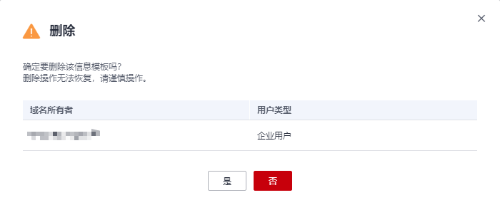

# 删除信息模板

## 操作场景

当不再使用某个信息模板时，可以删除信息模板。

> **说明：** 
>-   删除操作无法恢复，请谨慎操作。
>-   已被设为默认信息模板的模板，无法删除。
>-   信息模板的“认证状态”不影响删除信息模板操作。

## 操作步骤

1.  登录[域名注册控制台](https://console.huaweicloud.com/domain/?region=cn-north-4#/domain/list)。

    进入“域名列表”页面。

2.  在左侧树状导航栏中，选择“信息模板”。

1.  在信息模板列表中，找到待删除的信息模板，单击“操作”列的“删除”。

    **图 1**  删除信息模板  
    

2.  单击“是”，完成信息模板的删除。

