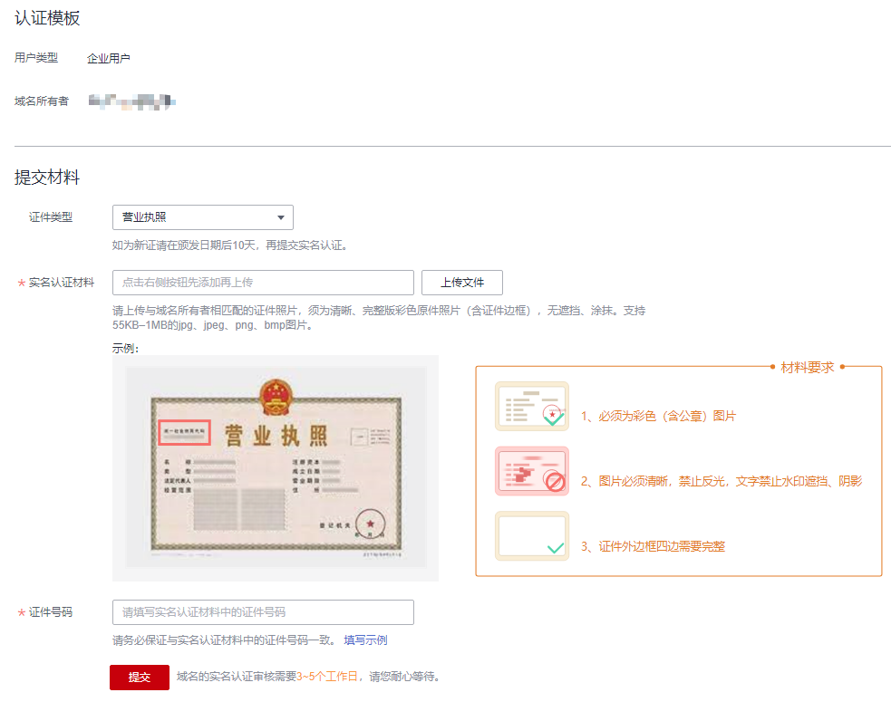

# 域名实名认证

## 操作场景

新注册的域名在购买成功后5天内均需进行实名认证。若您的域名在规定时间内未通过实名认证审核，注册局将暂停域名解析，域名将无法被正常访问。

域名实名认证可以选择以“个人用户”或者“企业用户”两种用户类型进行认证。用户类型的选择，取决于提交的实名认证材料类型，不影响域名的使用。

不用用户类型实名认证的详细内容，请参见[域名实名认证材料（个人用户）](域名实名认证材料（个人用户）.md)或者[域名实名认证材料（企业用户）](域名实名认证材料（企业用户）.md)。

> **说明：**   
>-   域名实名认证的审核主体为“注册局”，为保证域名的正常使用，请在购买域名后尽快提交实名认证审核。  
>-   域名实名认证审核周期为3\~5个工作日，实名认证审核通过后1\~2个工作日方可恢复正常使用。  
>-   实名认证不支持通过华为云APP操作。  

域名注册完成后，如果域名的“服务状态”为如下情况，则您可以通过本操作对域名进行实名认证：

-   未实名认证：域名还未进行实名认证
-   实名认证失败：域名实名认证审核不通过

    如果实名认证失败，您可以参考[域名实名认证失败如何处理？](https://support.huaweicloud.com/domain_faq/domain_faq_0001.html)排查失败原因及修改实名认证资料后再次提交实名认证审核。

本章节以“个人用户”为例，介绍域名实名认证的操作过程。

## 前提条件

-   已经注册华为云帐号并实名认证。
-   已经完成[注册域名](注册域名.md)。
-   已经完成实名认证材料的准备，详细内容请参见[域名实名认证材料（个人用户）](域名实名认证材料（个人用户）.md)或者[域名实名认证材料（企业用户）](域名实名认证材料（企业用户）.md)。

## 操作步骤

1.  登录管理控制台。
2.  选择“域名与网站 \> 域名注册”。

    进入“域名列表”页面。

3.  在“域名列表”页面中，找到待实名认证的域名，并单击“服务状态”列的“未实名认证”。

    进入“实名认证”页面。

4.  在“实名认证”页面的“提交材料”区域，填写并提交实名认证材料。

    **图 1**  提交实名认证材料  
    

    1.  选择“证件类型”，证件类型需要与域名所有者相匹配。
    2.  填写对应的“证件号码”。
    3.  单击“”上传实名认证材料。

    实名认证材料需要与域名所有者信息相符，更多详细说明请参见[表1](域名实名认证材料（个人用户）.md#table114459328395)。

    > **说明：**   
    >如果域名所有者为企业或者组织，请参考[域名实名认证材料（企业用户）](域名实名认证材料（企业用户）.md)提交对应的实名认证材料。  

5.  单击“提交”，完成实名认证材料的提交。
6.  在左侧树状导航栏中，选择“域名注册 \> 域名列表”。

    在域名列表中，域名“服务状态”为“实名认证审核中”，表示域名的实名认证材料提交成功。待域名“服务状态”变为“已实名认证”，表示域名实名认证审核通过。

    域名实名认证审核需要3\~5个工作日，请您耐心等待。在此期间，不支持修改已提交的实名认证材料。

