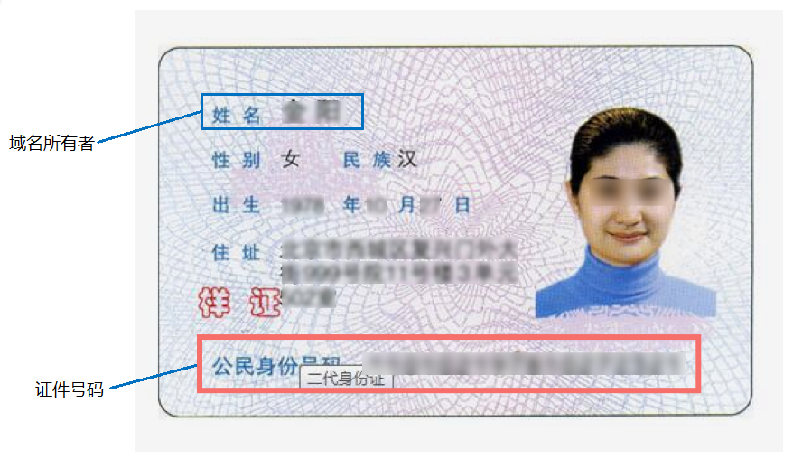
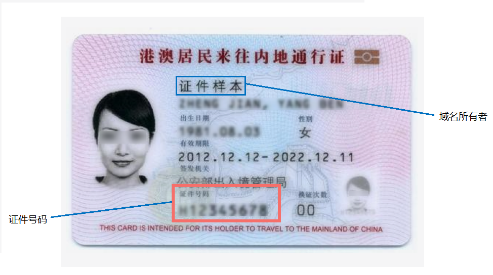
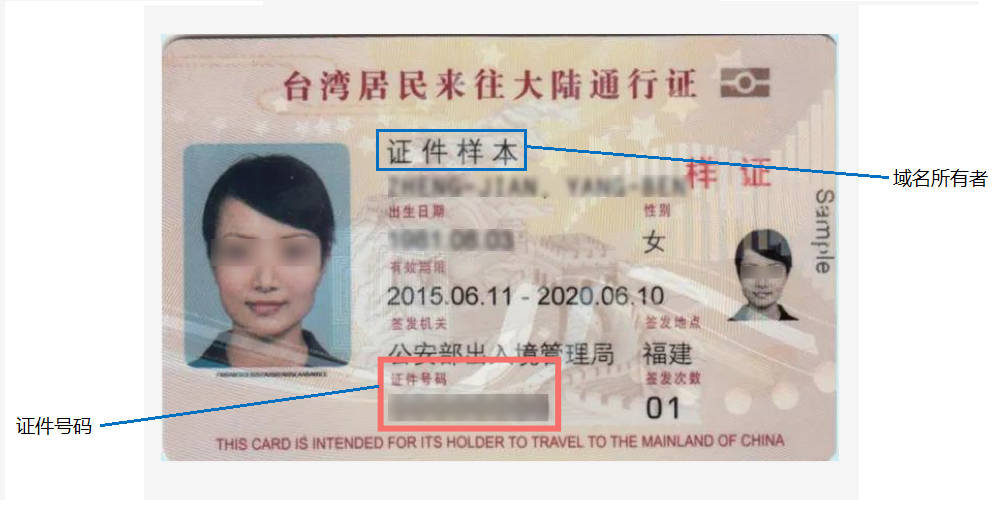
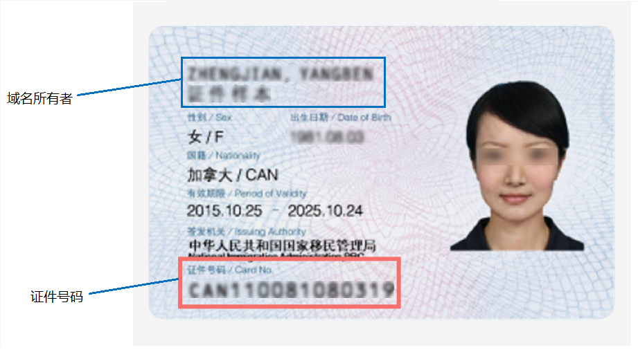

# 域名实名认证填写示例（个人用户）

为了帮助您成功完成域名实名认证的上传和审核，本文介绍当域名所有者为“个人用户”时，实名认证的“域名所有者”、“证件类型”以及“证件号码”如何填写。

当域名所有者为个人时，您可以使用个人有效身份证件进行域名实名认证，不同类型的用户可使用的证件类型如[表1](#table18418185613217)所示。

**表 1**  个人用户支持的域名实名认证证件类型

<table><thead align="left"><tr id="row6418456143215"><th class="cellrowborder" valign="top" width="49.9%" id="mcps1.2.3.1.1">
证件类型

</th>
<th class="cellrowborder" valign="top" width="50.1%" id="mcps1.2.3.1.2">
适用场景

</th>
</tr>
</thead>
<tbody><tr id="row141945653213"><td class="cellrowborder" valign="top" width="49.9%" headers="mcps1.2.3.1.1 ">
<a href="#section18581525115711">身份证</a>

</td>
<td class="cellrowborder" valign="top" width="50.1%" headers="mcps1.2.3.1.2 ">
中国大陆用户

</td>
</tr>
<tr id="row1141915565329"><td class="cellrowborder" valign="top" width="49.9%" headers="mcps1.2.3.1.1 ">
<a href="#section103722513579">港澳居民来往内地通行证</a>

</td>
<td class="cellrowborder" valign="top" width="50.1%" headers="mcps1.2.3.1.2 ">
中国香港或中国澳门用户

</td>
</tr>
<tr id="row641915612324"><td class="cellrowborder" valign="top" width="49.9%" headers="mcps1.2.3.1.1 ">
<a href="#section1211635319574">台湾居民来往大陆通行证</a>

</td>
<td class="cellrowborder" valign="top" width="50.1%" headers="mcps1.2.3.1.2 ">
中国台湾用户

</td>
</tr>
<tr id="row1952914915013"><td class="cellrowborder" valign="top" width="49.9%" headers="mcps1.2.3.1.1 ">
<a href="#section559913547573">护照</a>

</td>
<td class="cellrowborder" valign="top" width="50.1%" headers="mcps1.2.3.1.2 ">
非中国国籍用户

</td>
</tr>
<tr id="row1361714210117"><td class="cellrowborder" valign="top" width="49.9%" headers="mcps1.2.3.1.1 ">
<a href="#section18713175411583">外国人永久居留身份证</a>

</td>
<td class="cellrowborder" valign="top" width="50.1%" headers="mcps1.2.3.1.2 ">
拥有永久居留身份的非中国国籍用户

</td>
</tr>
</tbody>
</table>

> **说明：** 
>如何选择用于域名实名认证的证件、上传的实名认证材料的详细要求，请参考[域名实名认证填写规范](域名实名认证填写规范.md)。

## 证件类型：身份证

-   域名所有者：证件中的“姓名”
-   证件号码：证件中的“公民身份号码”

**图 1**  实名认证材料示例-身份证  

## 证件类型：港澳居民来往内地通行证

-   域名所有者：证件中的“姓名”
-   证件号码：证件中的“证件号码”

**图 2**  实名认证材料示例-港澳居民来往内地通行证  

## 证件类型：台湾居民来往大陆通行证

-   域名所有者：证件中的“姓名”
-   证件号码：证件中的“证件号码”

**图 3**  实名认证材料示例-台湾居民来往大陆通行证  

## 证件类型：护照

-   域名所有者：证件中的“姓名”
-   证件号码：证件中的“证件号码”

**图 4**  实名认证材料示例-护照  

## 证件类型：外国人永久居留身份证

-   域名所有者：证件中的“姓名”
-   证件号码：证件中的“证件号码”

**图 5**  实名认证材料示例-外国人永久居留身份证  

