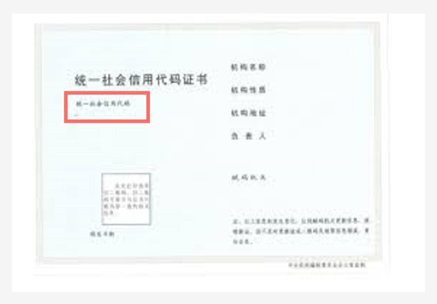
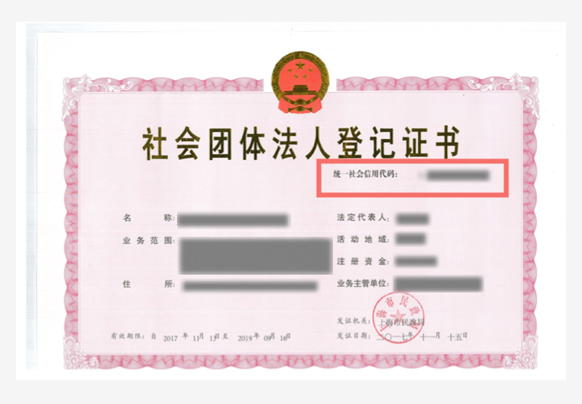

# 域名实名认证填写示例（企业用户）

为了帮助你成功完成域名实名认证的上传和审核，本文介绍当域名所有者为“企业用户”时，实名认证的“域名所有者”、“证件类型”以及“证件号码”如何填写。

> **说明：** 
>-   域名实名认证的操作指导，请参考[域名实名认证操作指导（新注册域名）](域名实名认证操作指导（新注册域名）.md)
>-   如果域名实名认证失败，请参考[域名实名认证失败如何处理？](https://support.huaweicloud.com/domain_faq/domain_faq_040304.html)

当域名所有者为企业或组织时，您可以使用企业或组织的有效证件进行域名实名认证，不同类型的企业或组织可使用的证件类型如[表1](#table068910194446)所示。

**表 1**  企业用户支持的域名实名认证证件类型

<table><thead align="left"><tr id="row068971910447"><th class="cellrowborder" valign="top" width="50%" id="mcps1.2.3.1.1">
企业或组织地域

</th>
<th class="cellrowborder" valign="top" width="50%" id="mcps1.2.3.1.2">
可选择证件类型

</th>
</tr>
</thead>
<tbody><tr id="row13690119174410"><td class="cellrowborder" rowspan="14" valign="top" width="50%" headers="mcps1.2.3.1.1 ">
中国大陆

</td>
<td class="cellrowborder" valign="top" width="50%" headers="mcps1.2.3.1.2 ">
<a href="#section18581525115711">营业执照</a>

</td>
</tr>
<tr id="row4690131944412"><td class="cellrowborder" valign="top" headers="mcps1.2.3.1.1 ">
<a href="#section137215421416">统一社会信用代码证书</a>

</td>
</tr>
<tr id="row106901419164412"><td class="cellrowborder" valign="top" headers="mcps1.2.3.1.1 ">
<a href="#section564753010116">组织机构代码证</a>

</td>
</tr>
<tr id="row12691161944420"><td class="cellrowborder" valign="top" headers="mcps1.2.3.1.1 ">
<a href="#section1305203419174">基金会法人登记证</a>

</td>
</tr>
<tr id="row11691019184417"><td class="cellrowborder" valign="top" headers="mcps1.2.3.1.1 ">
<a href="#section1332315182016">军队单位对外有偿服务许可证</a>

</td>
</tr>
<tr id="row11691141914417"><td class="cellrowborder" valign="top" headers="mcps1.2.3.1.1 ">
<a href="#section1850163716235">律师事务所执业许可证</a>

</td>
</tr>
<tr id="row14691419194412"><td class="cellrowborder" valign="top" headers="mcps1.2.3.1.1 ">
<a href="#section162120112717">民办非企业单位登记证书</a>

</td>
</tr>
<tr id="row17691181954420"><td class="cellrowborder" valign="top" headers="mcps1.2.3.1.1 ">
<a href="#section168241627193311">民办学校办学许可证</a>

</td>
</tr>
<tr id="row11691101912443"><td class="cellrowborder" valign="top" headers="mcps1.2.3.1.1 ">
<a href="#section6378201933615">社会团体法人登记证书</a>

</td>
</tr>
<tr id="row19692719164413"><td class="cellrowborder" valign="top" headers="mcps1.2.3.1.1 ">
<a href="#section782014361382">事业单位法人证书</a>

</td>
</tr>
<tr id="row5692171934412"><td class="cellrowborder" valign="top" headers="mcps1.2.3.1.1 ">
<a href="#section183662515414">司法鉴定许可证</a>

</td>
</tr>
<tr id="row469281964418"><td class="cellrowborder" valign="top" headers="mcps1.2.3.1.1 ">
<a href="#section112021655164316">医疗机构执业许可证</a>

</td>
</tr>
<tr id="row16692181911449"><td class="cellrowborder" valign="top" headers="mcps1.2.3.1.1 ">
<a href="#section13585104434712">宗教活动场所登记证</a>

</td>
</tr>
<tr id="row1669215198443"><td class="cellrowborder" valign="top" headers="mcps1.2.3.1.1 ">
<a href="#section194519513515">社会服务机构登记证书</a>

</td>
</tr>
<tr id="row176922019204411"><td class="cellrowborder" rowspan="3" valign="top" width="50%" headers="mcps1.2.3.1.1 ">
非中国大陆

</td>
<td class="cellrowborder" valign="top" width="50%" headers="mcps1.2.3.1.2 ">
<a href="#section888713695711">外国（地区）企业常驻代表机构登记证</a>

</td>
</tr>
<tr id="row6692111919449"><td class="cellrowborder" valign="top" headers="mcps1.2.3.1.1 ">
<a href="#section1693017521423">外国在华文化中心登记证</a>

</td>
</tr>
<tr id="row269215192445"><td class="cellrowborder" valign="top" headers="mcps1.2.3.1.1 ">
<a href="#section142296212519">外国政府旅游部门常驻代表机构批准登记表</a>

</td>
</tr>
</tbody>
</table>

> **说明：** 
>如何选择用于域名实名认证的证件、上传的实名认证材料的详细要求，请参考[域名实名认证填写规范](域名实名认证填写规范.md)。

## 证件类型：营业执照

-   域名所有者：证件中的“名称”
-   证件号码：证件中的“统一社会信用代码”

**图 1**  实名认证材料示例-营业执照  

## 证件类型：统一社会信用代码证书

-   域名所有者：证件中的“机构名称”
-   证件号码：证件中的“统一社会信用代码”

**图 2**  实名认证材料示例-统一社会信用代码证书  

## 证件类型：组织机构代码证

-   域名所有者：证件中的“机构名称”
-   证件号码：证件中的“代码”

**图 3**  实名认证材料示例-组织机构代码证  

## 证件类型：基金会法人登记证

-   域名所有者：证件中的“名称”
-   证件号码：证件中的“统一社会信用代码”

**图 4**  实名认证材料示例-基金会法人登记证  

## 证件类型：军队单位对外有偿服务许可证

-   域名所有者：证件中的“单位名称”
-   证件号码：证件中的“编号”

**图 5**  实名认证材料示例-军队单位对外有偿服务许可证  

## 证件类型：律师事务所执业许可证

-   域名所有者：证件中的“律师事务所名称”
-   证件号码：证件中的“证号”

**图 6**  实名认证材料示例-律师事务所执业许可证  

## 证件类型：民办非企业单位登记证书

-   域名所有者：证件中的“名称”
-   证件号码：证件中的“统一社会信用代码”

**图 7**  实名认证材料示例-民办非企业单位登记证书  

## 证件类型：民办学校办学许可证

-   域名所有者：证件中的“名称”
-   证件号码：证件中的“教民号”

**图 8**  实名认证材料示例-民办学校办学许可证  

## 证件类型：社会团体法人登记证书

-   域名所有者：证件中的“名称”
-   证件号码：证件中的“统一社会信用代码”

**图 9**  实名认证材料示例-社会团体法人登记证书  

## 证件类型：事业单位法人证书

-   域名所有者：证件中的“名称”
-   证件号码：证件中的“统一社会信用代码”

**图 10**  实名认证材料示例-事业单位法人证书  

## 证件类型：司法鉴定许可证

-   域名所有者：证件中的“机构名称”
-   证件号码：证件中的“社会信用代码”

**图 11**  实名认证材料示例-司法鉴定许可证  

## 证件类型：医疗机构执业许可证

-   域名所有者：证件中的“机构名称”
-   证件号码：证件中的“登记号”

**图 12**  实名认证材料示例-医疗机构执业许可证  

## 证件类型：宗教活动场所登记证

-   域名所有者：证件中的“名称”
-   证件号码：证件中的“宗教证（XX）号”

**图 13**  实名认证材料示例-宗教活动场所登记证  

## 证件类型：社会服务机构登记证书

-   域名所有者：证件中的“名称”
-   证件号码：证件中的“统一社会信用代码”

**图 14**  实名认证材料示例-社会服务机构登记证书  

## 证件类型：外国（地区）企业常驻代表机构登记证

-   域名所有者：证件中的“代表机构名称（中文）”
-   证件号码：证件中的“统一社会信用代码”

**图 15**  实名认证材料示例-外国（地区）企业常驻代表机构登记证  

## 证件类型：外国在华文化中心登记证

-   域名所有者：证件中的“机构名称”
-   证件号码：证件中的“统一社会信用代码”

**图 16**  实名认证材料示例-外国在华文化中心登记证  

## 证件类型：外国政府旅游部门常驻代表机构批准登记表

-   域名所有者：证件中的“机构名称”
-   证件号码：证件中的“统一社会信用代码”

**图 17**  实名认证材料示例-外国政府旅游部门常驻代表机构批准登记表  

