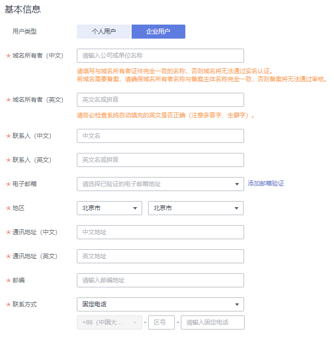

# 域名实名认证操作指导（促销购买域名）

## 操作场景

如果您是通过华为云的优惠促销活动购买的域名，则在购买过程中无法创建域名的信息模板，购买完成后，域名的“服务状态”为“未实名认证”。

此时，域名的详细信息如[图1](#fig1755316215115)所示。

**图 1**  域名详情（促销活动购买的域名）  

无法对当前所使用的信息模板进行实名认证，若直接提交实名认证会提示如[图2](#fig1761823201010)所示内容。

**图 2**  提示信息  

在此场景中，如果要完成域名实名认证，需要重新创建域名的信息模板，待信息模板实名认证通过后，再将域名过户到该信息模板上。

其中，创建信息模板并实名认证大约需要3\~5个工作日，域名过户大约需要1\~3个工作日。

本章节针对上述场景以“企业用户”为例，介绍域名实名认证的操作过程。

> **说明：** 
>如果域名所有者为个人，请参考[域名实名认证填写示例（个人用户）](域名实名认证填写示例（个人用户）.md)提交对应的实名认证材料。

## 操作步骤

1.  创建信息模板
    1.  登录[管理控制台](https://auth.huaweicloud.com/authui/login.html?locale=zh-cn#/login)。
    2.  选择“域名与网站 \> 域名注册”。

        进入“域名列表”页面。

    3.  在左侧树状导航栏中，选择“域名注册 \> 信息模板”。
    4.  在页面右上角，单击“创建信息模板”。
    5.  设置“用户类型”为“企业用户”。
    6.  根据实名认证证件内容填写“基本信息”区域。

        填写说明：

        -   模板中带“\*”的参数不能为空。
        -   “域名所有者（中文）”：支持输入1\~64个汉字，可包含数字和字母。

            > **说明：** 
            >-   必须与用于实名认证的证件上的“名称”完全一致，否则将会实名认证失败。
            >-   填写的内容不允许包含空格。

        -   “域名所有者（英文）”：支持输入1\~64个字符。

            若无英文名称，可使用系统自动填入的“域名所有者（中文）”的拼音。

            > **说明：** 
            >自动填充的英文内容如果因超长显示不完整，不影响信息模板的使用和实名认证。

        -   “联系人（中文）”：支持输入1\~32个字符，建议与实名认证证件上的“法定代表人”保持一致。
        -   “联系人（英文）”：支持输入1\~64个字符。

            若无英文名称，可使用系统自动填入的“联系人（中文）”的拼音。

        -   “通讯地址（中文）”：支持输入1\~64个汉字，由汉字开头，可包括英文字母和数字，建议与实名认证证件上的地址保持一致。
        -   “通讯地址（英文）”：支持输入1\~64个字符，由英文字母开头，可包括数字、点（.）、连字符（-）、逗号（,）以及空格。

            若无英文地址，可使用系统自动填入的“通讯地址（中文）”的拼音。

        -   “传真”：若不填写，在信息模板创建成功后，会自动填入“联系方式”中的电话号码。

        **图 3**  企业用户基本信息  
        

    7.  在“身份认证”区域，提交信息模板的实名认证材料。

        1.  选择“证件类型”，证件类型需要与域名所有者相匹配。
        2.  填写对应的“证件号码”。
        3.  单击“”上传实名认证材料。

        实名认证材料需要与域名所有者信息相符，详细说明请参考[域名实名认证填写示例（企业用户）](域名实名认证填写示例（企业用户）.md)。

    8.  单击“提交”，完成信息模板的配置。
    9.  在左侧树状导航栏中，选择“域名注册 \> 信息模板”。

        在信息模板列表中，可以查看已创建的信息模板。

        此时，信息模板的“认证状态”为“实名认证审核中”。待信息模板的“认证状态”变为“已实名认证”，表示信息模板实名认证审核通过。

        实名认证审核需要3\~5个工作日，请您耐心等待。

2.  域名过户
    1.  登录[管理控制台](https://auth.huaweicloud.com/authui/login.html?locale=zh-cn#/login)。
    2.  选择“域名与网站 \> 域名注册”。

        进入“域名列表”页面。

    1.  在“域名列表”中，单击待过户域名“操作”列的“更多”。

        **图 4**  选择域名过户  
        

    2.  选择“域名过户”，进入“身份认证”环节。
    3.  根据界面提示完成身份认证。

        **图 5**  身份认证  
        

        支持“手机验证”方式，该“联系电话”与登录管理控制台的帐号关联，若无法接收验证码，可以单击“修改手机号码”进行修改。

    4.  单击“下一步”，进入“填写信息”环节。
    5.  在“可使用的模板信息”列表中，选择要过户的信息模板。

        **图 6**  勾选待过户的信息模板  
        

        选择了过户的信息模板之后，可以在页面下方区域查看信息模板的详情。

    6.  单击“下一步”，提交域名过户申请。

        **图 7**  查看域名过户状态  
        

        您可以在域名列表的“服务状态”栏查看域名过户的进程。

        -   过户成功：域名过户已经完成。

            此时，域名已经通过实名认证，无需再次提交域名实名认证。

        -   过户资料审核中：域名过户申请等待注册局审核，大约需要1\~3个工作日。

            > **说明：** 
            >当域名的“服务状态”为“过户资料审核中”时，不支持对域名进行以下操作：
            >-   域名转入/转出
            >-   域名过户
            >-   域名账号间转移
            >-   域名实名认证
            >-   修改域名信息
            >如需操作，需要等待域名过户审核结束。

