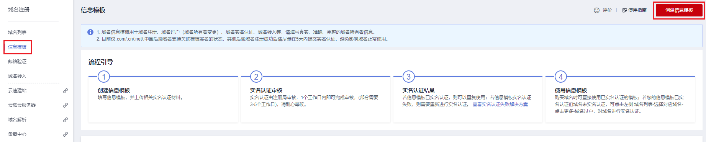
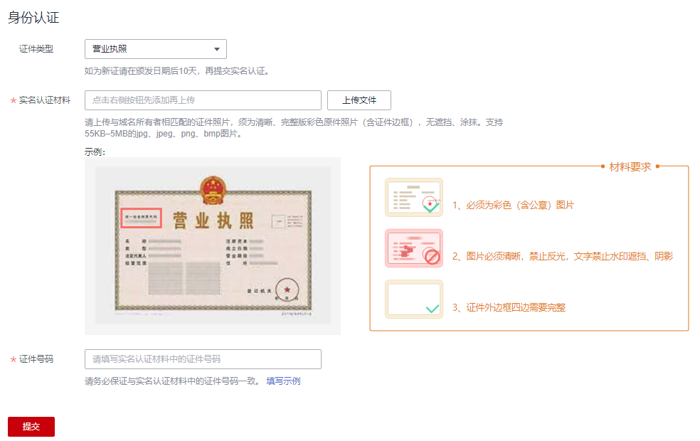
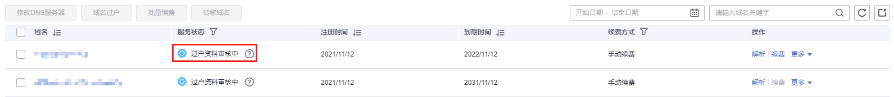

# 域名实名认证操作指导（促销购买域名）

## 操作场景

如果您是通过华为云的优惠促销活动购买的域名，则在购买过程中无法创建域名的信息模板，购买完成后，域名的“服务状态”为“未实名认证”。

此时，域名的详细信息如[图1](#fig1755316215115)所示。

**图 1**  域名详情（促销活动购买的域名）  

无法对当前所使用的信息模板进行实名认证，若直接提交实名认证会提示如[图2](#fig1761823201010)所示内容。

**图 2**  提示信息  

在此场景中，如果要完成域名实名认证，需要重新创建域名的信息模板，待信息模板实名认证通过后，再将域名过户到该信息模板上。

其中，创建信息模板并实名认证一般1个工作日内即可完成审核（部分需要3\~5个工作日），域名过户大约需要1\~3个工作日。

本章节针对上述场景以“企业用户”为例，介绍域名实名认证的操作过程。

> **说明：** 
>如果域名所有者为个人，请参考[域名实名认证填写示例（个人用户）](域名实名认证填写示例（个人用户）.md)提交对应的实名认证材料。

## 操作步骤

1.  创建信息模板
    1.  登录[域名注册控制台](https://console.huaweicloud.com/domain/?region=cn-north-4#/domain/list)。

        进入“域名列表”页面。

    2.  在左侧树状导航栏中，选择“信息模板”。
    3.  在页面右上角，单击“创建信息模板”。

        **图 3**  创建信息模板  
        

    4.  设置“用户类型”为“企业用户”。
    5.  根据实名认证证件内容填写“基本信息”区域，填写说明如[表1](#domain_ug_340003_table111828581945)所示。

        **图 4**  企业用户基本信息  
        

        > **说明：** 
        >模板中带“\*”的参数不能为空。

        **表 1**  基本信息填写说明

        
        <table><thead align="left"><tr id="domain_ug_340003_row218395813416"><th class="cellrowborder" valign="top" width="50%" id="mcps1.2.3.1.1">
参数

        </th>
        <th class="cellrowborder" valign="top" width="50%" id="mcps1.2.3.1.2">
参数说明

        </th>
        </tr>
        </thead>
        <tbody><tr id="domain_ug_340003_row918314581347"><td class="cellrowborder" valign="top" width="50%" headers="mcps1.2.3.1.1 ">
域名所有者（中文）

        </td>
        <td class="cellrowborder" valign="top" width="50%" headers="mcps1.2.3.1.2 ">
域名所有者的姓名。

        <ul id="domain_ug_340003_ul19929049201411"><li>支持输入4~64个字符，可以包含数字及英文字母。</li><li>可以使用.,、&middot;（）()《》\\-\"“”/'特殊字符。</li><li>必须包含中文，中间不允许输入空格。</li></ul>
        
 说明： 

必须与用于实名认证的证件上的“名称”完全一致，否则将会实名认证失败。

        

        </td>
        </tr>
        <tr id="domain_ug_340003_row5183135814411"><td class="cellrowborder" valign="top" width="50%" headers="mcps1.2.3.1.1 ">
域名所有者（英文）

        </td>
        <td class="cellrowborder" valign="top" width="50%" headers="mcps1.2.3.1.2 "><ul id="domain_ug_340003_ul116681532018"><li>支持输入4~64个字符，可以包含数字及空格。</li><li>可以使用.&middot;,()\\-\"/'特殊字符，但不允许以特殊字符紧跟空格开头。</li><li>填写的内容不允许包含"《》"。</li></ul>
        
 说明： 

若无英文名称，可使用系统自动填入的“域名所有者（中文）”的拼音。自动填充的英文内容如果因超长显示不完整，不影响信息模板的使用和实名认证。

        

        </td>
        </tr>
        <tr id="domain_ug_340003_row18731356850"><td class="cellrowborder" valign="top" width="50%" headers="mcps1.2.3.1.1 ">
联系人（中文）

        </td>
        <td class="cellrowborder" valign="top" width="50%" headers="mcps1.2.3.1.2 "><ul id="domain_ug_340003_ul1345175217218"><li>支持输入1~32个字符，可以包含数字及英文字母。</li><li>可以使用.,、&middot;（）()《》\\-\"“”/'特殊字符。</li><li>必须包含中文，中间不允许输入空格。
 说明： 

建议与实名认证证件上的“法定代表人”保持一致。

        

        </li></ul>
        </td>
        </tr>
        <tr id="domain_ug_340003_row94721141669"><td class="cellrowborder" valign="top" width="50%" headers="mcps1.2.3.1.1 ">
联系人（英文）

        </td>
        <td class="cellrowborder" valign="top" width="50%" headers="mcps1.2.3.1.2 ">
支持输入3~64个字符，可以包含数字及.,&middot;()-'\"/\\特殊字符。
 说明： 

若无英文名称，可使用系统自动填入的“联系人（中文）”的拼音。

        

        

        </td>
        </tr>
        <tr id="domain_ug_340003_row12181229618"><td class="cellrowborder" valign="top" width="50%" headers="mcps1.2.3.1.1 ">
电子邮箱

        </td>
        <td class="cellrowborder" valign="top" width="50%" headers="mcps1.2.3.1.2 ">
必须选择已验证的电子邮箱。可通过单击右侧“添加邮箱验证”进行验证，详细操作请参考<a href="https://support.huaweicloud.com/usermanual-domain/domain_ug_340008.html" target="_blank" rel="noopener noreferrer">邮箱验证</a>。

        </td>
        </tr>
        <tr id="domain_ug_340003_row4414427613"><td class="cellrowborder" valign="top" width="50%" headers="mcps1.2.3.1.1 ">
地区

        </td>
        <td class="cellrowborder" valign="top" width="50%" headers="mcps1.2.3.1.2 ">
根据所在地区进行选择。

        </td>
        </tr>
        <tr id="domain_ug_340003_row63108441269"><td class="cellrowborder" valign="top" width="50%" headers="mcps1.2.3.1.1 ">
通讯地址（中文）

        </td>
        <td class="cellrowborder" valign="top" width="50%" headers="mcps1.2.3.1.2 ">
支持输入4~64个中文，由中文开头，可包括英文字母和数字，建议与实名认证证件上的地址保持一致。

        </td>
        </tr>
        <tr id="domain_ug_340003_row718316581842"><td class="cellrowborder" valign="top" width="50%" headers="mcps1.2.3.1.1 ">
通讯地址（英文）

        </td>
        <td class="cellrowborder" valign="top" width="50%" headers="mcps1.2.3.1.2 ">
支持输入4~64个字符，由英文字母开头，可包括数字、点（.）、连字符（-）、逗号（,）以及空格。

        
 说明： 
<ul id="domain_ug_340003_ul16381229192116"><li>若无英文地址，可使用系统自动填入的“通讯地址（中文）”的拼音。</li><li>若英文地址长度超过64个字符，则可将英文字符删除到限值以内，不会影响实名认证。</li></ul>
        

        </td>
        </tr>
        <tr id="domain_ug_340003_row197305411274"><td class="cellrowborder" valign="top" width="50%" headers="mcps1.2.3.1.1 ">
邮编

        </td>
        <td class="cellrowborder" valign="top" width="50%" headers="mcps1.2.3.1.2 ">
通讯地址所在地的邮政编码。

        </td>
        </tr>
        <tr id="domain_ug_340003_row1928813441873"><td class="cellrowborder" valign="top" width="50%" headers="mcps1.2.3.1.1 ">
联系方式

        </td>
        <td class="cellrowborder" valign="top" width="50%" headers="mcps1.2.3.1.2 ">
支持输入固定电话和手机号码。

        </td>
        </tr>
        </tbody>
        </table>

    6.  在“身份认证”区域，提交信息模板的实名认证材料。

        **图 5**  身份认证（企业用户）  
        

        1.  选择“证件类型”，证件类型需要与域名所有者相匹配。
        2.  单击“上传文件”，上传实名认证材料。
        3.  填写对应的“证件号码”。

        实名认证材料需要与域名所有者信息相符，详细说明请参考[域名实名认证填写示例（企业用户）](域名实名认证填写示例（企业用户）.md)。

    7.  单击“提交”，完成信息模板的配置。
    8.  在左侧树状导航栏中，选择“信息模板”。

        在信息模板列表中，可以查看已创建的信息模板。

        此时，信息模板的“认证状态”为“实名认证审核中”。待信息模板的“认证状态”变为“已实名认证”，表示信息模板实名认证审核通过。

        实名认证一般1个工作日内即可完成审核（部分需要3\~5个工作日），请您耐心等待。

2.  域名过户
    1.  登录[域名注册控制台](https://console.huaweicloud.com/domain/?region=cn-north-4#/domain/list)。

        进入“域名列表”页面。

    1.  在“域名列表”中，单击待过户域名（个人用户A/企业用户A所拥有的域名）“操作”列的“更多”。

        **图 6**  选择域名过户  
        

    2.  选择“域名过户”，进入“身份认证”环节。
    3.  根据界面提示完成身份认证。

        **图 7**  身份认证  
        

        支持“手机验证”方式，该“联系电话”与登录管理控制台的帐号关联，若无法接收验证码，可以单击“修改手机号码”进行修改。

    4.  单击“下一步”，进入“填写信息”环节。
    5.  在“可使用的模板信息”列表中，选择要过户的信息模板（域名所有者为个人用户B/企业用户B的信息模板）。

        **图 8**  勾选待过户的信息模板  
        

        选择了过户的信息模板之后，可以在页面下方区域查看信息模板的详情。

    6.  单击“下一步”，提交域名过户申请。

        **图 9**  查看域名过户状态  
        

        您可以在域名列表的“服务状态”栏查看域名过户的进程。

        -   已实名认证：域名过户已经完成。
        -   过户资料审核中：域名过户申请等待注册局审核，大约需要1\~3个工作日。

            > **说明：** 
            >当域名的“服务状态”为“过户资料审核中”时，不支持对域名进行以下操作：
            >-   域名转入/转出
            >-   域名过户
            >-   域名帐号间转移
            >-   域名实名认证
            >-   修改域名信息
            >如需操作，需要等待域名过户审核结束。

