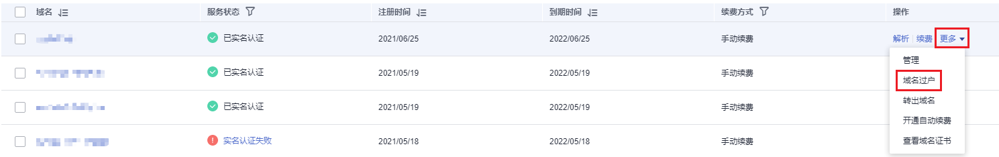

# 域名实名认证操作指导（失败后重新认证）

## 操作场景

如果提交域名实名认证后，域名的“服务状态”变为“实名认证失败”，则需要重新认证域名。

在进行域名的重新认证时，

-   有“已实名认证”的信息模板

    若用户账户中有可用的、状态为“已实名认证”的信息模板，建议将域名过户到该信息模板中。

    此过程大约需要1\~3个工作日。

-   无“已实名认证”的信息模板

    若用户账户中无状态为“已实名认证”的信息模板，或者已有信息模板不适用该域名，则需要修改域名实名认证材料，然后重新认证域名。

    此过程大约需要3\~5个工作日。

## 重新认证（有“已实名认证”的信息模板）

1.  登录管理控制台。
2.  选择“域名与网站 \> 域名注册”。

    进入“域名列表”页面。

3.  在“域名列表”中，单击实名认证失败域名“操作”列的“更多”。

    **图 1**  选择域名过户  
    

4.  选择“域名过户”，进入“身份认证”环节。
5.  根据界面提示完成身份认证。

    **图 2**  身份认证  
    

    支持“手机验证”方式，该“联系电话”与登录管理控制台的帐号关联，若无法接收验证码，可以单击“修改手机号码”进行修改。

6.  单击“下一步”，进入“填写信息”环节。
7.  在“可使用的模板信息”列表中，选择要过户的信息模板。

    **图 3**  勾选待过户的信息模板  
    

    选择了过户的信息模板之后，可以在页面下方区域查看信息模板的详情。

8.  单击“下一步”，提交域名过户申请。

    **图 4**  查看域名过户状态  
    

    您可以在域名列表的“服务状态”栏查看域名过户的进程。

    -   过户成功：域名过户已经完成。

        此时，域名已经通过实名认证，无需再次提交域名实名认证。

    -   过户资料审核中：域名过户申请等待注册局审核，大约需要1\~3个工作日。

        > **说明：** 
        >当域名的“服务状态”为“过户资料审核中”时，不支持对域名进行以下操作：
        >-   域名转入/转出
        >-   域名过户
        >-   域名账号间转移
        >-   域名实名认证
        >-   修改域名信息
        >如需操作，需要等待域名过户审核结束。

## 重新认证（无“已实名认证”的信息模板）

1.  登录管理控制台。
2.  选择“域名与网站 \> 域名注册”。

    进入“域名列表”页面。

3.  在“域名列表”中，单击待重新认证域名“服务状态”列的“实名认证失败”。

    进入实名认证的“认证结果”环节。

    **图 5**  实名认证认证结果  
    

    > **说明：** 
    >在认证结果中，可以看到域名实名认证失败的原因，您可以参考[域名实名认证失败排查思路](https://support.huaweicloud.com/domain_faq/domain_faq_040304.html)修改域名实名认证材料。

4.  在“认证结果”中，单击“重新认证”。

    进入“实名认证”的“提交认证”环节。

5.  在“提交认证”环节的“提交材料”区域，重新填写域名实名认证信息并提交认证材料。

    **图 6**  域名实名认证  
    

    1.  选择“证件类型”，证件类型需要与域名所有者相匹配。
    2.  填写对应的“证件号码”。
    3.  单击“”上传实名认证材料。

    实名认证材料需要与域名所有者信息相符，更多详细说明请参见[域名实名认证填写规范](域名实名认证填写规范.md)。

    > **说明：** 
    >-   提交的域名实名认证材料需要与“认证域名”区域的“用户类型”和“域名所有者”保持一致。
    >-   如果要变更域名的“用户类型”或者“域名所有者”，请重新创建信息模板并将域名过户到该信息模板中，详细内容请参考：
    >    -   [创建信息模板（个人用户）](创建信息模板（个人用户）.md)或者[创建信息模板（企业用户）](创建信息模板（企业用户）.md)
    >    -   [域名过户](域名过户.md)

6.  单击“提交”，完成实名认证材料的提交。
7.  在左侧树状导航栏中，选择“域名注册 \> 域名列表”。

    在域名列表中，域名“服务状态”为“实名认证审核中”，表示域名的实名认证材料提交成功。待域名“服务状态”变为“已实名认证”，表示域名实名认证审核通过。

    域名实名认证审核需要3\~5个工作日，请您耐心等待。在此期间，不支持修改已提交的实名认证材料。

    > **说明：** 
    >若多次提交域名实名认证失败，请将域名实名认证失败相关信息截图并[提交工单](https://support.huaweicloud.com/usermanual-ticket/zh-cn_topic_0127038618.html)寻求更多帮助。

