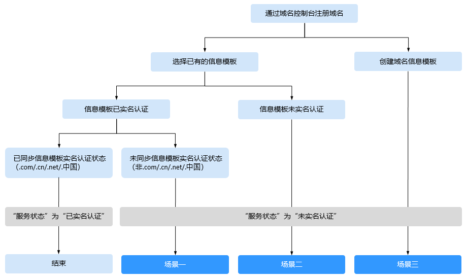
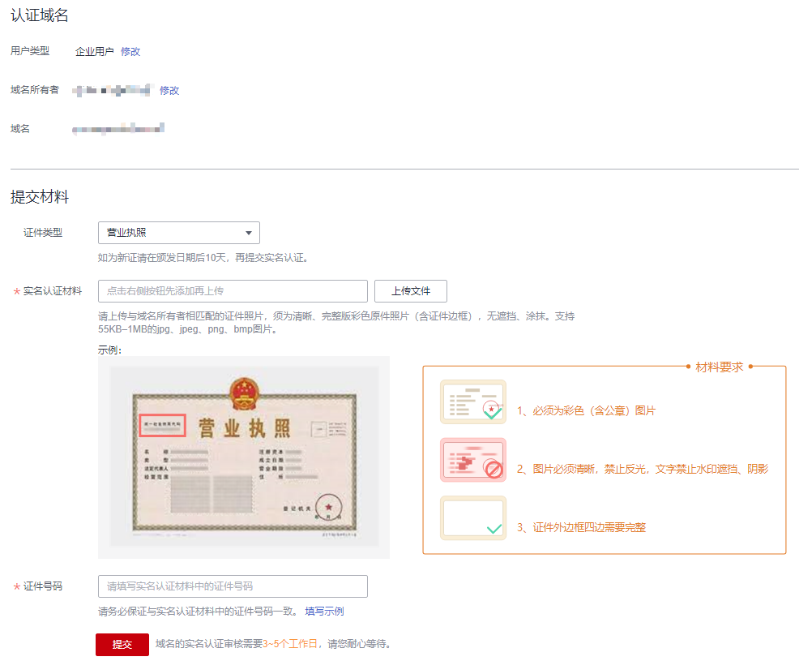

# 域名实名认证操作指导（新注册域名）

## 操作场景

新注册的域名在购买成功后5天内需进行实名认证。如果您的域名在规定时间内未通过实名认证审核，注册局将暂停域名解析，域名将无法被正常访问。

域名实名认证的审核主体为“注册局”，一般1个工作日内即可完成审核（部分需要3\~5个工作日），为保证域名的正常使用，请在购买域名后尽快提交实名认证审核。

域名实名认证可以选择以“个人用户”或者“企业用户”两种用户类型进行认证。用户类型的选择，取决于提交的实名认证材料类型，不影响域名的使用。不同用户类型实名认证的详细内容，请参见[域名实名认证填写规范与示例](域名实名认证填写规范与示例.md)。

> **说明：** 
>-   注册完成超过5个工作日的域名，仍然可以提交域名实名认证，待域名实名认证通过后1\~2个工作日可恢复正常使用。
>-   如果域名用于部署在中国大陆节点的网站，则还需要进行域名的备案。备案时，要求域名的实名认证信息（域名所有者、证件类型、证件号码）与备案主体信息保持一致。
>    因此，在确认域名实名认证信息时，建议参考域名所属网站的用途及备案主体信息，详细内容请参考[个人备案与单位备案FAQ](https://support.huaweicloud.com/icp_faq/icp_05_0136.html)。
>-   实名认证不支持通过华为云APP操作。

对于新注册的域名，如果域名的“服务状态”为“未实名认证”，则需要进行域名实名认证，包括的场景如[图1](#fig76677810418)所示。

**图 1**  新注册域名实名认证场景  

-   [场景一：未关联信息模板实名认证状态的域名](#section4400114016517)

    若注册的域名为“.com”、“.cn”、“.net”以及“.中国”之外的后缀类型，则不支持关联信息模板的实名认证状态，即使选择了已实名认证的信息模板，仍然需要进行域名的实名认证。

-   [场景二：未选择已实名认证的信息模板的域名](#section1467165812510)

    域名注册时，选择了状态为“未实名认证”或者“实名认证失败”的信息模板。

-   [场景三：未选择已有信息模板的域名](#section1819652115267)

    域名注册时，未选择已有信息模板，采用“创建域名信息模板”方式设置域名信息。这种情况下创建的信息模板，未进行实名认证，域名状态为“未实名认证”，需要进行域名的实名认证。

本章节针对上述场景以“企业用户”为例，介绍域名实名认证的操作过程。

> **说明：** 
>如果域名所有者为个人，请参考[域名实名认证填写示例（个人用户）](域名实名认证填写示例（个人用户）.md)提交对应的实名认证材料。

## 前提条件

-   已经注册华为云帐号并实名认证。
-   已经完成[注册单个域名操作指导](注册单个域名操作指导.md)。
-   已经完成实名认证材料的准备，详细内容请参见[域名实名认证填写规范](域名实名认证填写规范.md)。

## 场景一：未关联信息模板实名认证状态的域名

由于域名不支持关联信息模板的实名认证状态，因此，域名的“服务状态”仍然为“未实名认证”，需要对域名进行实名认证。

1.  登录[域名注册控制台](https://console.huaweicloud.com/domain/?region=cn-north-4#/domain/list)。

    进入“域名列表”页面。

2.  在“域名列表”页面中，找到待实名认证的域名，并单击“服务状态”列的“未实名认证”。

    进入“实名认证”页面。

    **图 2**  域名实名认证  
    

3.  在“实名认证”页面的“提交材料”区域，填写并提交实名认证材料。

    1.  选择“证件类型”，证件类型需要与域名所有者相匹配。
    2.  单击“上传文件”，上传实名认证材料。
    3.  填写对应的“证件号码”。

    实名认证材料需要与域名所有者信息相符，更多详细说明请参见[域名实名认证填写规范](域名实名认证填写规范.md)。

    > **说明：** 
    >-   提交的域名实名认证材料需要与“认证域名”区域的“用户类型”和“域名所有者”保持一致。
    >-   如果要变更域名的“用户类型”或者“域名所有者”，请重新创建信息模板并将域名过户到该信息模板中，详细内容请参考：
    >    -   [创建信息模板（个人用户）](创建信息模板（个人用户）.md)或者[创建信息模板（企业用户）](创建信息模板（企业用户）.md)
    >    -   [域名过户](域名过户.md)

4.  单击“提交”，完成实名认证材料的提交。
5.  在左侧树状导航栏中，选择“域名注册 \> 域名列表”。

    在域名列表中，域名“服务状态”为“实名认证审核中”，表示域名的实名认证材料提交成功。待域名“服务状态”变为“已实名认证”，表示域名实名认证审核通过。

    域名实名认证审核一般1个工作日内即可完成（部分需要3\~5个工作日），请您耐心等待。在此期间，不支持修改已提交的实名认证材料。

    > **说明：** 
    >若域名的“服务状态”变为“实名认证失败”，或者超过3\~5个工作日后仍然处于“实名认证审核中”，请参考[域名实名认证失败排查思路](https://support.huaweicloud.com/domain_faq/domain_faq_040304.html)进行处理。

## 场景二：未选择已实名认证的信息模板的域名

域名在注册过程中，如果选择的是“未实名认证”或者“实名认证失败”状态的信息模板，则注册完成后，域名的“服务状态”为“未实名认证”。

此时，建议重新创建信息模板，待信息模板实名认证通过后，再将域名过户到该信息模板上。

1.  [创建信息模板](创建信息模板（企业用户）.md)

    信息模板在创建过程中需要提交实名认证审核，实名认证审核由注册局负责，一般1个工作日内即可完成审核（部分需要3\~5个工作日）。

2.  [域名过户](域名过户.md)

    域名过户操作需要在信息模板实名认证审核通过后进行，域名的过户资料审核由注册局负责，大约需要1\~3个工作日。

## 场景三：未选择已有信息模板的域名

域名在注册过程中，必须通过信息模板设置域名信息。如果未选择已有的信息模板，则需要在注册过程中创建域名信息模板。

在此阶段创建的信息模板无法直接进行实名认证，因此，注册完成后，域名的“服务状态”为“未实名认证”。此时，需要提交域名实名认证。

> **说明：** 
>-   若域名后缀为“.com”、“.cn”、“.net”以及“.中国”，支持关联信息模板的实名认证状态，则域名实名认证审核通过后，对应的信息模板状态也为“已实名认证”。
>-   若域名后缀为“.com”、“.cn”、“.net”以及“.中国”之外的类型，不支持关联信息模板的实名认证状态，则域名实名认证审核通过后，对应的信息模板状态仍然为“未实名认证”，若要完成信息模板的实名认证，请参考[实名认证信息模板](实名认证信息模板.md)。

1.  登录[域名注册控制台](https://console.huaweicloud.com/domain/?region=cn-north-4#/domain/list)。

    进入“域名列表”页面。

2.  在“域名列表”页面中，找到待实名认证的域名，并单击“服务状态”列的“未实名认证”。

    进入“实名认证”页面。

    **图 3**  域名实名认证  
    

3.  在“实名认证”页面的“提交材料”区域，填写并提交实名认证材料。

    1.  选择“证件类型”，证件类型需要与域名所有者相匹配。
    2.  单击“上传文件”，上传实名认证材料。
    3.  填写对应的“证件号码”。

    实名认证材料需要与域名所有者信息相符，更多详细说明请参见[域名实名认证填写规范](域名实名认证填写规范.md)。

    > **说明：** 
    >-   提交的域名实名认证材料需要与“认证域名”区域的“用户类型”和“域名所有者”保持一致。
    >-   如果要变更域名的“用户类型”或者“域名所有者”，请重新创建信息模板并将域名过户到该信息模板中，详细内容请参考：
    >    -   [创建信息模板（个人用户）](创建信息模板（个人用户）.md)或者[创建信息模板（企业用户）](创建信息模板（企业用户）.md)
    >    -   [域名过户](域名过户.md)

4.  单击“提交”，完成实名认证材料的提交。
5.  在左侧树状导航栏中，选择“域名注册 \> 域名列表”。

    在域名列表中，域名“服务状态”为“实名认证审核中”，表示域名的实名认证材料提交成功。待域名“服务状态”变为“已实名认证”，表示域名实名认证审核通过。

    域名实名认证审核一般1个工作日内即可完成（部分需要3\~5个工作日），请您耐心等待。在此期间，不支持修改已提交的实名认证材料。

    > **说明：** 
    >若域名的“服务状态”变为“实名认证失败”，或者超过3\~5个工作日后仍然处于“实名认证审核中”，请参考[域名实名认证失败排查思路](https://support.huaweicloud.com/domain_faq/domain_faq_040304.html)进行处理。

