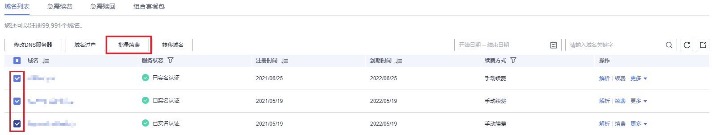

# 域名批量续费

## 操作场景

域名续费的目的是延长您已注册域名的有效使用期限。域名注册服务支持同时为多个域名批量续费。

为保障您的域名能正常使用，在域名到期之前，请及时按照本章节指导为域名续费。

域名到期前，华为云会通过邮件、短信等方式向您发送提醒通知，请注意查收并及时为域名续费。

## 对解析的影响

-   域名到期后，注册局会暂停域名的解析，此时域名无法访问。
-   域名到期后，有大约30天的续费宽限期，在宽限期内，您仍然可以为域名续费。
-   受运营商Local DNS的TTL设置的限制，域名续费成功后，大约需要24\~48小时可以恢复域名的解析。

鉴于以上原因，建议您在域名到期前及时为域名续费。

> **说明：** 
>-   域名续费宽限期时长，请参见[不同后缀类型域名的续费宽限期和赎回期是多久？](https://support.huaweicloud.com/domain_faq/domain_faq_0018.html)。
>-   如果超过续费宽限期仍未续费，您需要花费比正常续费价格更高的费用进行[域名赎回](域名赎回.md)。

## 操作步骤

1.  登录管理控制台。
2.  选择“域名与网站 \> 域名注册”。

    进入“域名列表”页面。

3.  在域名列表中，勾选待续费域名，单击域名列表左上角的“批量续费”。

    进入“域名续费”页面。

    **图 1**  域名批量续费  
    

4.  在“注册域名”区域，设置“购买年限”。

    **图 2**  批量设置续费年限  
    

    批量续费的多个域名支持灵活设置续费年限，您可以根据需要选择不同的设置方式：

    -   批量选择年限：支持为所有批量续费的域名设置统一的续费年限，取值范围为1\~10年。
    -   单域名选择续费年限：支持为批量续费的多个域名设置不同的续费年限，取值范围为1\~10年。

    更详细的域名价格信息请参见[价格详情](https://www.huaweicloud.com/pricing.html#/domains)“产品价格详情”页签。

5.  单击“立即续费”。
6.  在“订单确认”环节，确认订单详情后，勾选“ 我已阅读并同意《华为云域名注册服务协议》”。
7.  单击“去支付”。
8.  选择支付方式后，单击“确认付款”，完成域名的批量续费。

