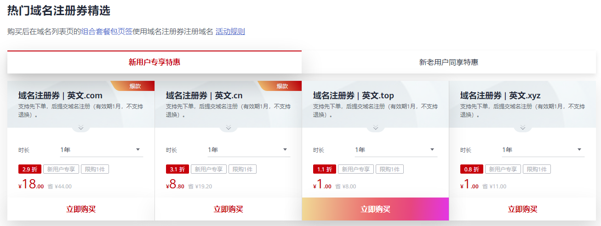
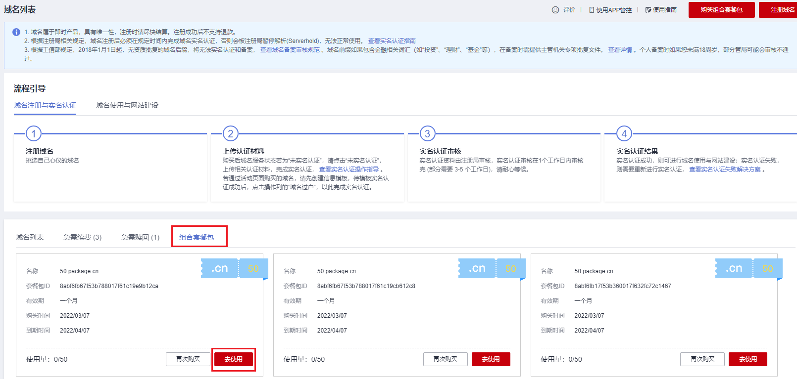

# 域名注册券购买和使用

## 操作场景

域名注册券是华为云推出的优惠活动类产品，帮助您预购买域名，支持先下单，后进行域名注册，在后续注册域名时，选择对应的域名注册券进行抵扣即可。

> **说明：** 
>-   域名注册券有效期为1个月，购买后不支持退换。
>-   域名注册券支持的域名后缀有：.com、.cn、.top、.xyz。
>-   域名注册券购买的域名时长只能为1年，域名到期后，您可以进行[域名续费](域名续费.md)。

## 购买域名注册券

1.  进入[域名注册产品页](https://www.huaweicloud.com/product/domain.html)。
2.  在下方的“热门域名注册券精选”位置，选择需要购买的域名后缀。

    **图 1**  购买域名注册券  
    

3.  单击“立即购买”。
4.  进入“购买域名注册服务”页面，单击右下角的“立即购买”。
5.  在详情页面，核对订单信息。
6.  单击“去支付”，进入“支付”环节。
7.  在“支付”环节，选择支付方式。
8.  单击“去在线支付”，完成域名注册券购买。

## 使用域名注册券进行域名注册

1.  在“域名列表”的“组合套餐包”页签，可以查看到已购买的域名注册券。

    **图 2**  域名注册券  
    

2.  单击“去使用”。
3.  在页面上方搜索框中输入域名，进行查询。
4.  显示域名未被注册时，单击“加入清单”。
5.  单击“立即购买”，进入信息模板设置界面。
6.  选择已实名认证的信息模板。
7.  单击“立即购买”，进入订单确认页面。
8.  确认无误后，勾选“我已阅读并同意《华为云域名注册服务协议》”。
9.  单击“去支付”，即可完成使用域名注册券进行域名注册。

    > **说明：** 
    >由于在购买域名注册券时已完成支付，因此此处显示的支付价格为0元。

