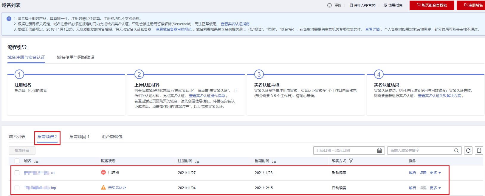
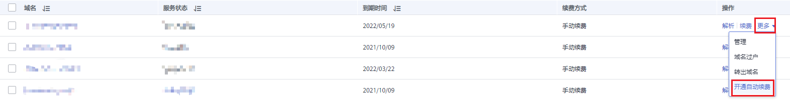
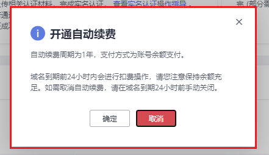
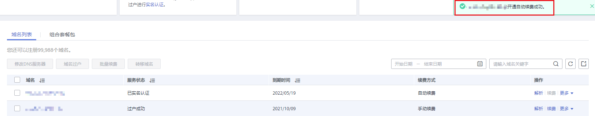

# 域名续费

## 操作场景

域名续费的目的是延长您已注册域名的有效使用期限。

为保障您的域名能正常使用，在域名到期之前，请及时按照本章节指导为域名续费。

您可通过“域名列表”页面中的“急需续费”页签获取急需续费的域名及域名个数，包含距离到期仅剩一个月及处于宽限期的域名。

**图 1**  急需续费  

> **说明：** 
>-   域名续费支持以下操作类型：
>    -   [手动续费](#section688255814510)：域名到期前，华为云会通过邮件、短信等方式向您发送提醒通知，请注意查收并及时为域名续费。
>    -   [自动续费](#section134411623103114)：为避免域名到期未及时续费，导致域名不可用，用户可以为单个域名设置开通自动续费功能。域名到期前一天早上10点前进行扣费操作，请您注意保持余额充足。如需取消自动续费，请在域名到期前一天早上10点前手动关闭。
>-   提交域名续费后请及时完成支付，续费订单在完成支付后才可生效，否则超过域名续费宽限期，您需要花费比正常续费价格更高的费用赎回域名。

## 约束与限制

未完成实名认证的域名无法进行域名续费操作。

## 对解析的影响

-   域名到期后，注册局会暂停域名的解析，此时域名无法访问。
-   域名到期后，有大约30天的续费宽限期，在宽限期内，您仍然可以为域名续费。
-   受运营商Local DNS的TTL设置的限制，域名续费成功后，大约需要24\~48小时可以恢复域名的解析。

鉴于以上原因，建议您在域名到期前及时为域名续费。

> **说明：** 
>-   域名续费宽限期时长，请参见[不同后缀类型域名的续费宽限期和赎回期是多久？](https://support.huaweicloud.com/domain_faq/domain_faq_0018.html)。
>-   如果超过续费宽限期仍未续费，您需要花费比正常续费价格更高的费用进行[域名赎回](域名赎回.md)。

## 手动域名续费

1.  登录[域名注册控制台](https://console.huaweicloud.com/domain/?region=cn-north-4#/domain/list)。

    进入“域名列表”页面。

2.  在域名列表中，单击待续费域名“操作”列的“更多”。

    进入“域名续费”页面。

3.  在“注册域名”区域，设置“购买年限”。

    **图 2**  设置续费年限  
    

    更详细的域名价格信息请参见[价格详情](https://www.huaweicloud.com/pricing.html#/domains)的“价格详情”页签。

4.  单击“立即续费”。
5.  在“订单确认”环节，确认订单详情后，勾选“ 我已阅读并同意《华为云域名注册服务协议》”。
6.  单击“去支付”。
7.  选择支付方式后，单击“确认付款”，完成域名的续费。

## 自动域名续费

1.  登录[域名注册控制台](https://console.huaweicloud.com/domain/?region=cn-north-4#/domain/list)。

    进入“域名列表”页面。

2.  在域名列表中，单击待续费域名“操作”列的“更多”。

    **图 3**  开通自动续费  
    

3.  选择“开通自动续费”，弹出如下界面。

    **图 4**  确认界面  
    

4.  单击“确认”，完成开通自动续费功能。

    **图 5**  开通完成  
    

    > **说明：** 
    >若要关闭自动续费功能，则在域名“操作”列的“更多”中选择“关闭自动续费”即可。

