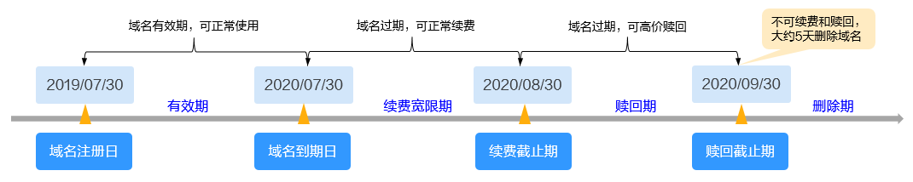
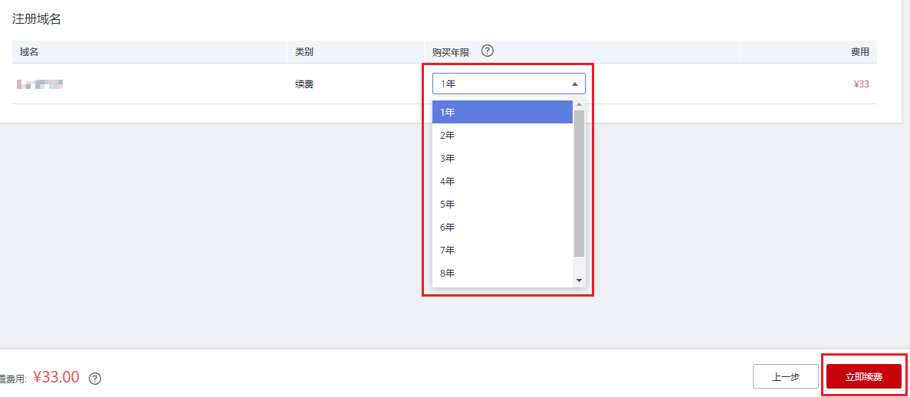

# 域名续费

## 背景

域名从注册开始，会经历有效期、续费宽限期、赎回期以及删除期等阶段，如[图1](#fig574611520314)所示。

**图 1**  域名生命周期  

各个阶段的含义如[表1](#table18229123812269)所示。

**表 1**  域名各阶段说明

<table><thead align="left"><tr id="row42301386265"><th class="cellrowborder" valign="top" width="10.14%" id="mcps1.2.5.1.1">
阶段

</th>
<th class="cellrowborder" valign="top" width="30.42%" id="mcps1.2.5.1.2">
含义

</th>
<th class="cellrowborder" valign="top" width="39.7%" id="mcps1.2.5.1.3">
说明

</th>
<th class="cellrowborder" valign="top" width="19.74%" id="mcps1.2.5.1.4">
支持的操作

</th>
</tr>
</thead>
<tbody><tr id="row1323013383263"><td class="cellrowborder" valign="top" width="10.14%" headers="mcps1.2.5.1.1 ">
有效期

</td>
<td class="cellrowborder" valign="top" width="30.42%" headers="mcps1.2.5.1.2 ">
域名注册的年限

</td>
<td class="cellrowborder" valign="top" width="39.7%" headers="mcps1.2.5.1.3 ">
自域名注册成功日开始，域名到期日结束。

</td>
<td class="cellrowborder" valign="top" width="19.74%" headers="mcps1.2.5.1.4 ">
域名续费

</td>
</tr>
<tr id="row2230183816268"><td class="cellrowborder" valign="top" width="10.14%" headers="mcps1.2.5.1.1 ">
续费宽限期

</td>
<td class="cellrowborder" valign="top" width="30.42%" headers="mcps1.2.5.1.2 ">
域名到期后，支持续费的周期

</td>
<td class="cellrowborder" valign="top" width="39.7%" headers="mcps1.2.5.1.3 ">
不同后缀类型域名的续费宽限期不同，约为30天左右。

<ul id="ul11236756143010"><li>详细的域名续费宽限期，请参见<a href="https://support.huaweicloud.com/domain_faq/domain_faq_0018.html" target="_blank" rel="noopener noreferrer">不同后缀类型域名的续费和赎回有哪些差异？</a></li><li>详细的域名续费价格，请参见<a href="https://www.huaweicloud.com/pricing.html#/domains" target="_blank" rel="noopener noreferrer">价格详情</a>。</li></ul>
</td>
<td class="cellrowborder" valign="top" width="19.74%" headers="mcps1.2.5.1.4 ">
域名续费

</td>
</tr>
<tr id="row123018388264"><td class="cellrowborder" valign="top" width="10.14%" headers="mcps1.2.5.1.1 ">
赎回期

</td>
<td class="cellrowborder" valign="top" width="30.42%" headers="mcps1.2.5.1.2 ">
域名超过续费宽限期后，支持赎回的周期

</td>
<td class="cellrowborder" valign="top" width="39.7%" headers="mcps1.2.5.1.3 ">
不同后缀类型域名的赎回期不同，约为15~30天。

详细的域名赎回期及赎回价格，请参见<a href="https://support.huaweicloud.com/domain_faq/domain_faq_0018.html" target="_blank" rel="noopener noreferrer">不同后缀类型域名的续费和赎回有哪些差异？</a>

</td>
<td class="cellrowborder" valign="top" width="19.74%" headers="mcps1.2.5.1.4 ">
域名赎回

</td>
</tr>
<tr id="row021216547331"><td class="cellrowborder" valign="top" width="10.14%" headers="mcps1.2.5.1.1 ">
删除期

</td>
<td class="cellrowborder" valign="top" width="30.42%" headers="mcps1.2.5.1.2 ">
域名超过赎回期后，等待删除的周期

</td>
<td class="cellrowborder" valign="top" width="39.7%" headers="mcps1.2.5.1.3 ">
删除期约为5天。

在此期间，不支持续费和赎回，域名随时会被删除。

</td>
<td class="cellrowborder" valign="top" width="19.74%" headers="mcps1.2.5.1.4 ">
无

</td>
</tr>
</tbody>
</table>

## 操作场景

域名续费的目的是延长您已注册域名的有效使用期限。

为保障您的域名能正常运行，在域名续费宽限期到期之前，您可以通过以下操作为域名进行续费。

> **说明：**   
>如果未能及时续费，您需要花费比正常续费价格高的费用进行[域名赎回](域名赎回.md)。  

## 操作步骤

1.  登录管理控制台。
2.  选择“域名与网站 \> 域名注册”。

    进入“域名列表”页面。

3.  在域名列表中，单击待续费域名“操作”列的“续费”。

    进入“域名续费”页面。

4.  在“注册域名”区域，设置“购买年限”。

    **图 2**  设置续费年限  
    

    更详细的域名价格信息请参见[价格详情](https://www.huaweicloud.com/pricing.html#/domains)。

5.  单击“立即续费”。
6.  在“订单确认”环节，确认订单详情后，勾选“ 我已阅读并同意《华为云域名注册服务协议》”。
7.  单击“去支付”。
8.  选择支付方式后，单击“确认付款”，完成域名的续费。

> **说明：**   
>不支持批量域名续费，不可批量勾选。  
>域名续费支持以下操作类型：  
>-   手动续费：如上述操作。目前不支持自动续费。  
>-   设置统一到期日：通过续费将域名的到期日统一固定为一个月的某一天，便于对域名进行统一续费和管理。  
>更多续费相关内容请参考《费用中心用户指南》的[续费管理](https://support.huaweicloud.com/usermanual-billing/zh-cn_topic_0071343164.html)。  

