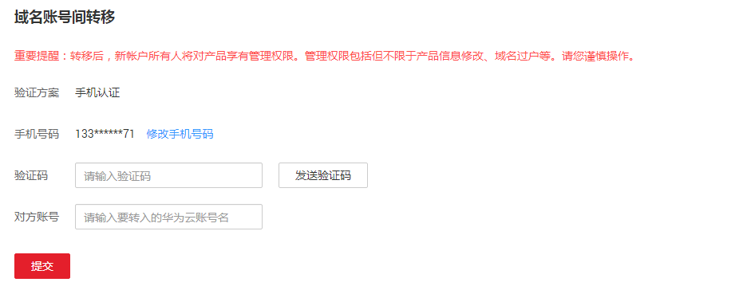

# 域名账号间转移

## 操作场景

如果您想要将域名转移至华为云其它帐号进行管理，可以使用域名注册服务的账号间转移功能。

域名注册服务支持单个域名的帐号间转移和多个域名的账号间批量转移，最多支持一次性转移1000个域名。

> **说明：**   
>转移后，新账号所有人将拥有对域名的所有管理权限，请谨慎操作。  
>不支持将域名转入华为云的子账号。  

## 域名账号间单个转移

1.  登录管理控制台。
2.  选择“域名与网站 \> 域名注册”。

    进入“域名列表”页面。

3.  在“域名列表”中，单击待转移域名，进入域名基本信息页面。
4.  在左侧导航栏，单击“域名账号间转移”。

    **图 1**  域名账号间转移  
    

5.  单击“发送验证码”，获取域名“手机认证”的“验证码”，进行验证。

    支持“手机验证”方式，验证过程与登录管理控制台的帐号关联，若无法接收验证码，可以单击“修改手机号码”进行修改。

6.  输入获取的“验证码”以及“对方账号”。
7.  单击“提交”，完成域名帐号间转移。

    **图 2**  域名转移成功  
    

## 域名账号间批量转移

1.  登录管理控制台。
2.  选择“域名与网站 \> 域名注册”。

    进入“域名列表”页面。

3.  在“域名列表”中，勾选待转移域名，单击“转移域名”，进入“批量转移域名”页面。

    **图 3**  批量转移域名（1）  
    

    **图 4**  批量转移域名（2）  
    

4.  单击“发送验证码”，获取域名“手机认证”的“验证码”，进行验证。

    支持“手机验证”方式，验证过程与登录管理控制台的帐号关联，若无法接收验证码，可以单击“修改手机号码”进行修改。

5.  输入获取的“验证码”以及“对方账号”。
6.  单击“提交”，完成批量域名帐号间转移。

    **图 5**  域名转移成功  
    

