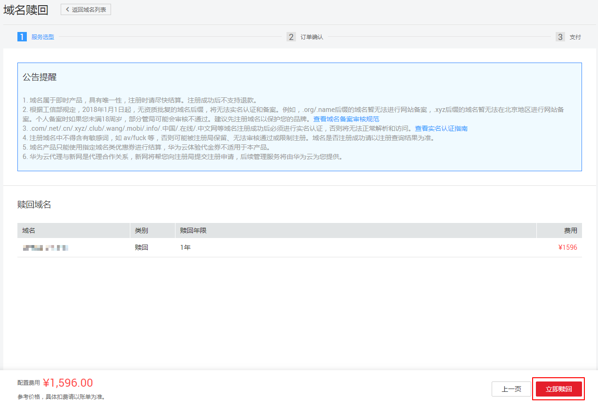

# 域名赎回

## 操作场景

如果超过域名续费宽限期仍未进行续费，则域名进入赎回期。在此期间，您可以高价赎回域名。

> **说明：** 
>受运营商Local DNS的TTL设置的限制，域名赎回成功后，大约需要24\~48小时可以恢复域名的解析。
>超过域名赎回期，域名进入删除期，不可赎回且随时会被删除。

## 操作步骤

1.  登录管理控制台。
2.  选择“域名与网站 \> 域名注册”。

    进入“域名列表”页面。

3.  在域名列表中，单击待赎回域名“操作”列的“赎回”。

    进入“域名赎回”页面。

4.  在“赎回域名”区域，确认待赎回域名及费用信息后，单击“立即赎回”。

    **图 1**  域名赎回  
    

    不同后缀类型域名的赎回价格，请参考[域名赎回价格是多少？](https://support.huaweicloud.com/domain_faq/domain_faq_040403.html)。

5.  在“订单确认”环节，确认订单详情后，勾选“ 我已阅读并同意《华为云域名注册服务协议》”。
6.  单击“去支付”。
7.  选择支付方式后，单击“确认付款”，完成域名的赎回。

> **说明：** 
>不支持批量域名赎回，不可批量勾选。

