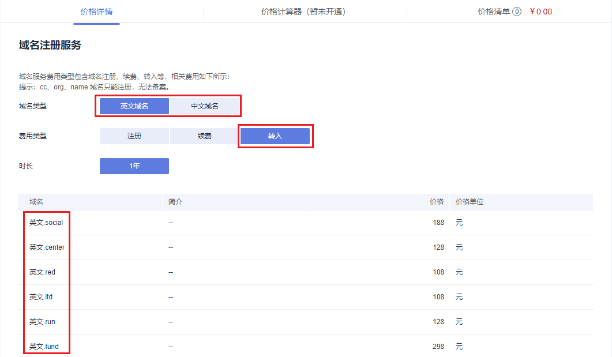
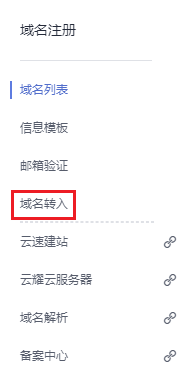

# 域名转入华为云

## 操作场景

当您通过其他域名注册商注册了一个域名，想将该域名转入华为云进行管理时，您可以使用华为云域名注册的域名转入功能实现。

由于华为云的域名注册是与新网合作，因此，您的域名将转入新网，并由华为云为您提供域名服务。

域名的转入承接机构，请参见[域名转入时填写的承接注册服务机构是什么？](https://support.huaweicloud.com/domain_faq/domain_faq_040617.html)

> **说明：** 
>-   如果域名服务商是新网，则不支持将该域名转入华为云。
>-   域名转入过程通常需要5\~7天，取决于域名原注册商的转出确认时间。若您想要快速完成域名转入，请联系域名原注册商尽快完成转出确认。
>-   华为云的域名注册服务与新网合作，通过华为云注册的域名其注册商为新网，由华为云提供域名管理服务。因此在从其他服务商处将域名转入华为云时，新注册商为‘新网’。

## 转入规则

域名转入华为云需符合以下转入规则：

-   域名真实存在且符合命名规范。
-   距域名注册成功超过60天。
-   距域名最近一次转移成功超过60天。
-   如果是国内域名（.中国和.cn），则距域名到期超过15天。
-   最多支持二级域名（example.com）的转入，不支持三级以上域名的转入（例如，abc.example.com）。
-   域名转入需支付域名续费1年的费用。

    域名转入是免费的，但根据注册局规定，转入时需在原期限上续费1年，因此，需支付域名续费1年的费用。

    > **说明：** 
    >域名的最长购买年限是10年，如果您的域名在转入前的使用年限已经超过9年，则域名转入后无法增加完整的1年年限。

-   域名状态正常，不存在如下情况：
    -   域名处于纠纷、仲裁中或法院限制转出
    -   域名状态为禁止转移（clientTransferProhibited/serverTransferProhibited）
    -   域名状态为注册商设置暂停解析（clienthold）
    -   域名处于转移中状态

-   不支持转入白金域名（或称溢价域名）。
-   域名转入不影响域名的DNS解析。

    域名转入是指将域名的管理权转入华为云，该操作是针对域名的管理权，不改变域名的“DNS服务器”设置以及域名的解析记录，因此，不影响域名的正常解析。

    > **说明：** 
    >-   某些域名注册商不提供单独的DNS服务，例如GoDaddy，在域名转出后会删除原有的域名解析数据。因此，从GoDaddy转入华为云的域名，其解析会失效。
    >-   在域名转移期间，不支持修改域名的“DNS服务器”设置，即不支持进行解析的迁移。
    >针对这种情况，为了保证在域名转入时，域名的解析不受影响，建议您在域名转入操作前先将域名的解析迁移至华为云，待解析迁移完成后再进行域名转入操作。详细指导，请参见[迁移域名到华为云进行解析](https://support.huaweicloud.com/usermanual-dns/dns_usermanual_0001.html)。

## 前提条件

域名转入前需要完成以下准备：

-   查看域名是否支持转入华为云。

    您可以在华为云的[价格详情](https://www.huaweicloud.com/pricing.html#/domains)中进行查看，若域名后缀类型包含在转入价格列表中，则表示支持转入华为云，否则不支持转入华为云。

    **图 1**  支持转入华为云的域名后缀类型  
    

-   您必须是域名所有者，或者已经获得域名所有者的授权。
-   您必须拥有已经通过实名认证的信息模板。

    > **说明：** 
    >已实名认证的信息模板不限用户类型，可以是个人用户，也可以是企业用户。

-   若您转入后使用华为云DNS进行域名解析，在域名转入之前，需要完成以下工作：
    -   在华为云上添加域名现有的解析记录，详细操作请参见[配置公网解析](https://support.huaweicloud.com/qs-dns/zh-cn_topic_0035467699.html)。
    -   在原注册商处修改域名的DNS服务器，详细操作请参见[迁移域名到华为云进行解析](https://support.huaweicloud.com/usermanual-dns/dns_usermanual_0001.html)。

-   向原注册商索取转移密码。

    如果原域名注册商拒绝提供域名转移密码，可采用以下方式进行投诉：

    -   国际域名投诉：[https://forms.icann.org/en/resources/compliance/complaints/transfer/form](https://forms.icann.org/en/resources/compliance/complaints/transfer/form)
    -   国内域名投诉：supervise@cnnic.cn（邮箱），010-58813000（电话）

-   国际域名（.com/.net 等）转入前需要确保域名所有者的电子邮箱可用。

    由于国际域名的转入需要域名所有者通过邮箱授权同意，因此需要确保邮箱可以正常收信，并在邮箱中确认域名要转入华为云。

## 操作步骤

1.  登录[管理控制台](https://auth.huaweicloud.com/authui/login.html?locale=zh-cn#/login)。
2.  选择“域名与网站 \> 域名注册”。

    进入“域名列表”页面。

3.  在左侧树状导航栏，选择“域名注册 \> 域名转入”。

    进入“域名转入”页面。

    **图 2**  域名转入  
    

4.  在“域名转入”页面右上角，单击“域名转入”。
5.  在“域名转入”区域的文本框中，输入待转入域名以及转移密码。

    **图 3**  输入域名和转移密码  
    

    > **说明：** 
    >-   转移密码向域名原注册商索取。
    >-   若用户已经提交了某一域名的转入申请，则不能重复提交该域名的转入申请，否则，系统会提示该域名已经存在。
    >-   填写格式：域名+空格+转移密码，例如：example.com password1。
    >-   每行填写一个域名，如需一次性转入多个域名，以换行符隔开。最多支持一次性转入5个域名。

6.  单击“立即转入”，系统进行转入域名的合法性校验。
    -   当转入域名因域名名称、域名状态等问题无法转入时，您需要根据提示的原因处理后，再次进行转入。
    -   当转入的域名全部合法，则直接进入下一步。

7.  设置订单信息。
    1.  在“注册域名”栏，确认要转入的域名。

        若不转入，单击域名“操作”列的“删除”。

    2.  在“域名信息”栏，设置域名信息。

        > **说明：** 
        >域名转入仅支持选择已通过实名认证的信息模板，不限于用户类型，可以是个人用户或者企业用户。

8.  单击“立即购买”，进行订单确认。
9.  若订单信息无误，勾选“我已阅读并同意《华为云域名注册服务协议》”。
10. 单击“去支付”。

    选择支付方式后付款，完成域名转入。

## 后续操作

域名转入支付完成后，可以返回域名转入页面查看转入进度。

1.  单击页面上方的“返回转入列表”，查看域名转入状态。
2.  单击域名“操作”列的“查看”，进入转入流程页面。

    在转入流程页面，可以对转入域名进行进一步操作，详细内容请参见[表1](#zh-cn_topic_0186353674_table1994141511286)。

    **表 1**  域名转入后续操作

    
    <table><thead align="left"><tr id="zh-cn_topic_0186353674_row1943715182810"><th class="cellrowborder" valign="top" width="17%" id="mcps1.2.4.1.1">
域名状态

    </th>
    <th class="cellrowborder" valign="top" width="43%" id="mcps1.2.4.1.2">
说明

    </th>
    <th class="cellrowborder" valign="top" width="40%" id="mcps1.2.4.1.3">
后续操作

    </th>
    </tr>
    </thead>
    <tbody><tr id="zh-cn_topic_0186353674_row169435158288"><td class="cellrowborder" valign="top" width="17%" headers="mcps1.2.4.1.1 ">
转入提交

    </td>
    <td class="cellrowborder" valign="top" width="43%" headers="mcps1.2.4.1.2 ">
域名转入提交完成，启动域名转入流程。

    </td>
    <td class="cellrowborder" valign="top" width="40%" headers="mcps1.2.4.1.3 ">
无需操作，等待系统转入处理。

    
若要取消转入，可以在转入流程页面通过单击“取消转入”实现。

    </td>
    </tr>
    <tr id="zh-cn_topic_0186353674_row7943615162817"><td class="cellrowborder" valign="top" width="17%" headers="mcps1.2.4.1.1 ">
审核中

    </td>
    <td class="cellrowborder" valign="top" width="43%" headers="mcps1.2.4.1.2 ">
域名转入进入审核阶段。

    </td>
    <td class="cellrowborder" valign="top" width="40%" headers="mcps1.2.4.1.3 ">
无需操作，等待系统转入处理。

    
若要取消转入，可以在转入流程页面通过单击“取消转入”实现。

    
域名转入过程通常需要5~7天。

    </td>
    </tr>
    <tr id="zh-cn_topic_0186353674_row109430159283"><td class="cellrowborder" valign="top" width="17%" headers="mcps1.2.4.1.1 ">
转入成功

    </td>
    <td class="cellrowborder" valign="top" width="43%" headers="mcps1.2.4.1.2 ">
域名转入成功。

    </td>
    <td class="cellrowborder" valign="top" width="40%" headers="mcps1.2.4.1.3 ">
域名转入成功，需要对域名进行实名认证，详细操作请参见<a href="https://support.huaweicloud.com/qs-domain/zh-cn_topic_0122928879.html" target="_blank" rel="noopener noreferrer">实名认证域名</a>。

    </td>
    </tr>
    <tr id="zh-cn_topic_0186353674_row39431515102811"><td class="cellrowborder" valign="top" width="17%" headers="mcps1.2.4.1.1 ">
转入失败

    </td>
    <td class="cellrowborder" valign="top" width="43%" headers="mcps1.2.4.1.2 ">
域名转入失败。

    </td>
    <td class="cellrowborder" valign="top" width="40%" headers="mcps1.2.4.1.3 ">
根据界面提示的域名转入失败原因，进行处理：

    <ul id="zh-cn_topic_0186353674_ul3402164362318"><li>用户取消转入</li><li>域名转移密码错误</li><li>注册局转移失败</li><li>当前域名正在转入中</li><li>域名服务商取消了该域名的转入操作</li><li>通知邮件确认超时</li></ul>
    </td>
    </tr>
    <tr id="zh-cn_topic_0186353674_row16107171112318"><td class="cellrowborder" valign="top" width="17%" headers="mcps1.2.4.1.1 ">
转入密码错误

    </td>
    <td class="cellrowborder" valign="top" width="43%" headers="mcps1.2.4.1.2 ">
填写的转入密码不正确，无法转入域名。

    </td>
    <td class="cellrowborder" valign="top" width="40%" headers="mcps1.2.4.1.3 ">
需要重新核对转入密码后，再次执行转入操作。

    </td>
    </tr>
    <tr id="zh-cn_topic_0186353674_row728294510303"><td class="cellrowborder" valign="top" width="17%" headers="mcps1.2.4.1.1 ">
转入撤销

    </td>
    <td class="cellrowborder" valign="top" width="43%" headers="mcps1.2.4.1.2 ">
执行“取消转入”操作后，域名转入进入“转入撤销”状态。

    
域名状态为“转入提交”和“审核中”的域名可以执行“取消转入”。

    </td>
    <td class="cellrowborder" valign="top" width="40%" headers="mcps1.2.4.1.3 ">
无需操作，域名转入流程结束。

    </td>
    </tr>
    </tbody>
    </table>

