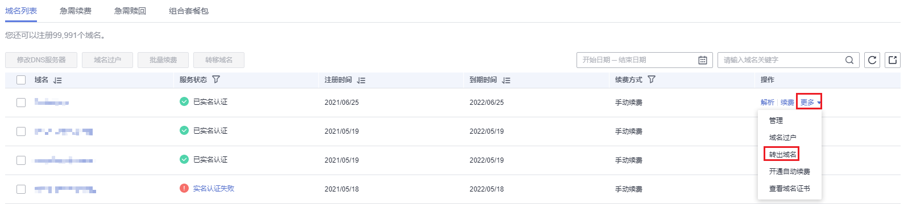

# 域名转出华为云

## 操作场景

域名转出是将某域名从华为云转出到其他域名注册商进行管理。

华为云与新网合作，您的域名将从新网转出。

## 约束与限制

由于华为云与新网合作，您的域名将从新网转出，因此不支持将域名从华为云转出至新网域名的其他代理商。

## 转出规则

-   域名转出时距离域名申请日（域名注册日期）60天以上。
-   .中国和.cn后缀的域名转出时距离该域名到期日大于15天。
-   域名转出时处于正常状态（不能是禁止转出状态），不欠费、不处于任何仲裁及法律程序中、不存在该域名所有者的身份不清楚或者存在争议。
-   建议在距离该域名到期30天以前办理域名转出，避免在操作转移过程中域名过期，给您的管理带来不便。
-   在域名最后一次续费的60天后办理域名转出，避免您的域名的注册年限可能在转出到其他服务商后不能延长一年，从而损失一年的续费费用。
-   域名转出过程中，不允许对域名执行过户操作。
-   域名转出的目的方由用户决定，华为云并无限制。
-   域名的最长购买年限是10年，当前不支持转出使用年限超过9年以上的域名。

## 操作步骤

域名转出华为云是免费服务。为了保证您的域名能够顺利办理转出，请您先查询您的域名到期日期以及域名状态，确保域名到期日期以及域名状态符合转出必要条件。

> **说明：** 
>转移过程中，需要使用您的域名注册人邮箱（即域名基本管理页面基本信息里的联系人邮箱）查收转移密码。请您确保您可以正常使用域名注册人邮箱。如果该邮箱已失效、或者无法确认是否能正常进行管理，请参考[修改域名资料](https://support.huaweicloud.com/usermanual-domain/domain_ug_330006.html)提前修改。

1.  登录[域名注册控制台](https://console.huaweicloud.com/domain/?region=cn-north-4#/domain/list)。

    进入“域名列表”页面。

2.  在“域名列表”中，单击待转出域名“操作”列的“更多”。

    **图 1**  选择转出域名  
    

3.  选择“转出域名”。

    进入“核对邮箱”环节。

4.  核对邮箱无误后，单击“下一步”，进入“安全验证”环节。

    支持“邮箱验证”和“手机验证”两种方式，验证过程与登录管理控制台的帐号关联，若无法接收验证码，可以单击“修改”进行修改。

    > **说明：** 
    >在“核对邮箱”环节，若邮箱有误，则可将域名过户到域名持有人所在的信息模板。

5.  根据界面提示完成安全验证，单击“下一步”。
6.  通过安全验证后，转移密码会发送至域名联系人邮箱。
    -   此阶段可以取消转出。
    -   转移密码有效期为5天，如果5天内一直没有进行操作，转移密码将失效，您需要重新获取转移密码。

7.  当您通过短信和邮件收到转移密码后，可以在第三方发起域名转入，具体操作请参考第三方的操作指导。

    域名成功转出的时间取决于您的域名转入新的域名服务商的时间，转出完成后会返回操作结果

    此阶段可以取消转出。域名转出成功后，系统会自动在域名列表中清除此域名。

