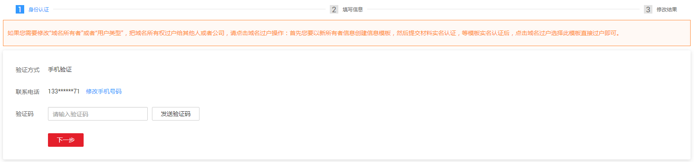

# 域名过户

## 操作场景

域名过户是指变更域名的所有者或者用户类型。

对于已经注册完成的域名，域名过户操作支持如下场景：

-   “个人用户A”变更为“个人用户B”
-   “企业用户A”变更为“企业用户B”
-   “个人用户”变更为“企业用户”
-   “企业用户”变更为“个人用户”
-   域名信息填写错误，需要修改“域名所有者”或者“用户类型”

> **说明：**   
>当域名的服务状态为“实名认证审核中”和“过户审核中”时，无法进行域名过户。  

## 前提条件

-   已经注册华为云帐号并实名认证。
-   已创建待过户的信息模板，并完成信息模板的实名认证。

    创建信息模板并实名认证的详细内容，请参见[创建信息模板（个人用户）](创建信息模板（个人用户）.md)或者[创建信息模板（企业用户）](创建信息模板（企业用户）.md)。

## 操作步骤

1.  登录管理控制台。
2.  选择“域名与网站 \> 域名注册”。

    进入“域名列表”页面。

1.  在“域名列表”中，单击待过户域名“操作”列的“更多”。

    **图 1**  选择域名过户  
    

2.  选择“域名过户”。

    进入“身份认证”环节。

3.  根据界面提示完成身份认证。

    **图 2**  域名过户  
    

    支持“手机验证”方式，该“联系电话”与登录管理控制台的帐号关联，若无法接收验证码，可以单击“修改手机号码”进行修改。

4.  单击“下一步”，进入“填写信息”环节。
5.  在“可使用的模板信息”列表中，选择要过户的信息模板。

    选择了过户的信息模板之后，可以在页面下方区域查看信息模板的详情。

    > **说明：**   
    >若想要过户的信息模板不包含在“可使用的模板信息”列表中，需要先创建帐户的信息模板并完成实名认证，具体操作请参见[配置信息模板](https://support.huaweicloud.com/qs-domain/zh-cn_topic_0122928867.html)。  

6.  单击“下一步”，提交域名过户申请。

    您可以在域名列表的“服务状态”栏查看域名过户的进程。

    -   过户成功：域名过户已经完成。
    -   过户审核中：域名过户申请等待注册局审核，大约需要1\~3个工作日。

