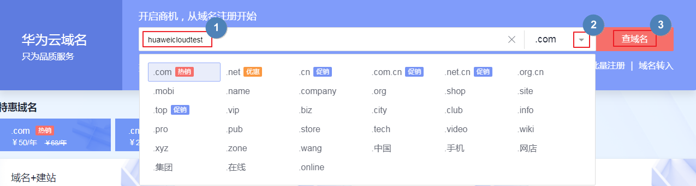
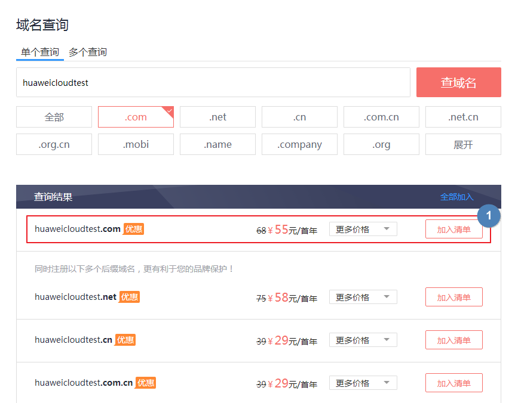

# 多入口查询域名

## 操作场景

注册域名之前，需要查询待注册的域名是否已被他人注册，只有状态为“未注册”的域名才可以被注册。

在选定了想要注册的域名名称及后缀之后，您需要通过“查询域名”操作检查域名的注册状态。

本章节介绍查询域名是否已被注册的方法，您可以选择如下两种入口进行查询：

-   [查询域名（服务首页入口）](#zh-cn_topic_0207315139_section11114150111820)
-   [查询域名（管理控制台入口）](#zh-cn_topic_0207315139_section1446212459327)

本文以查询单个域名“huaweicloudtest.com”为例进行介绍。查询多个域名的方法请参见[批量查询域名](批量注册域名.md#zh-cn_topic_0207315141_section1448313194515)。

> **说明：**   
>只有在完成域名购买订单的支付后，才算完成注册，获取域名的使用权。因此，选定域名并确认域名可被注册后，请尽快完成域名的服务选型及购买，以免被其他用户抢注。  

## 查询域名（服务首页入口）

1.  [登录域名注册服务首页](https://www.huaweicloud.com/product/domain.html)。
2.  输入想要注册的域名名称“huaweicloudtest”，查询域名是否已被注册。

    输入域名名称后，可以单击“”选择查询指定后缀的域名，例如“.com”。

    **图 1**  查询域名是否可用  
    

3.  单击“查域名”。

    进入“域名查询”页面。

4.  在“域名查询”页面的“查询结果”区域，找到待注册的域名“huaweicloudtest.com”，单击“加入清单”。

    -   若待注册的域名“huaweicloudtest.com”未被注册，则可以直接注册该域名。
    -   若待注册的域名“huaweicloudtest.com”已被注册，则无法注册该域名，需要重新修改域名名称或者选择其他后缀的域名。

    在“查询结果”中可以看到不同后缀域名的首年价格，同时还可以查看“更多价格”。

    更详细的域名价格信息请参见[价格详情](https://www.huaweicloud.com/pricing.html#/domains)。

    **图 2**  域名查询结果  
    

5.  在页面右侧的“域名清单”区域可以看到加入的域名，单击“立即购买”开始购买域名。

    **图 3**  域名清单  
    

## 查询域名（管理控制台入口）

1.  登录管理控制台。
2.  选择“域名与网站 \> 域名注册”。

    进入“域名列表”页面。

3.  在页面右上角，单击“注册域名”。

    进入“域名查询”页面。

4.  在“域名查询”的“单个查询”页签，输入待注册的域名名称“huaweicloudtest”。

    您可以在输入框下面选择查询“全部”后缀的域名，也可以查询指定后缀的域名，例如“.com”。

    **图 4**  域名查询  
    

5.  单击“查询”，显示“查询结果”。
6.  在“查询结果”区域，找到待注册的域名“huaweicloudtest.com”，单击“加入清单”。

    您可以根据查询结果选择域名进行注册：

    -   未注册：域名未被注册，可以直接注册该域名。
    -   已被注册：域名已被注册，需要重新修改域名名称或者选择其他后缀的域名。

    在“查询结果”中可以看到不同后缀域名的首年价格，同时还可以查看“更多价格”。

    更详细的域名价格信息请参见[价格详情](https://www.huaweicloud.com/pricing.html#/domains)。

    > **说明：**   
    >您可以单击“查看域名信息”查看已被注册域名的域名注册信息（WHOIS）。  

7.  在页面右侧的“域名清单”可以看到加入的域名，单击“立即购买”开始购买域名。

    **图 5**  域名清单  
    

