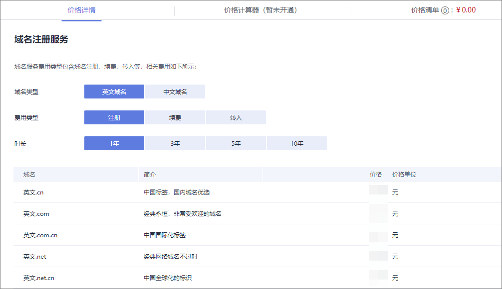

# 如何挑选及命名域名

## 支持注册的域名后缀

注册域名之前，您需要了解华为云域名注册服务支持注册的域名后缀。

在域名注册服务的[价格详情](https://www.huaweicloud.com/pricing.html#/domains)的“产品价格详情”页签中，介绍了支持注册、续费以及转入的域名后缀类型，如[图1](#zh-cn_topic_0193892068_fig157621751112116)所示。

**图 1**  价格详情  

在“产品价格详情”中，您可以根据域名后缀的用途简介、费用、支持注册的年限等因素，选择注册合适后缀的域名。

> **说明：** 
>.cc、.org以及.name后缀的域名只能注册，无法备案。备案是网站能够正常被访问的必要条件之一，如果想要为网站注册域名，请慎选这几类后缀的域名。

## 域名命名规则

域名注册服务支持注册不同后缀类型的域名，分为：

-   英文域名：

    英文域名的构成为“英文名称+英文后缀”，例如，example.com。

-   中文域名：

    中文域名是指域名中至少包含一个汉字，包括：

    -   “英文名称+中文后缀”，例如，example.中国
    -   “中文名称+英文后缀”，例如，中文.com
    -   “中文名称+中文后缀”，例如，中文.中国

不同类型域名的命名规则如[表1](#zh-cn_topic_0193892068_table14815101245520)所示。

**表 1**  域名命名规则

<table><thead align="left"><tr id="zh-cn_topic_0193892068_row8815101235511"><th class="cellrowborder" valign="top" width="19.950000000000003%" id="mcps1.2.4.1.1">
域名类型

</th>
<th class="cellrowborder" valign="top" width="17.119999999999997%" id="mcps1.2.4.1.2">
域名组成

</th>
<th class="cellrowborder" valign="top" width="62.93%" id="mcps1.2.4.1.3">
命名规则

</th>
</tr>
</thead>
<tbody><tr id="zh-cn_topic_0193892068_row16815181245511"><td class="cellrowborder" valign="top" width="19.950000000000003%" headers="mcps1.2.4.1.1 ">
英文域名

</td>
<td class="cellrowborder" valign="top" width="17.119999999999997%" headers="mcps1.2.4.1.2 ">
英文名称+英文后缀

</td>
<td class="cellrowborder" rowspan="4" valign="top" width="62.93%" headers="mcps1.2.4.1.3 ">
域名“名称”部分的命名规则：

<ul id="zh-cn_topic_0193892068_ul198804915911"><li>由汉字、英文字母 （a~z，不区分大小写）、数字（0~9）以及连字符（-）组成，汉字的简体和繁体只需注册一个。</li><li>连字符（-）不得出现在域名名称的开始和结尾。</li><li>不超过63个字符。</li><li>部分英文后缀的域名，不支持中文名称的域名，支持注册的域名组成请参考<a href="https://www.huaweicloud.com/pricing.html#/domains" target="_blank" rel="noopener noreferrer">价格详情</a>的“产品价格详情”页签。</li></ul>
</td>
</tr>
<tr id="zh-cn_topic_0193892068_row1781511219558"><td class="cellrowborder" rowspan="3" valign="top" headers="mcps1.2.4.1.1 ">
中文域名

</td>
<td class="cellrowborder" valign="top" headers="mcps1.2.4.1.2 ">
英文名称+中文后缀

</td>
</tr>
<tr id="zh-cn_topic_0193892068_row1881612128552"><td class="cellrowborder" valign="top" headers="mcps1.2.4.1.1 ">
中文名称+英文后缀

</td>
</tr>
<tr id="zh-cn_topic_0193892068_row8816012175519"><td class="cellrowborder" valign="top" headers="mcps1.2.4.1.1 ">
中文名称+中文后缀

</td>
</tr>
</tbody>
</table>

## 域名注册建议

域名应该简单易记、便于输入，并且具有内涵和意义。一个好的域名需要具备以下特点：

-   简短顺口，方便用户记忆。
-   字符越少越好，易于拼读，不易导致拼写错误。
-   避免同音异义词。

搭建网站或者为企业注册域名时，还应遵循以下原则：

-   选取具有实际意义和内涵的词或词组作为域名，既可以反映网站的性质，也有助于实现企业的营销目标。

    例如，可以采用企业名称、产品名称、品牌名称作为网站域名，使企业的网络营销目标和非网络营销目标达成一致。

-   不建议选取其他企业拥有的独特商标名作为域名。

    选取其他企业独特的商标名作为自己的域名，可能会引起法律纠纷。

-   为避免域名到期后因忘记续费而失去重要的域名，建议注册域名时，一次购买多年，降低域名丢失的风险。

    域名到期前，华为云会通过邮件、短信等方式向您发送提醒通知，请注意查收并及时为域名续费，详细内容请参见[域名续费](域名续费.md)。

