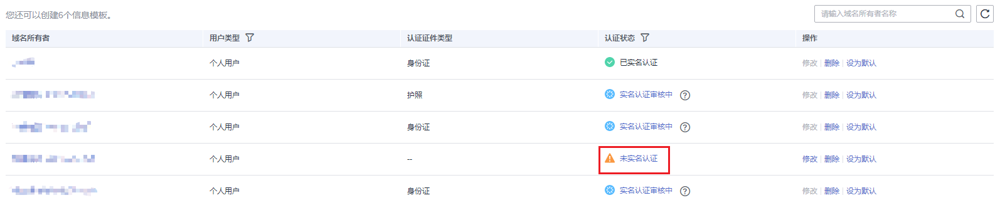

# 实名认证信息模板

## 操作场景

如果信息模板的“认证状态”为如下情况，您可以通过本操作对域名信息模板进行实名认证：

-   未实名认证：如果域名信息模板是在“注册域名”过程中创建的，则“认证状态”为“未实名认证”。
-   实名认证失败：如果创建域名信息模板时提交的实名认证审核失败，则“认证状态”为“实名认证失败”。

本章节以“个人用户”的信息模板为例分别介绍上述两种情况信息模板实名认证的过程。

## 前提条件

-   已经注册华为云帐号并实名认证。
-   已经确定个人用户的域名所有者信息及相关证件。

## 实名认证信息模板（未实名认证）

1.  登录管理控制台。
2.  选择“域名与网站 \> 域名注册”。

    进入“域名列表”页面。

3.  在左侧树状导航栏中，选择“域名注册 \> 信息模板”。

1.  在“信息模板”页面的列表中，找到待实名认证的信息模板，并单击“认证状态”列的“未实名认证”。

    **图 1**  未实名认证信息模板  
    

2.  在“实名认证”页面的“提交材料”区域，填写并提交实名认证材料。

    **图 2**  提交实名认证材料  
    

    1.  选择“证件类型”，证件类型需要与域名所有者相匹配。
    2.  填写对应的“证件号码”。
    3.  单击“”上传实名认证材料。

    实名认证材料需要与域名所有者信息相符，详细说明如[表1](#domain_ug_340002_zh-cn_topic_0193892073_table531201717377)所示。

    **表 1**  实名认证材料示例（个人用户）

    
    <table><thead align="left"><tr id="domain_ug_340002_domain_ug_320002_zh-cn_topic_0216046856_zh-cn_topic_0193892073_row431081783718"><th class="cellrowborder" valign="top" width="12.43124312431243%" id="mcps1.2.5.1.1">
证件类型

    </th>
    <th class="cellrowborder" valign="top" width="14.891489148914891%" id="mcps1.2.5.1.2">
证件号码

    </th>
    <th class="cellrowborder" valign="top" width="39.64396439643964%" id="mcps1.2.5.1.3">
证件示例图样

    </th>
    <th class="cellrowborder" valign="top" width="33.03330333033303%" id="mcps1.2.5.1.4">
实名认证材料要求

    </th>
    </tr>
    </thead>
    <tbody><tr id="domain_ug_340002_domain_ug_320002_zh-cn_topic_0216046856_zh-cn_topic_0193892073_row4311161713718"><td class="cellrowborder" valign="top" width="12.43124312431243%" headers="mcps1.2.5.1.1 ">
身份证

    </td>
    <td class="cellrowborder" valign="top" width="14.891489148914891%" headers="mcps1.2.5.1.2 ">
身份证号码

    </td>
    <td class="cellrowborder" valign="top" width="39.64396439643964%" headers="mcps1.2.5.1.3 ">

    </td>
    <td class="cellrowborder" valign="top" width="33.03330333033303%" headers="mcps1.2.5.1.4 ">
域名所有者身份证人像面扫描件或照片。格式要求为：

    <ul id="domain_ug_340002_domain_ug_320002_zh-cn_topic_0216046856_zh-cn_topic_0193892073_ul2311171717374"><li>清晰、完整的电子版图片（含证件边框）。</li><li>无遮挡、无涂抹。</li><li>图片大小为55KB~1MB。</li><li>图片格式为jpg。</li></ul>
    </td>
    </tr>
    <tr id="domain_ug_340002_domain_ug_320002_zh-cn_topic_0216046856_zh-cn_topic_0193892073_row1931281713377"><td class="cellrowborder" valign="top" width="12.43124312431243%" headers="mcps1.2.5.1.1 ">
护照

    </td>
    <td class="cellrowborder" valign="top" width="14.891489148914891%" headers="mcps1.2.5.1.2 ">
护照号码

    </td>
    <td class="cellrowborder" valign="top" width="39.64396439643964%" headers="mcps1.2.5.1.3 ">

    </td>
    <td class="cellrowborder" valign="top" width="33.03330333033303%" headers="mcps1.2.5.1.4 ">
域名所有者护照个人资料页扫描件或照片。格式要求为：

    <ul id="domain_ug_340002_domain_ug_320002_zh-cn_topic_0216046856_zh-cn_topic_0193892073_ul6312201716371"><li>清晰、完整的电子版图片（含证件边框）。</li><li>无遮挡、无涂抹。</li><li>图片大小为55KB~1MB。</li><li>图片格式为jpg。</li></ul>
    </td>
    </tr>
    </tbody>
    </table>

3.  单击“提交”，完成实名认证材料的提交。
4.  在左侧树状导航栏中，选择“域名注册 \> 信息模板”。

    在信息模板列表中，如果信息模板的“认证状态”为“已实名认证”，则表示信息模板的实名认证审核通过。

    > **说明：**   
    >实名认证审核需要3\~5个工作日，请您耐心等待。  

## 实名认证信息模板（实名认证失败）

1.  登录管理控制台。
2.  选择“域名与网站 \> 域名注册”。

    进入“域名列表”页面。

3.  在左侧树状导航栏中，选择“域名注册 \> 信息模板”。

1.  在“信息模板”页面的列表中，找到待实名认证的信息模板，并单击“认证状态”列的“实名认证失败”，显示实名认证失败报告。

    **图 3**  实名认证失败信息模板  
    

2.  在实名认证失败的报告页面中，单击“重新认证”，进入“实名认证”页面。

    **图 4**  实名认证失败报告  
    

3.  在“身份认证”区域，提交信息模板的实名认证材料。

    1.  选择“证件类型”，证件类型需要与域名所有者相匹配。
    2.  填写对应的“证件号码”。
    3.  单击“”上传实名认证材料。

    实名认证材料需要与域名所有者信息相符，详细说明如[表2](#domain_ug_340003_zh-cn_topic_0212131360_table280520507477)所示。

    **表 2**  实名认证证件示例（企业用户）

    
    <table><thead align="left"><tr id="domain_ug_340003_domain_ug_320003_zh-cn_topic_0216046857_zh-cn_topic_0212131360_row1680610503474"><th class="cellrowborder" valign="top" width="11.52%" id="mcps1.2.6.1.1">
用户所属地域

    </th>
    <th class="cellrowborder" valign="top" width="14.57%" id="mcps1.2.6.1.2">
证件类型

    </th>
    <th class="cellrowborder" valign="top" width="14.97%" id="mcps1.2.6.1.3">
证件号码

    </th>
    <th class="cellrowborder" valign="top" width="32.24%" id="mcps1.2.6.1.4">
实名认证材料示例

    </th>
    <th class="cellrowborder" valign="top" width="26.700000000000003%" id="mcps1.2.6.1.5">
实名认证材料要求

    </th>
    </tr>
    </thead>
    <tbody><tr id="domain_ug_340003_domain_ug_320003_zh-cn_topic_0216046857_zh-cn_topic_0212131360_row1380620500474"><td class="cellrowborder" rowspan="15" valign="top" width="11.52%" headers="mcps1.2.6.1.1 ">
中国大陆

    </td>
    <td class="cellrowborder" valign="top" width="14.57%" headers="mcps1.2.6.1.2 ">
营业执照

    </td>
    <td class="cellrowborder" valign="top" width="14.97%" headers="mcps1.2.6.1.3 ">
统一社会信用代码

    </td>
    <td class="cellrowborder" valign="top" width="32.24%" headers="mcps1.2.6.1.4 ">

    </td>
    <td class="cellrowborder" rowspan="19" valign="top" width="26.700000000000003%" headers="mcps1.2.6.1.5 ">
与域名所有者相匹配的证件扫描件或照片。

    
格式要求为：

    <ul id="domain_ug_340003_domain_ug_320003_zh-cn_topic_0216046857_zh-cn_topic_0212131360_ul1527214818545"><li>清晰、完整的电子版图片（含证件边框）。</li><li>无遮挡、无涂抹。</li><li>图片大小为55KB~1MB。</li><li>图片格式为jpg。</li></ul>
    </td>
    </tr>
    <tr id="domain_ug_340003_domain_ug_320003_zh-cn_topic_0216046857_zh-cn_topic_0212131360_row080619503476"><td class="cellrowborder" valign="top" headers="mcps1.2.6.1.1 ">
统一社会信用代码证书

    </td>
    <td class="cellrowborder" valign="top" headers="mcps1.2.6.1.2 ">
统一社会信用代码

    </td>
    <td class="cellrowborder" valign="top" headers="mcps1.2.6.1.3 ">

    </td>
    </tr>
    <tr id="domain_ug_340003_domain_ug_320003_zh-cn_topic_0216046857_zh-cn_topic_0212131360_row1280616509470"><td class="cellrowborder" valign="top" headers="mcps1.2.6.1.1 ">
组织机构代码证

    </td>
    <td class="cellrowborder" valign="top" headers="mcps1.2.6.1.2 ">
代码

    </td>
    <td class="cellrowborder" valign="top" headers="mcps1.2.6.1.3 ">

    </td>
    </tr>
    <tr id="domain_ug_340003_domain_ug_320003_zh-cn_topic_0216046857_zh-cn_topic_0212131360_row15806450144712"><td class="cellrowborder" valign="top" headers="mcps1.2.6.1.1 ">
部队代号

    </td>
    <td class="cellrowborder" valign="top" headers="mcps1.2.6.1.2 ">
部队代号

    </td>
    <td class="cellrowborder" valign="top" headers="mcps1.2.6.1.3 ">

    </td>
    </tr>
    <tr id="domain_ug_340003_domain_ug_320003_zh-cn_topic_0216046857_zh-cn_topic_0212131360_row78061350154710"><td class="cellrowborder" valign="top" headers="mcps1.2.6.1.1 ">
基金会法人登记证

    </td>
    <td class="cellrowborder" valign="top" headers="mcps1.2.6.1.2 ">
统一社会信用代码

    </td>
    <td class="cellrowborder" valign="top" headers="mcps1.2.6.1.3 ">

    </td>
    </tr>
    <tr id="domain_ug_340003_domain_ug_320003_zh-cn_topic_0216046857_zh-cn_topic_0212131360_row19806250164717"><td class="cellrowborder" valign="top" headers="mcps1.2.6.1.1 ">
军队单位对外有偿服务许可证

    </td>
    <td class="cellrowborder" valign="top" headers="mcps1.2.6.1.2 ">
编号

    </td>
    <td class="cellrowborder" valign="top" headers="mcps1.2.6.1.3 ">

    </td>
    </tr>
    <tr id="domain_ug_340003_domain_ug_320003_zh-cn_topic_0216046857_zh-cn_topic_0212131360_row1480710509476"><td class="cellrowborder" valign="top" headers="mcps1.2.6.1.1 ">
律师事务所执业许可证

    </td>
    <td class="cellrowborder" valign="top" headers="mcps1.2.6.1.2 ">
统一社会信用代码

    </td>
    <td class="cellrowborder" valign="top" headers="mcps1.2.6.1.3 ">

    </td>
    </tr>
    <tr id="domain_ug_340003_domain_ug_320003_zh-cn_topic_0216046857_zh-cn_topic_0212131360_row92516341241"><td class="cellrowborder" valign="top" headers="mcps1.2.6.1.1 ">
民办非企业单位登记证书

    </td>
    <td class="cellrowborder" valign="top" headers="mcps1.2.6.1.2 ">
代码

    </td>
    <td class="cellrowborder" valign="top" headers="mcps1.2.6.1.3 ">

    </td>
    </tr>
    <tr id="domain_ug_340003_domain_ug_320003_zh-cn_topic_0216046857_zh-cn_topic_0212131360_row1096783815246"><td class="cellrowborder" valign="top" headers="mcps1.2.6.1.1 ">
民办学校办学许可证

    </td>
    <td class="cellrowborder" valign="top" headers="mcps1.2.6.1.2 ">
教民XXX号

    </td>
    <td class="cellrowborder" valign="top" headers="mcps1.2.6.1.3 ">

    </td>
    </tr>
    <tr id="domain_ug_340003_domain_ug_320003_zh-cn_topic_0216046857_zh-cn_topic_0212131360_row16967338122417"><td class="cellrowborder" valign="top" headers="mcps1.2.6.1.1 ">
社会团体法人登记证书

    </td>
    <td class="cellrowborder" valign="top" headers="mcps1.2.6.1.2 ">
统一社会信用代码

    </td>
    <td class="cellrowborder" valign="top" headers="mcps1.2.6.1.3 ">

    </td>
    </tr>
    <tr id="domain_ug_340003_domain_ug_320003_zh-cn_topic_0216046857_zh-cn_topic_0212131360_row8222114317244"><td class="cellrowborder" valign="top" headers="mcps1.2.6.1.1 ">
事业单位法人证书

    </td>
    <td class="cellrowborder" valign="top" headers="mcps1.2.6.1.2 ">
统一社会信用代码

    </td>
    <td class="cellrowborder" valign="top" headers="mcps1.2.6.1.3 ">

    </td>
    </tr>
    <tr id="domain_ug_340003_domain_ug_320003_zh-cn_topic_0216046857_zh-cn_topic_0212131360_row4222643192414"><td class="cellrowborder" valign="top" headers="mcps1.2.6.1.1 ">
司法鉴定许可证

    </td>
    <td class="cellrowborder" valign="top" headers="mcps1.2.6.1.2 ">
社会信用代码

    </td>
    <td class="cellrowborder" valign="top" headers="mcps1.2.6.1.3 ">

    </td>
    </tr>
    <tr id="domain_ug_340003_domain_ug_320003_zh-cn_topic_0216046857_zh-cn_topic_0212131360_row9222943132418"><td class="cellrowborder" valign="top" headers="mcps1.2.6.1.1 ">
医疗机构执业许可证

    </td>
    <td class="cellrowborder" valign="top" headers="mcps1.2.6.1.2 ">
登记号

    </td>
    <td class="cellrowborder" valign="top" headers="mcps1.2.6.1.3 ">

    </td>
    </tr>
    <tr id="domain_ug_340003_domain_ug_320003_zh-cn_topic_0216046857_zh-cn_topic_0212131360_row42236438248"><td class="cellrowborder" valign="top" headers="mcps1.2.6.1.1 ">
宗教活动场所登记证

    </td>
    <td class="cellrowborder" valign="top" headers="mcps1.2.6.1.2 ">
统一社会信用代码

    </td>
    <td class="cellrowborder" valign="top" headers="mcps1.2.6.1.3 ">

    </td>
    </tr>
    <tr id="domain_ug_340003_domain_ug_320003_zh-cn_topic_0216046857_zh-cn_topic_0212131360_row09411624124513"><td class="cellrowborder" valign="top" headers="mcps1.2.6.1.1 ">
社会服务机构登记证书

    </td>
    <td class="cellrowborder" valign="top" headers="mcps1.2.6.1.2 ">
证件号码

    </td>
    <td class="cellrowborder" valign="top" headers="mcps1.2.6.1.3 ">

    </td>
    </tr>
    <tr id="domain_ug_340003_domain_ug_320003_zh-cn_topic_0216046857_zh-cn_topic_0212131360_row1231691511274"><td class="cellrowborder" rowspan="4" valign="top" headers="mcps1.2.6.1.1 ">
非中国大陆

    

    </td>
    <td class="cellrowborder" valign="top" headers="mcps1.2.6.1.2 ">
外国（地区）企业常驻代表机构登记证

    </td>
    <td class="cellrowborder" valign="top" headers="mcps1.2.6.1.3 ">
统一社会信用代码

    </td>
    <td class="cellrowborder" valign="top" headers="mcps1.2.6.1.4 ">

    </td>
    </tr>
    <tr id="domain_ug_340003_domain_ug_320003_zh-cn_topic_0216046857_zh-cn_topic_0212131360_row1431721582714"><td class="cellrowborder" valign="top" headers="mcps1.2.6.1.1 ">
外国在华文化中心登记证

    </td>
    <td class="cellrowborder" valign="top" headers="mcps1.2.6.1.2 ">
统一社会信用代码

    </td>
    <td class="cellrowborder" valign="top" headers="mcps1.2.6.1.3 ">

    </td>
    </tr>
    <tr id="domain_ug_340003_domain_ug_320003_zh-cn_topic_0216046857_zh-cn_topic_0212131360_row13317131515275"><td class="cellrowborder" valign="top" headers="mcps1.2.6.1.1 ">
外国政府旅游部门常驻代表机构批准登记表

    </td>
    <td class="cellrowborder" valign="top" headers="mcps1.2.6.1.2 ">
统一社会信用代码

    </td>
    <td class="cellrowborder" valign="top" headers="mcps1.2.6.1.3 ">

    </td>
    </tr>
    <tr id="domain_ug_340003_domain_ug_320003_zh-cn_topic_0216046857_zh-cn_topic_0212131360_row24142674610"><td class="cellrowborder" valign="top" headers="mcps1.2.6.1.1 ">
国外机构证件

    </td>
    <td class="cellrowborder" valign="top" headers="mcps1.2.6.1.2 ">
证件号码

    </td>
    <td class="cellrowborder" valign="top" headers="mcps1.2.6.1.3 ">

    </td>
    </tr>
    </tbody>
    </table>

4.  单击“提交”，完成实名认证材料的提交。
5.  在左侧树状导航栏中，选择“域名注册 \> 信息模板”。

    在信息模板列表中，如果信息模板的“认证状态”为“已实名认证”，则表示信息模板的实名认证审核通过。

    > **说明：**   
    >实名认证审核需要3\~5个工作日，请您耐心等待。  

