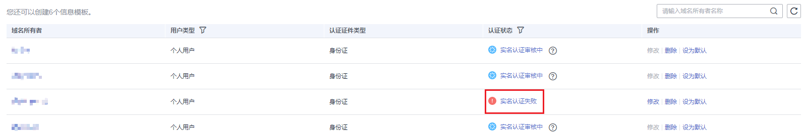
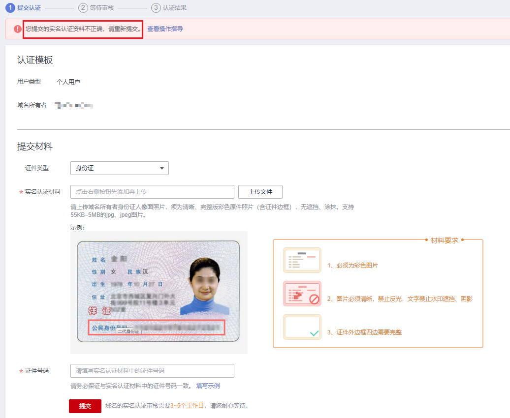

# 实名认证信息模板

## 操作场景

如果信息模板的“认证状态”为如下情况，您可以通过本操作对域名信息模板进行实名认证：

-   未实名认证：如果域名信息模板是在“注册域名”过程中创建的，则“认证状态”为“未实名认证”。
-   实名认证失败：如果创建域名信息模板时提交的实名认证审核失败，则“认证状态”为“实名认证失败”。

本章节针对“未实名认证”和“实名认证失败”两个场景介绍信息模板实名认证的过程。

## 前提条件

-   已经注册华为云帐号并实名认证。
-   已经确定域名所有者信息及相关证件。

## 实名认证信息模板（未实名认证）

1.  登录[管理控制台](https://auth.huaweicloud.com/authui/login.html?locale=zh-cn#/login)。
2.  选择“域名与网站 \> 域名注册”。

    进入“域名列表”页面。

3.  在左侧树状导航栏中，选择“域名注册 \> 信息模板”。

1.  在“信息模板”页面的列表中，找到待实名认证的信息模板，并单击“认证状态”列的“未实名认证”。

    **图 1**  未实名认证信息模板  
    

2.  在“实名认证”页面的“提交材料”区域，填写并提交实名认证材料。

    **图 2**  提交实名认证材料  
    

    1.  选择“证件类型”，证件类型需要与域名所有者相匹配。
    2.  填写对应的“证件号码”。
    3.  单击“”上传实名认证材料。

    实名认证材料需要与域名所有者信息相符，详细说明请参考[域名实名认证填写示例（企业用户）](域名实名认证填写示例（企业用户）.md)。

3.  单击“提交”，完成实名认证材料的提交。
4.  在左侧树状导航栏中，选择“域名注册 \> 信息模板”。

    在信息模板列表中，如果信息模板的“认证状态”为“已实名认证”，则表示信息模板的实名认证审核通过。

    > **说明：** 
    >实名认证审核需要3\~5个工作日，请您耐心等待。

## 实名认证信息模板（实名认证失败）

1.  登录[管理控制台](https://auth.huaweicloud.com/authui/login.html?locale=zh-cn#/login)。
2.  选择“域名与网站 \> 域名注册”。

    进入“域名列表”页面。

3.  在左侧树状导航栏中，选择“域名注册 \> 信息模板”。

1.  在“信息模板”页面的列表中，找到待实名认证的信息模板，并单击“认证状态”列的“实名认证失败”，显示实名认证失败报告。

    **图 3**  实名认证失败信息模板  
    

2.  在实名认证失败的认证结果页面中，单击“重新认证”，进入“实名认证”页面。

    **图 4**  实名认证失败报告  
    

    **图 5**  实名认证的提交认证环节  
    

3.  在“实名认证”页面的“提交材料”区域，参考[域名实名认证失败如何处理？](https://support.huaweicloud.com/domain_faq/domain_faq_040304.html)重新填写并提交信息模板的实名认证材料。

    1.  选择“证件类型”，证件类型需要与域名所有者相匹配。
    2.  填写对应的“证件号码”。
    3.  单击“”上传实名认证材料。

    实名认证材料需要与域名所有者信息相符，详细说明请参考[域名实名认证填写示例（个人用户）](域名实名认证填写示例（个人用户）.md)。

4.  单击“提交”，完成实名认证材料的提交。
5.  在左侧树状导航栏中，选择“域名注册 \> 信息模板”。

    在信息模板列表中，如果信息模板的“认证状态”为“已实名认证”，则表示信息模板的实名认证审核通过。

    > **说明：** 
    >实名认证审核需要3\~5个工作日，请您耐心等待。

