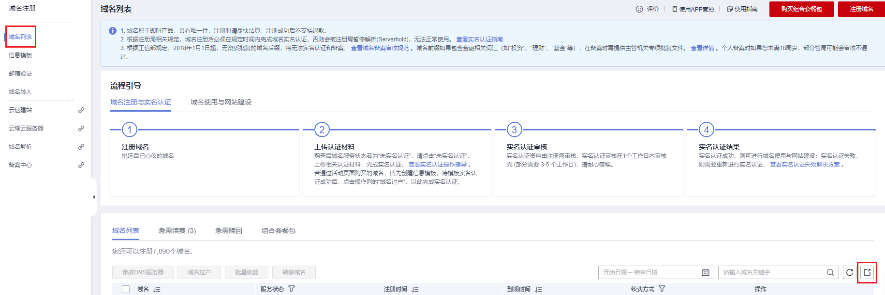

# 导出域名列表

## 操作场景

域名注册成功后您可以根据自身需要导出域名，导出的域名列表中包含域名、注册时间、到期时间，用户类型、域名持有者、域名状态及DNS服务器信息。

## 操作步骤

1.  登录[域名注册控制台](https://console.huaweicloud.com/domain/?region=cn-north-4#/domain/list)。

    进入“域名列表”页面。

2.  在“域名列表”页面，单击“”。

    **图 1**  导出域名  
    

3.  导出完成后的域名列表文件会自动打开，即可查看导出结果。

