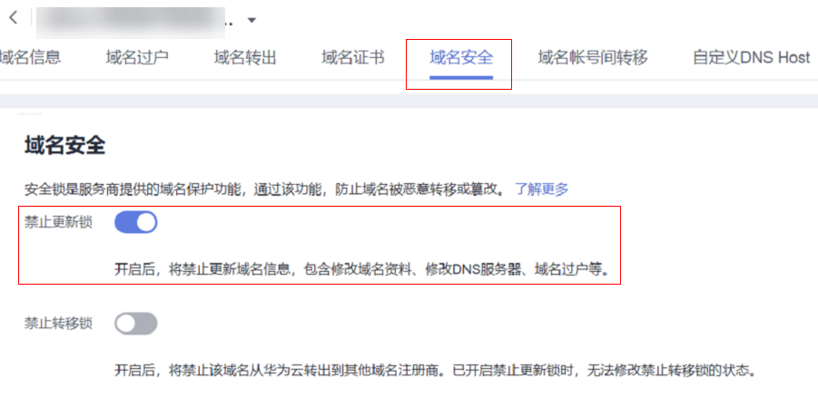

# 开启禁止更新锁

## 操作场景

在华为云注册或管理的域名，可以免费开启禁止更新锁。开启后，禁止更新域名信息，包括修改域名资料、修改DNS服务器、域名过户等操作，防止域名被恶意篡改。

## 操作步骤

1.  登录[域名注册控制台](https://console.huaweicloud.com/domain/?region=cn-north-4#/domain/list)。

    进入“域名列表”页面。

2.  在域名列表中，单击待操作的域名，进入“域名详情”页面。
3.  点击“域名安全”。
4.  选择开启“禁止更新锁”。
5.  根据验证提示，输入验证码，即可开启禁止更新锁。

    **图 1**  开启禁止更新锁  
    

