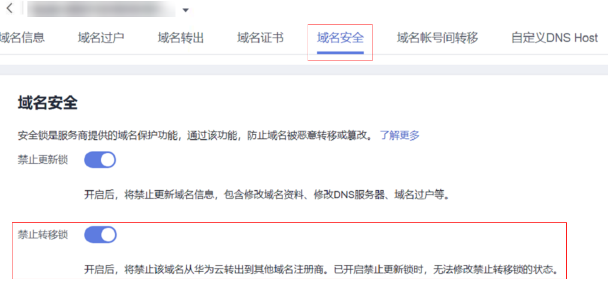

# 开启禁止转移锁

## 操作场景

在华为云注册或管理的域名，您可以免费开启禁止转移锁。开启禁止域名从华为云转出到其他域名注册商，避免域名被恶意转移。

当同时开启禁止更新锁时，无法修改禁止转移锁的状态。

## 操作步骤

1.  登录[域名注册控制台](https://console.huaweicloud.com/domain/?region=cn-north-4#/domain/list)。

    进入“域名列表”页面。

2.  在域名列表中，单击待操作的域名，进入“域名详情”页面。
3.  点击“域名安全”。
4.  选择开启“禁止转移锁”。
5.  根据验证提示，输入验证码，即可开启禁止转移锁。

    **图 1**  开启禁止转移锁  
    

## 常见问题

**怎样关闭“禁止转移锁”？**

如果需要关闭禁止转移锁，请先关闭“禁止更新锁”。

在"域名详情 \> 域名安全”页签下先选择关闭“禁止更新锁”，再选择关闭“禁止转移锁”。

