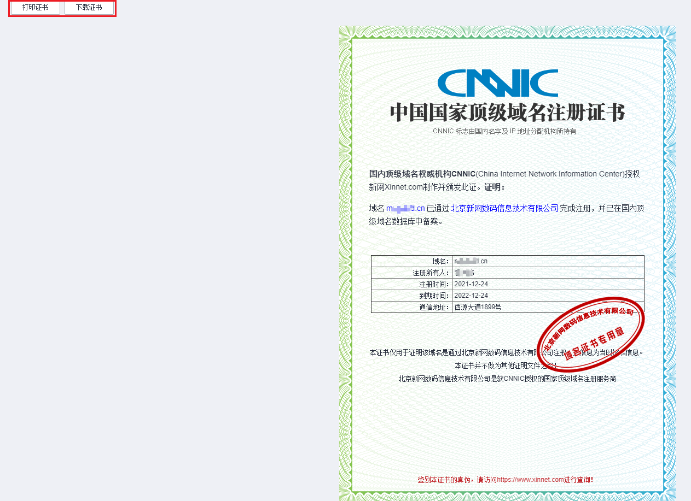

# 打印/下载域名证书

## 操作场景

域名证书是域名所有者的身份证明，通常用于域名备案。

> **说明：** 
>打印/下载域名证书不支持通过华为云APP操作。

## 操作步骤

1.  登录[管理控制台](https://auth.huaweicloud.com/authui/login.html?locale=zh-cn#/login)。
2.  选择“域名与网站 \> 域名注册”。

    进入“域名列表”页面。

3.  在域名列表中，单击“域名”列的待打印或下载证书的域名。

    进入域名信息页面。

4.  在左侧导航栏，单击“域名证书”。

    页面中显示当前域名的证书，您可以打印或者下载该证书。

    > **说明：** 
    >如果不显示域名的证书，且页面出现“对不起，没有找到符合条件的记录，请稍后再试。”，请[提交工单](https://support.huaweicloud.com/usermanual-ticket/zh-cn_topic_0127038618.html)联系客服处理。

    **图 1**  域名证书  
    

5.  打印或者下载域名证书。
    -   单击“打印证书”，完成域名证书的打印。
    -   单击“下载证书”，可以将域名证书下载到本地，证书格式为PNG。

