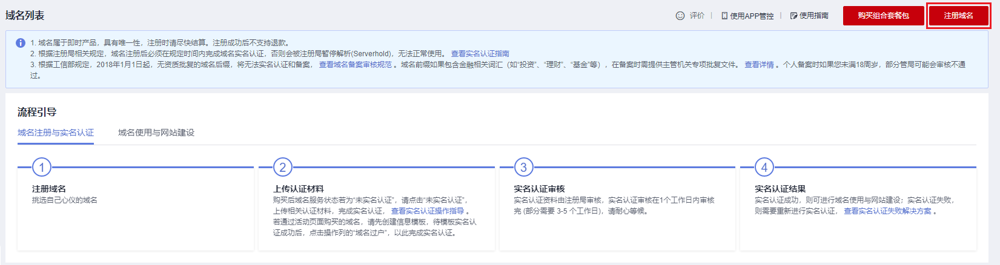
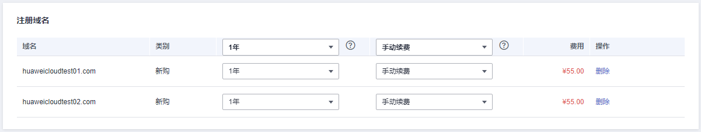
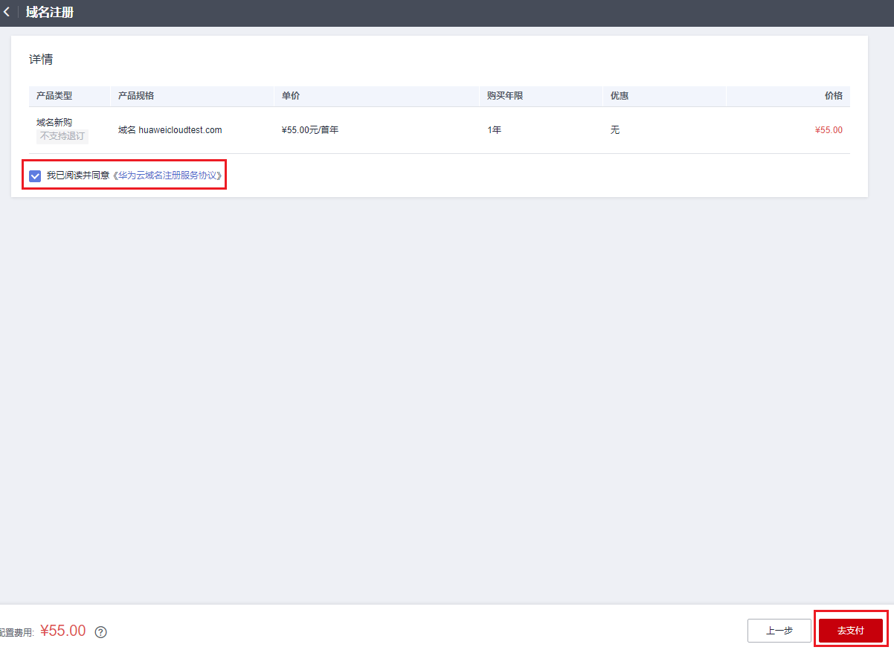

# 批量注册域名

## 操作场景

注册域名就是付费获取域名某一时间段使用权的过程。

用户可以选择华为云作为域名注册商注册域名，该操作在管理控制台上完成。域名注册服务支持批量注册域名，最多支持同时注册50个域名。

本章节以域名“huaweicloudtest01.com”和““huaweicloudtest02.com”为例，介绍批量注册域名的全过程。

> **说明：**   
>域名无地域限制，无需设置区域和项目。  

## 前提条件

-   已经注册华为云帐号并实名认证。
-   已经确定域名的“用户类型”和“域名所有者”信息。

    域名注册完成后，不能直接修改“用户类型”和“域名所有者，需要通过[域名过户](域名过户.md)操作进行变更。

## 操作流程

注册域名的流程如[图1](#zh-cn_topic_0207315141_fig1066572232318)所示。

**图 1**  域名注册流程  

## 查询域名

注册域名之前，需要查询待注册的域名是否已被他人注册，只有状态为“未注册”的域名才可以被注册。

1.  登录管理控制台。
2.  选择“域名与网站 \> 域名注册”。

    进入“域名列表”页面。

3.  在页面右上角，单击“注册域名”。

    **图 2**  注册域名  
    

4.  在“域名查询”的“多个查询”页签，输入待注册的域名名称“huaweicloudtest01”和“huaweicloudtest02”，域名之间以换行符分隔。

    查询多个域名时，仅支持查询指定后缀的域名，例如“.com”。

    **图 3**  域名查询  
    

5.  单击“查询”，显示“查询结果”。
6.  在“查询结果”区域，找到待注册的域名“huaweicloudtest01.com”和“huaweicloudtest02.com”，分别单击“加入清单”。

    您可以根据查询结果选择域名进行注册：

    -   未注册：域名未被注册，可以直接注册该域名。
    -   已被注册：域名已被注册，需要重新修改域名名称或者选择其他后缀的域名。

    在“查询结果”中可以看到不同后缀域名的首年价格，同时还可以查看“更多价格”。

    更详细的域名价格信息请参见[价格详情](https://www.huaweicloud.com/pricing.html#/domains)。

    > **说明：**   
    >您可以单击“查看域名信息”查看已被注册域名的域名注册信息（WHOIS）。  

7.  在页面右侧的“域名清单”可以看到加入的域名，单击“立即购买”开始购买域名。

    **图 4**  域名清单  
    

## 购买域名

域名属于即时产品，具有唯一性，选定域名并确认可被注册后，请尽快完成域名的服务选型及购买，以免被其他用户抢注。

购买域名包括如下环节：

-   服务选型
-   订单确认
-   支付

**图 5**  购买域名三环节  

> **说明：**   
>域名注册成功后不支持退款。  

**服务选型**

1.  在“注册域名”区域，单击“批量选择年限”后面的“”设置待注册域名的购买年限。

    **图 6**  批量选择年限  
    

    为了降低域名丢失风险，建议一次注册多年。

    若不同域名的年限设置不同，则不能“批量选择年限”，需要为每个域名单独设置年限。

2.  在“域名信息”区域，选择一个信息模板为待注册域名设置域名信息。

    批量注册域名仅支持为多个域名设置相同的域名信息。

    **图 7**  设置域名信息  
    

    如果列表中没有可用的域名信息模板，或者待注册域名的“域名所有者”和“用户类型”与现有模板不符，可以单击“创建域名信息模板”设置域名信息。

    > **说明：**   
    >-   若已经设置了默认信息模板，则系统会自动选择该信息模板。设置默认信息模板的操作请参见[设置默认信息模板](设置默认信息模板.md)。  
    >-   “.com”、“.cn”、“.net”、“.top”以及“.中国”后缀的域名支持关联模板实名认证的状态。选择已实名认证的域名信息模板则无需再次进行域名实名认证，因此，建议您提前创建域名信息模板并完成实名认证，详细内容请参见[创建信息模板（个人用户）](创建信息模板（个人用户）.md)和[创建信息模板（企业用户）](创建信息模板（企业用户）.md)。  
    >-   对于其他不支持关联模板实名状态后缀类型的域名，即使选择了已实名认证的信息模板，在注册完成后仍然需要对域名进行实名认证，详细内容请参见[域名实名认证](域名实名认证.md)。  

3.  单击“立即购买”，进入“订单确认”环节。

**订单确认**

1.  在“订单确认”环节，核对订单信息无误后，勾选“我已阅读并同意《华为云域名注册服务协议》”。

    **图 8**  勾选《华为云域名注册服务协议》  
    

2.  单击“去支付”，进入“支付”环节。

**支付**

1.  在“支付”环节的“购买域名”页面，选择支付方式。

    **图 9**  选择支付方式  
    

2.  单击“确认付款”，完成域名的注册。

## 后续操作

1.  在菜单栏的“服务列表”中，选择“域名与网站 \> 域名注册”。

    进入“域名列表”页面。

2.  在“域名列表”，可以查看到已注册的域名。

    域名注册完成后，可以进行以下操作：

    -   [域名实名认证](域名实名认证.md)：根据工信部的规定，新注册域名需在购买成功后5天内进行实名认证，否则将无法正常解析和访问。
    -   [配置域名解析](https://support.huaweicloud.com/qs-dns/dns_qs_0002.html)：用于配置域名到网站或Web应用服务器的解析记录。
    -   [域名续费](域名续费.md)：用于为即将到期的域名进行续费。
    -   [修改DNS服务器](修改DNS服务器.md)：用于修改域名的权威DNS服务器，华为云注册的域名默认使用华为云DNS进行解析。
    -   [域名过户](域名过户.md)：用于变更域名的“用户类型”和“域名所有者”。
    -   [域名转出华为云](域名转出华为云.md)：用于将域名转出华为云。
    -   [域名账号间转移](域名账号间转移.md)：用于将域名转移至华为云其他账户。

