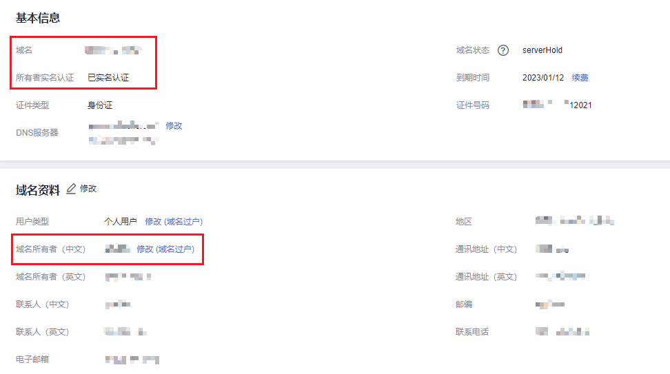

# 查看域名实名认证信息和状态

## 操作场景

本章节介绍如何查看域名实名认证的信息和状态。

在网站备案时，您可以参考本操作提供域名实名认证的截图。

## 操作步骤

1.  登录[管理控制台](https://auth.huaweicloud.com/authui/login.html?locale=zh-cn#/login)。
2.  选择“域名与网站 \> 域名注册”，进入“域名列表”页面。

    在域名列表页面的“服务状态”列，可查看域名的实名认证状态。

    域名的实名认证状态包括：

    -   未实名认证：域名还未进行实名认证，请参考[域名实名认证操作指导（新注册域名）](域名实名认证操作指导（新注册域名）.md)进行实名认证。
    -   实名认证失败：域名实名认证审核不通过，请参考[域名实名认证失败如何处理？](https://support.huaweicloud.com/domain_faq/domain_faq_040304.html)进行处理。
    -   实名认证审核中：已提交域名实名认证，请耐心等待注册局审核，大约需要3\~5个工作日。
    -   已实名认证：域名实名认证审核成功，您可以继续进行域名的备案、解析等操作。

3.  在域名列表中，单击域名的名称，即可查看域名实名认证信息。

    如果用于备案，则可以进行截图，示例如[图1](#fig1556618743613)所示。

    **图 1**  域名实名认证信息  
    

