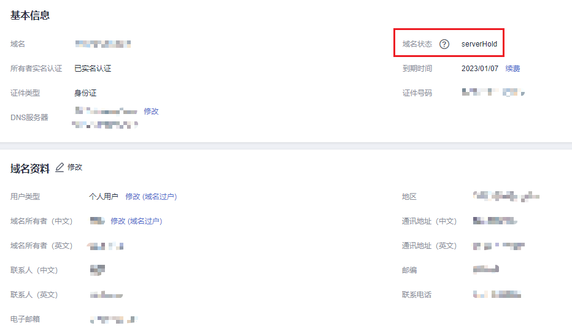

# 查看域名状态

## 操作场景

查看域名状态有助于定位域名异常的原因，并及时采取相应措施。

## 操作步骤

1.  登录管理控制台。
2.  选择“域名与网站 \> 域名注册”。

    进入“域名列表”页面。

3.  在域名列表中，单击待查看域名的“域名”列，进入域名信息页面。

    **图 1**  域名信息  
    

    在域名的“基本信息”区域，可查看“域名状态”。

    域名状态详细内容请参见[域名状态](域名状态.md)。

