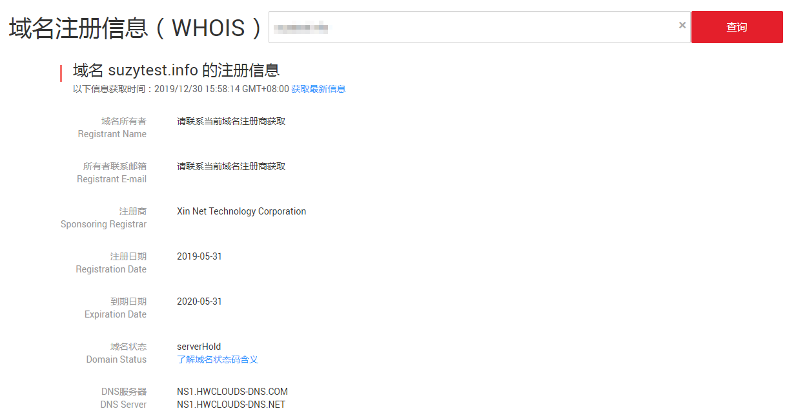

# 查询域名注册信息（WHOIS）

## 操作场景

华为云支持查询已注册域名的注册信息（WHOIS）。

根据如下组织和规范的合规要求，WHOIS数据库的公开查询结果将不再显示域名注册者的私人信息：

-   ICANN（The Internet Corporation for Assigned Names and Numbers，ICANN）：《通用顶级域名注册数据临时政策细则》（Temporary Specification for gTLD Registration Data）
-   欧盟：《通用数据保护条例》（General Data Protection Regulation，简称GDPR）

因此，域名注册信息的查询结果将隐藏域名所有者的私人信息。

您可以通过华为云的[WHOIS平台](https://www.huaweicloud.com/whois/index.html)进行域名注册信息的查询，也可以进入域名注册服务管理控制台查询域名注册信息（WHOIS）。

## 查询域名注册信息（WHOIS平台）

1.  打开[https://www.huaweicloud.com/whois/index.html](https://www.huaweicloud.com/whois/index.html)，进入“域名注册信息查询（WHOIS）”页面。

    **图 1**  域名注册信息查询（WHOIS）  
    

2.  在输入框中，输入待查询的域名名称，例如“example.com”。
3.  单击“查询”。

    显示域名example.com的注册信息。

    **图 2**  域名example.com注册信息  
    

## 查询域名注册信息（域名注册服务管理控制台）

1.  登录管理控制台。
2.  选择“域名与网站 \> 域名注册”。

    进入“域名列表”页面。

3.  单击“注册域名”。
4.  在“域名查询”中输入待查询的域名。
5.  单击“查询”。
6.  在“查询结果”区域，单击“查看域名信息”，查看域名注册信息（WHOIS），主要包括：

    -   域名所有者
    -   所有者联系邮箱
    -   注册商
    -   注册日期
    -   到期日期
    -   域名状态，详细内容请参见[域名状态](域名状态.md)
    -   DNS服务器

    **图 3**  域名注册信息（WHOIS）示例  
    

