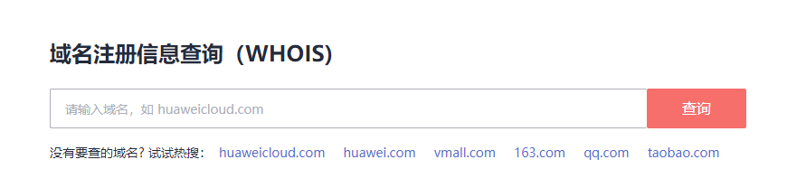
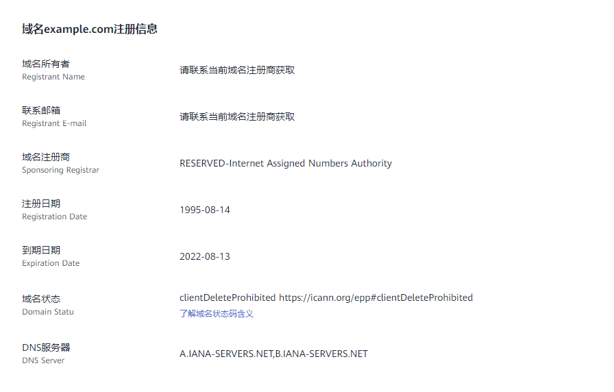

# 查询域名注册信息（WHOIS）

## 操作场景

域名注册成功后，WHOIS平台会记录已注册域名的注册信息。请登录华为云[WHOIS平台](https://www.huaweicloud.com/whois/index.html)，查询域名注册信息。

支持查询的域名注册信息如[表1](#table0848124212012)所示。

**表 1**  已注册域名信息

<table><thead align="left"><tr id="row9848204217209"><th class="cellrowborder" valign="top" width="23.330000000000002%" id="mcps1.2.3.1.1">
参数

</th>
<th class="cellrowborder" valign="top" width="76.67%" id="mcps1.2.3.1.2">
参数说明

</th>
</tr>
</thead>
<tbody><tr id="row14153105716221"><td class="cellrowborder" valign="top" width="23.330000000000002%" headers="mcps1.2.3.1.1 ">
域名所有者

</td>
<td class="cellrowborder" rowspan="2" valign="top" width="76.67%" headers="mcps1.2.3.1.2 ">
根据ICANN组织和欧盟合规要求，WHOIS数据库的公开查询结果将不再显示域名注册者的私人信息，请联系当前域名注册商获取。

<ul id="ul12407516280"><li>ICANN（The Internet Corporation for Assigned Names and Numbers，ICANN）：《通用顶级域名注册数据临时政策细则》（Temporary Specification for gTLD Registration Data）</li><li>欧盟：《通用数据保护条例》（General Data Protection Regulation，简称GDPR）</li></ul>
</td>
</tr>
<tr id="row14745145419220"><td class="cellrowborder" valign="top" headers="mcps1.2.3.1.1 ">
联系邮箱

</td>
</tr>
<tr id="row148489424207"><td class="cellrowborder" valign="top" width="23.330000000000002%" headers="mcps1.2.3.1.1 ">
域名注册商

</td>
<td class="cellrowborder" valign="top" width="76.67%" headers="mcps1.2.3.1.2 ">
域名当前的注册商。

</td>
</tr>
<tr id="row1784818422206"><td class="cellrowborder" valign="top" width="23.330000000000002%" headers="mcps1.2.3.1.1 ">
注册日期

</td>
<td class="cellrowborder" valign="top" width="76.67%" headers="mcps1.2.3.1.2 ">
域名首次被注册的日期。

示例：

<ul id="ul155072916148"><li>xxxx-xx-xx：域名example.com第一次被注册。</li><li>yyyy-yy-yy：域名example.com到期后被释放。</li><li>zzzz-zz-zz：域名example.com被其他人购买。该购买人通过WHOIS平台查询，显示的注册日期为域名第一次被注册的日期（xxxx-xx-xx），而不是他购买域名的日期（zzzz-zz-zz）。</li></ul>
</td>
</tr>
<tr id="row138481442102013"><td class="cellrowborder" valign="top" width="23.330000000000002%" headers="mcps1.2.3.1.1 ">
到期日期

</td>
<td class="cellrowborder" valign="top" width="76.67%" headers="mcps1.2.3.1.2 ">
域名到期日期。

为确保域名的正常使用，请在域名到期前及时续费，详情请参见<a href="域名续费.md">域名续费</a>。

</td>
</tr>
<tr id="row2084824222016"><td class="cellrowborder" valign="top" width="23.330000000000002%" headers="mcps1.2.3.1.1 ">
域名状态

</td>
<td class="cellrowborder" valign="top" width="76.67%" headers="mcps1.2.3.1.2 ">
了解域名各状态码的含义，请参见<a href="查看域名状态.md">查看域名状态</a>。

</td>
</tr>
<tr id="row128901114102112"><td class="cellrowborder" valign="top" width="23.330000000000002%" headers="mcps1.2.3.1.1 ">
DNS服务器

</td>
<td class="cellrowborder" valign="top" width="76.67%" headers="mcps1.2.3.1.2 ">
域名当前用于解析的权威DNS服务器。

通过华为云注册成功的域名默认使用华为云DNS进行解析，如需更改，请参见<a href="修改DNS服务器.md">修改DNS服务器</a>。

</td>
</tr>
</tbody>
</table>

## 操作步骤

1.  打开[https://www.huaweicloud.com/whois/index.html](https://www.huaweicloud.com/whois/index.html)，进入“域名注册信息查询（WHOIS）”页面。

    **图 1**  域名注册信息查询（WHOIS）  
    

2.  在输入框中，输入待查询的域名名称，例如“example.com”。
3.  单击“查询”。

    显示域名example.com的注册信息。

    **图 2**  域名example.com注册信息  
    

