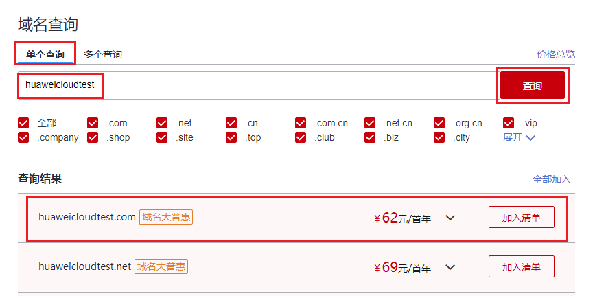
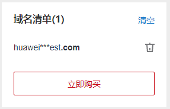
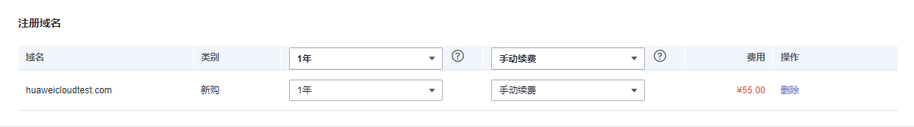
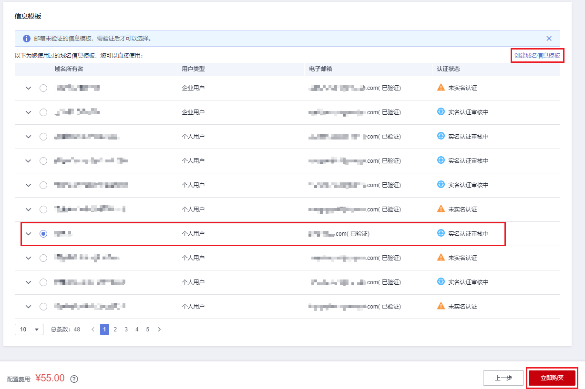
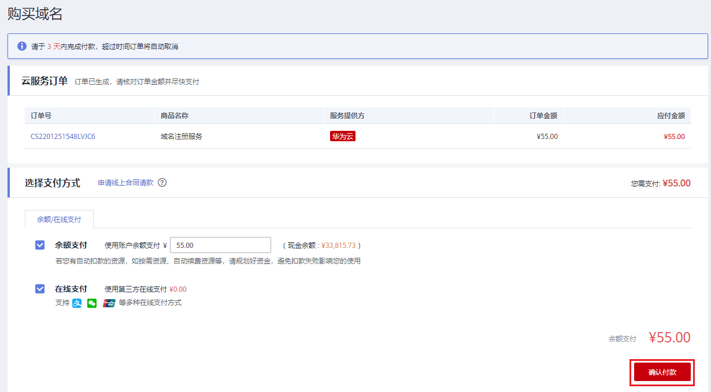

# 注册单个域名操作指导

## 操作场景

注册域名就是付费获取域名某一时间段使用权的过程。

用户可以选择华为云作为域名注册商注册域名，该操作在管理控制台上完成。

本章节以域名“huaweicloudtest.cn”为例，介绍域名注册的全过程。

> **说明：** 
>-   同一个租户帐号，最多支持注册50000个域名。
>-   域名注册成功后不能退订、不能改名、不能注销。
>-   域名无地域限制，无需设置区域和项目。
>-   不支持购买白金域名（或称溢价域名）。

## 前提条件

-   已经注册华为云帐号并实名认证。
-   已经确定域名的“用户类型”和“域名所有者”信息。

    域名注册完成后，不能直接修改“用户类型”和“域名所有者”，需要通过[域名过户](域名过户.md)操作进行变更。

## 操作流程

注册域名的流程如[图1](#zh-cn_topic_0207315140_fig1066572232318)所示。

**图 1**  域名注册流程  

## 查询域名

注册域名之前，需要查询待注册的域名是否已被他人注册，只有状态为“未注册”的域名才可以被注册。

1.  登录[管理控制台](https://auth.huaweicloud.com/authui/login.html?locale=zh-cn#/login)。
2.  选择“域名与网站 \> 域名注册”。

    进入“域名列表”页面。

3.  在页面右上角，单击“注册域名”。

    **图 2**  注册域名  
    

4.  在“域名查询”的“单个查询”页签，输入待注册的域名名称“huaweicloudtest”。

    您可以在输入框下面选择查询“全部”后缀的域名，也可以查询指定后缀的域名，例如“.cn”。

    **图 3**  域名查询  
    

5.  单击“查询”，显示“查询结果”。
6.  在“查询结果”区域，找到待注册的域名“huaweicloudtest.cn”，单击“加入清单”。

    您可以根据查询结果选择域名进行注册：

    -   未注册：域名未被注册，可以直接注册该域名。
    -   已被注册：域名已被注册，需要重新修改域名名称或者选择其他后缀的域名。

    在“查询结果”中可以看到不同后缀域名的首年价格，同时还可以查看“更多价格”。

    更详细的域名价格信息请参见[价格详情](https://www.huaweicloud.com/pricing.html#/domains)的“产品价格详情”页签。

    > **说明：** 
    >您可以单击“查看域名信息”查看已被注册域名的域名注册信息（WHOIS）。

7.  在页面右侧的“域名清单”可以看到加入的域名，单击“立即购买”开始购买域名。

    **图 4**  域名清单  
    

## 购买域名

域名属于即时产品，具有唯一性，选定域名并确认可被注册后，请尽快完成域名的服务选型及购买，以免被其他用户抢注。

购买域名包括如下环节：

-   服务选型
-   订单确认
-   支付

**图 5**  购买域名三环节  

> **说明：** 
>域名注册成功后不支持退款。

**服务选型**

1.  在“服务选型”环节的“注册域名”区域，单击“”设置待注册域名的购买年限。

    **图 6**  设置域名年限  
    

    为了降低域名丢失风险，建议一次注册多年。

    若一次性为多个域名设置年限，可以选择“批量选择年限”。

2.  在“域名信息”区域，选择一个信息模板为待注册域名设置域名信息。

    **图 7**  设置域名信息  
    

    -   若已经预先设置了默认信息模板，系统会自动选择该信息模板。

        设置默认信息模板的操作请参见[设置默认信息模板](设置默认信息模板.md)。

    -   如果列表中有“已实名认证”的信息模板，建议优先选择该模板。
        -   “.com”、“.cn”、“.net”以及“.中国”后缀的域名支持关联信息模板实名认证的状态。选择已实名认证的信息模板后，无需再次进行域名实名认证。
        -   对于其他不支持关联模板实名状态后缀类型的域名，即使选择了已实名认证的信息模板，在注册完成后仍然需要对域名进行实名认证，详细内容请参见[域名实名认证操作指导（新注册域名）](域名实名认证操作指导（新注册域名）.md)。

    -   如果列表中没有可用的域名信息模板，或者待注册域名的“域名所有者”和“用户类型”与现有模板不符，可以单击“创建域名信息模板”设置域名信息。

        通过该方式创建的信息模板并未进行实名认证，请在域名注册完成后对信息模板进行实名认证，详细操作请参见[实名认证信息模板](实名认证信息模板.md)。

    > **说明：** 
    >如果在本步骤中未设置信息模板，则“立即购买”为灰色，无法购买域名。

3.  单击“立即购买”，进入“订单确认”环节。

**订单确认**

1.  在“订单确认”环节，核对订单信息无误后，勾选“我已阅读并同意《华为云域名注册服务协议》”。

    **图 8**  勾选《华为云域名注册服务协议》  
    

2.  单击“去支付”，进入“支付”环节。

**支付**

1.  在“支付”环节的“购买域名”页面，选择支付方式。

    **图 9**  选择支付方式  
    

2.  单击“确认付款”，完成域名的注册。

## 后续操作

1.  在菜单栏的“服务列表”中，选择“域名与网站 \> 域名注册”。

    进入“域名列表”页面。

2.  在“域名列表”，可以查看到已注册的域名。

    **图 10**  域名列表  
    

    域名注册完成后，可以进行以下操作：

    1.  检查域名的“服务状态”，并实名认证域名。
        -   [查看域名及其服务状态](查看域名及其服务状态.md)：用于查看已注册域名，以及域名当前的“服务状态”。
        -   [域名实名认证操作指导（新注册域名）](域名实名认证操作指导（新注册域名）.md)：若域名的“服务状态”为“未实名认证”，则需要尽快完成域名实名认证，以免影响域名使用。

    2.  （可选）配置域名，实现通过域名访问网站。
        -   [快速完成网站备案](https://support.huaweicloud.com/qs-icp/icp_07_0002.html)：用于域名及网站的备案。
        -   [配置域名解析](https://support.huaweicloud.com/qs-dns/dns_qs_0002.html)：用于配置域名到网站或Web应用服务器的解析记录。
        -   [购买SSL证书](https://support.huaweicloud.com/qs-scm/scm_07_0001.html)：为网站购买并部署SSL证书。

    3.  （可选）管理域名。
        -   [域名续费](域名续费.md)和[域名批量续费](域名批量续费.md)：用于为即将到期的域名进行续费。
        -   [修改DNS服务器](修改DNS服务器.md)：用于修改域名的权威DNS服务器，华为云注册的域名默认使用华为云DNS进行解析。
        -   [域名过户](域名过户.md)：用于变更域名的“用户类型”和“域名所有者”。
        -   [域名转出华为云](域名转出华为云.md)：用于将域名转出华为云。
        -   [域名账号间转移](域名账号间转移.md)：用于将域名转移至华为云其他账户。

