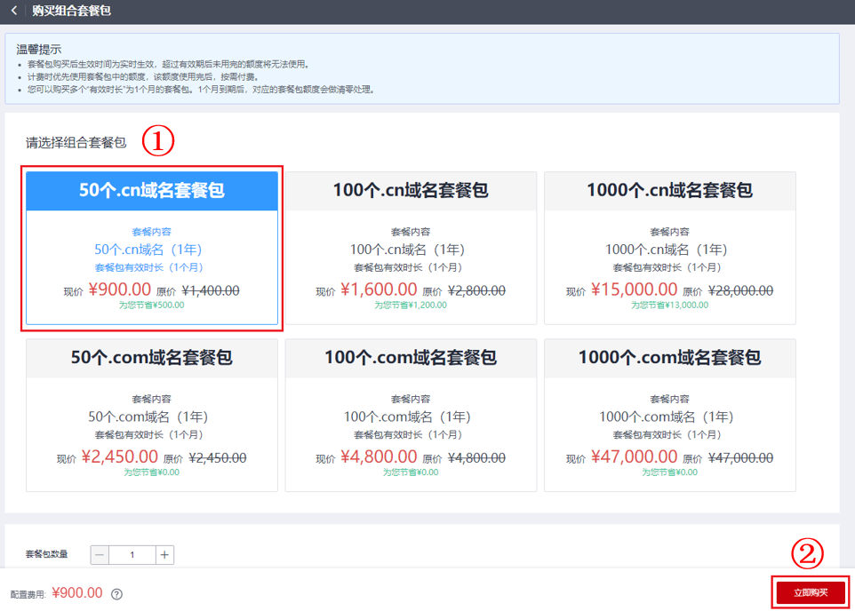
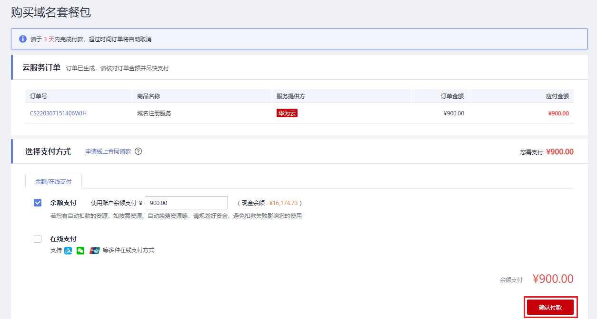

# 组合套餐包购买和使用

## 操作场景

组合套餐包是华为云推出的优惠活动类产品，套餐包内含有多个域名组合，以优惠价方式限量出售。如您有长期、批量注册域名的需求，可提前购买组合套餐包，并在后续注册域名时，选择对应的域名套餐包进行抵扣即可。

> **说明：** 
>-   套餐包购买后生效时间为实时生效，超过有效期后未用完的额度将无法使用。
>-   计费时优先使用套餐包中的额度，该额度使用完后，按正常付费购买域名。
>-   您可以购买多个“有效时长”为1个月的套餐包。1个月到期后，对应的套餐包额度会做清零处理。
>-   套餐包不支持代金券、折扣支付，购买成功后不支持退款。
>-   组合套餐包支持的域名后缀有：.cn、.com。

## 购买组合套餐包

1.  登录[域名注册控制台](https://console.huaweicloud.com/domain/?region=cn-north-4#/domain/list)。

    进入“域名列表”页面。

2.  在页面右上角，单击“购买组合套餐包”。

    **图 1**  购买组合套餐包  
    

3.  选择要购买的组合套餐包后，单击“立即购买”。

    **图 2**  选择组合套餐包  
    

4.  在“套餐详情”页面，核对订单信息。

    **图 3**  核对订单信息  
    

5.  单击“去支付”，进入“支付”环节。
6.  在“支付”环节的“购买域名套餐包”页面，选择支付方式。

    **图 4**  选择支付方式  
    

7.  单击“确认付款”，完成组合套餐包购买。

## 使用组合套餐包进行域名注册

1.  在“域名列表”，可以查看到已购买的组合套餐包。

    **图 5**  组合套餐包  
    

2.  单击“去使用”。
3.  在页面上方搜索框中输入域名，进行查询。
4.  显示域名未被注册时，单击“加入清单”。
5.  单击“立即购买”，进入信息模板设置界面。
6.  选择已实名认证的信息模板。
7.  单击“立即购买”，进入订单确认页面。
8.  确认无误后，勾选“我已阅读并同意《华为云域名注册服务协议》”。
9.  单击“去支付”，即可完成使用组合套餐包进行域名注册。

    > **说明：** 
    >由于在购买组合套餐包时已完成支付，因此此处显示的支付价格为0元。

