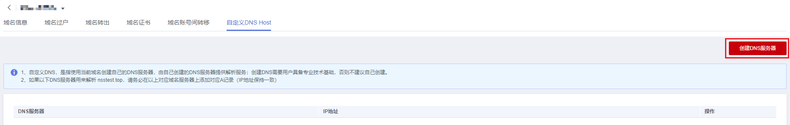
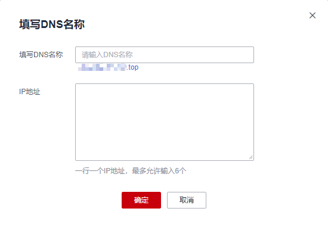

# 自定义DNS Host

## 操作场景

自定义DNS Host，是指使用当前域名创建自己的DNS服务器，即可由自己创建的DNS服务器提供解析服务。

本章节指导您如何添加自定义DNS Host。

> **说明：** 
>-   1个域名可以添加的自定义DNS数量无限制，但是一个DNS服务器最多可以加6个IP地址。
>-   如果使用自己创建的DNS Host来解析域名，必须在对应域名服务器上添加对应A记录（IP地址保持一致）。

## 操作步骤

1.  登录[域名注册控制台](https://console.huaweicloud.com/domain/?region=cn-north-4#/domain/list)。

    进入“域名列表”页面。

2.  在域名列表中，单击需要设置自定义DNS Host的域名。

    进入域名信息页面。

3.  在“域名信息” 页面，单击“自定义DNS Host”页签。
4.  在页面右上角，单击“创建DNS服务器”。

    **图 1**  创建DNS服务器  
    

5.  在弹出的“填写DNS名称”窗口中，填写相关信息。

    **图 2**  填写DNS名称  
    

    -   填写DNS名称：输入DNS Host的子域名称。
    -   IP地址：输入服务器 IP 地址。

6.  单击“确定”，即可完成DNS Host添加。

    > **说明：** 
    >为了使添加的DNS Host 生效，请在域名解析商处对设置DNS Host的域名添加A记录，记录值为DNS Host的服务器IP地址。如您的域名解析商为华为云，详细操作可参考[增加A类型记录集](https://support.huaweicloud.com/usermanual-dns/dns_usermanual_0007.html)。

