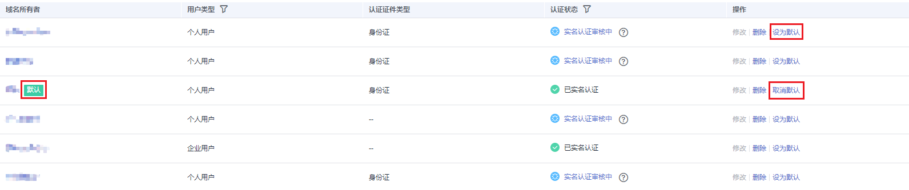

# 设置默认信息模板

## 操作场景

如果想要在注册域名操作时，自动选择某个信息模板，可以将该信息模板设置为默认模板。

> **说明：** 
>-   一个租户帐号只能设置一个默认信息模板。
>-   设置默认信息模板操作不可取消，如果不想将某个信息模板作为默认模板，可以将其它模板设为默认信息模板。
>-   信息模板的“认证状态”不影响设置默认信息模板操作。

## 操作步骤

1.  登录管理控制台。
2.  选择“域名与网站 \> 域名注册”。

    进入“域名列表”页面。

3.  在左侧树状导航栏中，选择“域名注册 \> 信息模板”。

1.  在信息模板列表中，找到待设置的信息模板，单击“操作”列的“设为默认”。

    **图 1**  设置默认信息模板  
    

    设置完成后，在“域名所有者”所在列会出现“默认”标志。

