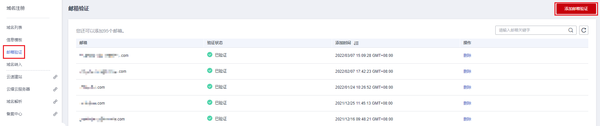
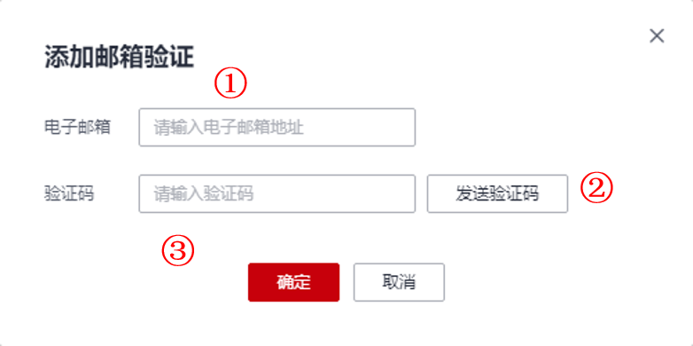

# 邮箱验证

## 操作场景

根据ICANN政策要求，域名注册信息（即WHOIS信息）必须真实和完整，域名所有者的电子邮箱必须真实存在。因此，在创建信息模板的时候必须选择已验证过的邮箱。

本章节将介绍如何进行域名所有者的邮箱验证。

## 操作步骤

1.  登录[域名注册控制台](https://console.huaweicloud.com/domain/?region=cn-north-4#/domain/list)。

    进入“域名列表”页面。

2.  在左侧树状导航栏中，选择“邮箱验证”。
3.  在页面右上角，单击“添加邮箱验证”。

    **图 1**  添加邮箱验证  
    

4.  在弹出的“添加邮箱验证”窗口中，输入需要验证的电子邮箱地址并填写获取的验证码。

    **图 2**  填写邮箱验证信息  
    

5.  单击“确定”，即可完成电子邮箱验证。

    > **说明：** 
    >也可在创建信息模板时，在电子邮箱右侧单击“添加邮箱验证”完成验证。

## 后续操作

完成以上操作后您可在左侧树状导航栏中，选择“信息模板”，使用已验证通过的电子邮箱创建信息模板。

-   [创建信息模板（个人用户）](https://support.huaweicloud.com/usermanual-domain/domain_ug_340002.html)
-   [创建信息模板（企业用户）](https://support.huaweicloud.com/usermanual-domain/domain_ug_340003.html)

